# agent-multi

[](https://github.com/juanknebel/piki-multi-ai/actions/workflows/nightly.yml)

A terminal UI for orchestrating multiple [Claude Code](https://docs.anthropic.com/en/docs/claude-code) instances in parallel — each running in its own isolated git worktree, pointing to an existing directory, or managing a multi-service project root.

Built with Rust and [ratatui](https://ratatui.rs/).

### Navigation & Interaction

| Navigation mode | Interaction mode |
|:---:|:---:|
| 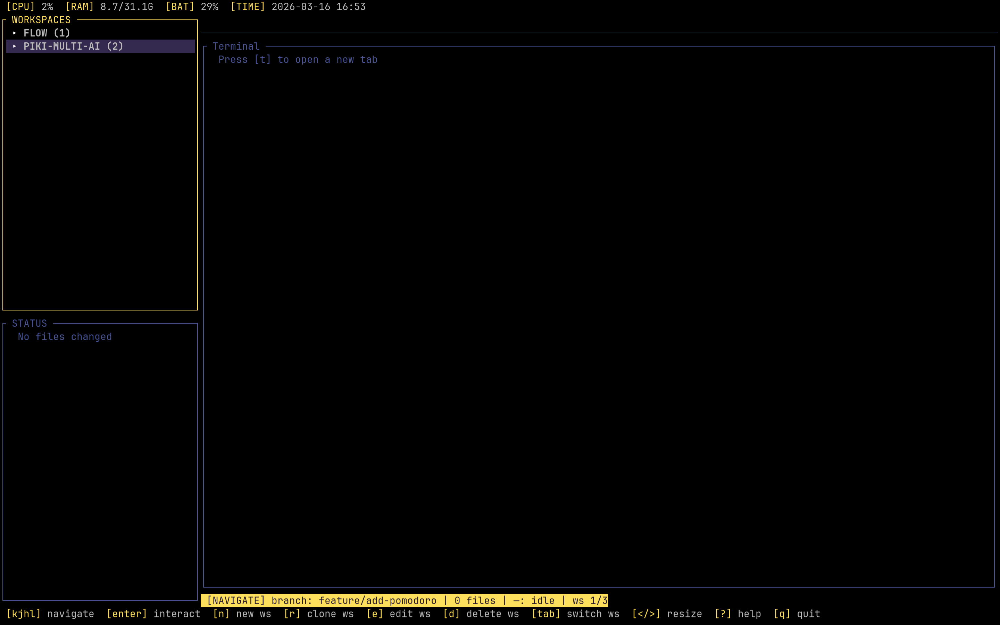 | 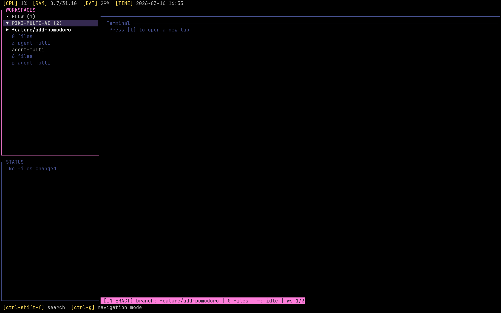 |

### Workspace Dashboard

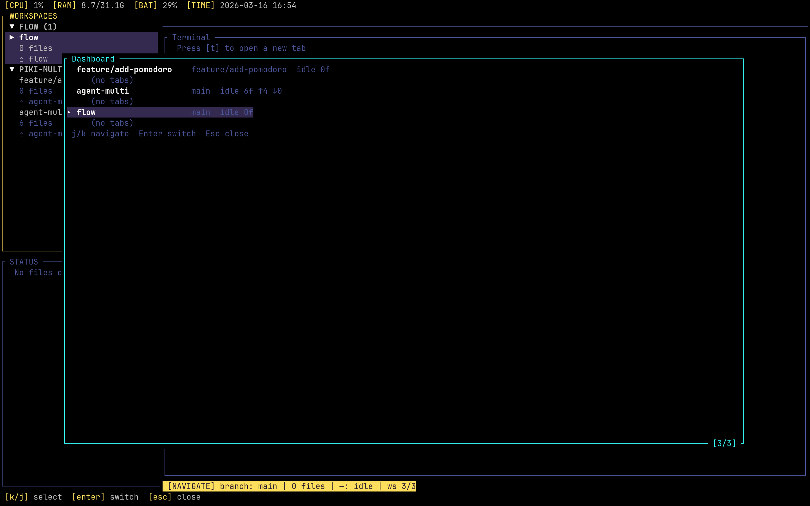

### New Tab (categorized menu)

| Main menu | AI Agents | Tools |
|:---:|:---:|:---:|
| 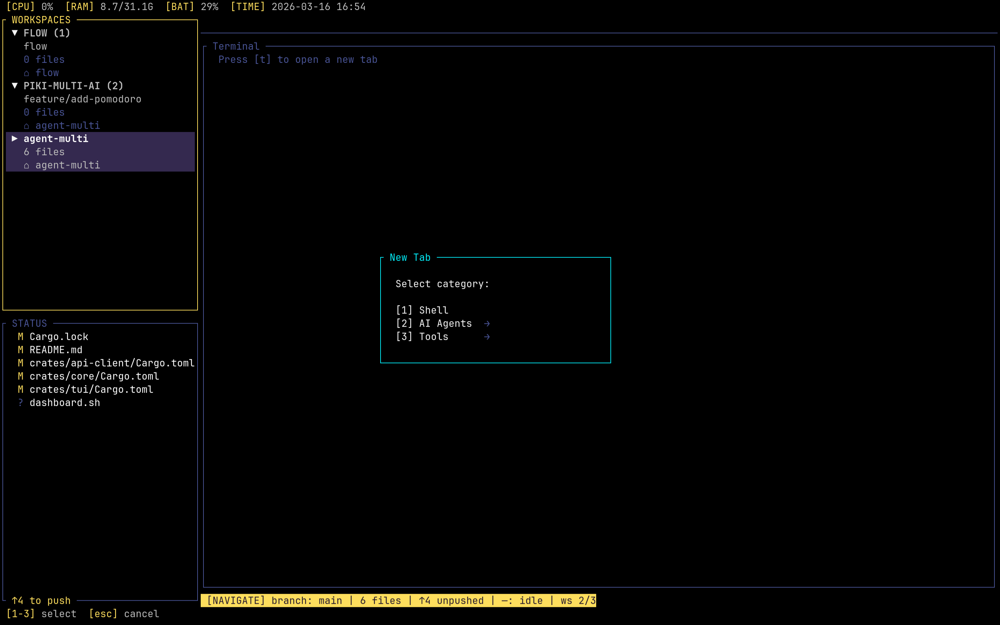 | 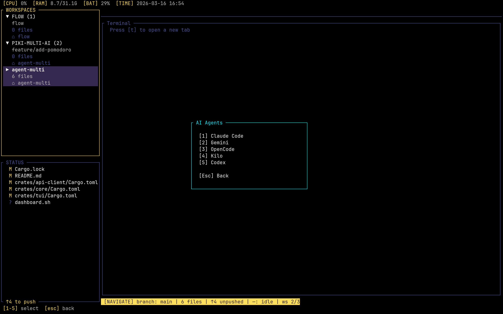 | 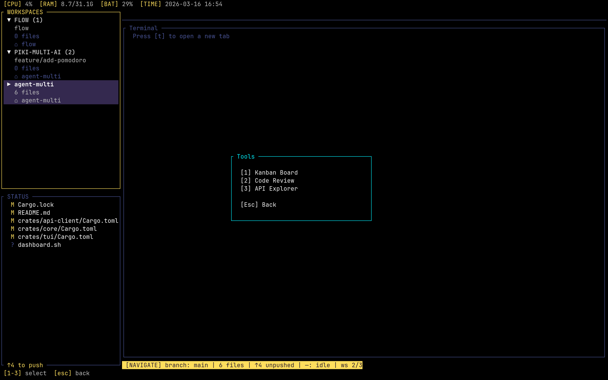 |

### AI Agent Tab & Git Diff

| OpenCode tab | Side-by-side diff |
|:---:|:---:|
| 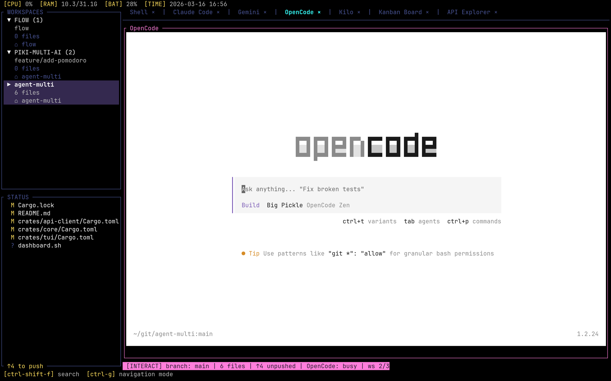 | 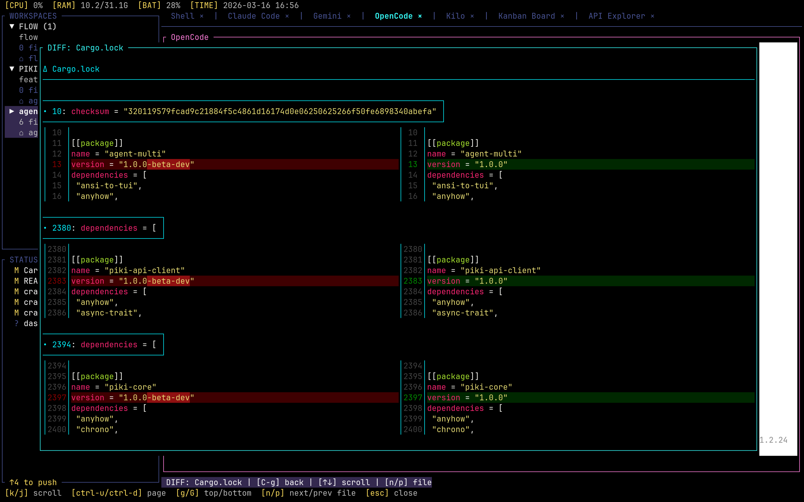 |

### API Explorer

| Request & Response | Response search |
|:---:|:---:|
| 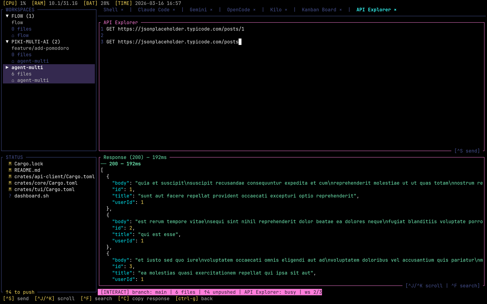 | 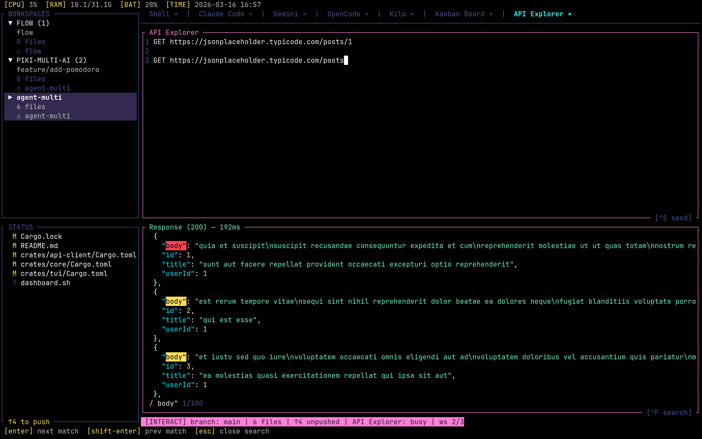 |

### Code Review

| Inline comment | General comment |
|:---:|:---:|
| 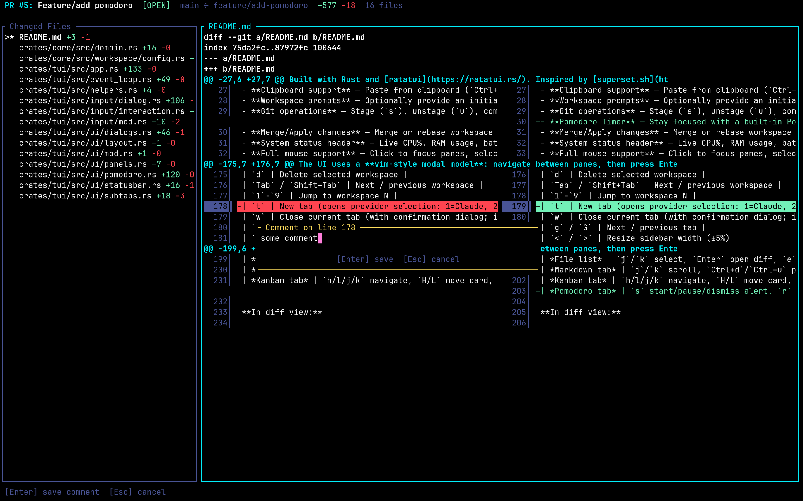 | 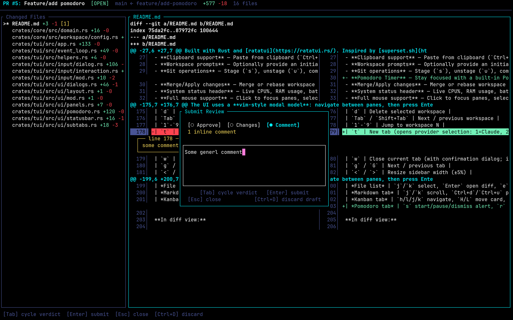 |

## Features

- **Parallel workspaces** — Run multiple AI coding sessions simultaneously, each in an isolated git worktree, pointing directly to an existing directory (Simple mode), or managing a multi-service project root (Project mode)
- **Dynamic tabs** — Workspaces start empty; create tabs on demand (`t`) organized in categories: Shell (direct), AI Agents (Claude Code, Gemini, OpenCode, Kilo, Codex), and Tools (Kanban Board, Code Review, API Explorer); close tabs with `w`; cycle with `g`/`G`; Kanban Board and API Explorer are singletons — re-opening one focuses the existing tab instead of creating a duplicate
- **Workspace dashboard** — Press `D` for a bird's-eye overview of all workspaces with their tabs, status (idle/busy/done), changed files, and ahead/behind; `j`/`k` to navigate, `Enter` to switch, `Esc` to close
- **Git log viewer** — Press `L` in navigation mode to open a scrollable overlay showing `git log --oneline --graph --decorate --all -50`; navigate with `j`/`k`, `Ctrl+d`/`Ctrl+u` for page, `g`/`G` for top/bottom; press `Enter` on a commit to view its diff (piped through delta if available); `Esc` to close
- **Live terminal rendering** — See AI assistant output in real-time with full ANSI color support via `tui-term`
- **Interactive input** — Type directly into any AI session (Enter on the terminal pane to interact)
- **Git branch-style naming** — Workspace names support `/`, `.`, `-`, `_` (e.g. `feature/login`, `bugfix/issue-42`)
- **Workspace groups** — Organize workspaces into named groups with collapsible headers (`▼`/`▸`) in the sidebar; assign groups when creating or editing workspaces
- **Simple workspaces** — Create workspaces that point directly to an existing directory without creating a git worktree or branch; name is auto-derived from the directory
- **Project workspaces** — Point to a multi-service directory root (e.g. monorepo with `frontend/`, `backend/`, `infra/`); STATUS panel shows navigable sub-directories as services; double-click or Enter to spawn a new workspace from any sub-directory, pre-filled with parent's prompt, kanban path, and group
- **Rich workspace list** — Each workspace shows type icon (⎇ worktree, ▣ project, ○ simple), name, file count, and branch/description; thin separators and alternating backgrounds improve visual hierarchy; group headers use uppercase labels with background tint; press `i` to view full details (branch, paths, type, group, description, prompt) in a copyable overlay
- **File watching** — Automatically detects file changes in each worktree using `notify`, with periodic refresh every 3s to catch commits and rebases
- **Full git status** — STATUS panel shows all file states: modified, staged, untracked, conflicted, renamed, and more via `git status --porcelain=v1`
- **Ahead/behind indicator** — STATUS panel border and status bar show `↑N to push` / `↓N behind` relative to upstream tracking branch
- **Side-by-side diffs** — View diffs as a floating overlay rendered by [delta](https://github.com/dandavison/delta) with ANSI colors preserved (terminal stays visible behind)
- **Deterministic workspace ordering** — Workspaces persist their display order via an `order` field; new workspaces append to the end; order is stable across restarts
- **Context-aware Tab** — Tab/Shift+Tab behavior depends on the active pane: cycles workspaces in the sidebar, cycles subtabs in the main panel, and cycles files in the status panel; backtick (`` ` ``) toggles to previous workspace (Alt-Tab style); the fuzzy switcher (`Space`) and command palette (`Ctrl+P`) cover quick jumps to any workspace
- **Scrollbar indicators** — Thin scrollbars appear on the right edge of scrollable areas (terminal, diff, markdown, file list, workspace list) when content overflows the viewport
- **Fuzzy workspace switcher** — Press `Space` to open a fuzzy search overlay for instant workspace switching by name, group, or branch
- **Vim-style navigation** — j/k for movement, Enter to activate, Esc to go back (non-terminal panes), Ctrl+G for terminal panes; h from main panel goes to workspace list; j/k from main panel reach GitStatus/WorkspaceList; Enter on a workspace switches and auto-focuses the main panel
- **Fuzzy file search** — Search all files in the active worktree with fuzzy matching powered by [nucleo](https://github.com/helix-editor/nucleo) (same engine as Helix editor), respects `.gitignore`
- **$EDITOR integration** — Open any file in your preferred editor (`$EDITOR` or `vi`); TUI suspends and resumes automatically
- **Inline editor** — Edit files directly inside the TUI with a built-in text editor (cursor movement, line numbers, scroll); syntax-highlighted via `syntect`
- **Syntax highlighting** — Language-aware syntax coloring powered by [syntect](https://github.com/trishume/syntect) across three surfaces: code review diffs (per-line highlighting merged with add/delete coloring), inline editor (with cursor overlay), and markdown fenced code blocks (with language hints like ` ```rust `); configurable theme via `syntax_theme` in `config.toml` (default: `base16-ocean.dark`)
- **Terminal search** — Press `Ctrl+Shift+F` in terminal interaction mode to search within terminal output; type to filter, `Enter`/`Shift+Enter` to navigate matches, `Esc` to close
- **Undo stage/unstage** — Press `Ctrl+Z` in navigation mode to undo the last stage or unstage operation (up to 20 entries); status bar shows `[C-z undo]` hint after each operation
- **Clipboard support** — Paste from clipboard (`Ctrl+Shift+V`), copy visible terminal (`Ctrl+Shift+C`), and mouse drag-to-select with auto-copy; cross-platform (Wayland, X11, macOS, Windows)
- **Workspace prompts** — Optionally provide an initial prompt when creating a workspace, stored for reference and used when spawning AI tabs
- **Git operations** — Stage (`s`), unstage (`u`), commit (`c`), push (`P`), merge (`M`), and stash (`S`) directly from the TUI; commit dialog with inline message input; stash overlay supports save/pop/apply/drop/show
- **Merge/Apply changes** — Merge or rebase workspace branches into main directly from the TUI (`M`); supports merge commit and rebase strategies with conflict detection and resolution
- **Conflict resolution** — Interactive overlay (`X`) for resolving merge/rebase conflicts: select conflicted files and resolve with ours (`o`), theirs (`t`), mark resolved (`m`), or edit in `$EDITOR` (`e`); auto-opens when merge/rebase produces conflicts; abort merge/rebase with `A`
- **System status header** — Live CPU%, RAM usage, battery level, and date/time displayed in a top header bar (powered by `systemstat`)
- **Full mouse support** — Click to focus panes, select workspaces/files, switch tabs, close tabs (×), scroll anywhere contextually; mouse scroll forwarded to TUI apps (OpenCode, Kilo) in alternate screen mode; drag to resize borders or select text; overlays dismiss on click
- **Resizable panes** — Resize sidebar and workspace/file split with keyboard (`<`/`>`, `+`/`-`) or mouse drag on borders
- **Markdown viewer** — Preview `.md` files rendered in-terminal via `tui-markdown`; open from fuzzy search with `Ctrl+o`, scroll with `j/k`, `Ctrl+d/u`, `g/G`, or mouse wheel; read-only interact mode; close tab with `w`
- **Customizable configuration** — Keybindings and themes loaded from `~/.config/piki-multi/config.toml`
- **Customizable themes** — Colors loaded from TOML files; supports named colors and hex `#rrggbb`
- **OS notifications** — Unified desktop-notification surface for tab-completion events, fired regardless of which workspace is currently focused, with an in-process replace-by-origin mailbox so the same tab can't pile up stale entries. Events are tagged with a `NotificationCategory` (`Complete` for shell exit 0 / agent idle after a meaningful burst, `Error` for shell non-zero exits). Each event carries a per-tab `origin` key — pushing a new event for the same `origin` replaces any previous mailbox entry instead of stacking (design lifted from Warp's `app/src/ai/agent_management/notifications/`). (1) Custom-provider tabs (Claude/Gemini/etc.) trigger when their `IdleWatcher` reports the PTY has been silent past the configured threshold (default 3 s); the watcher also enforces a minimum re-arm byte delta (`DEFAULT_IDLE_REARM_BYTES = 256`) so cursor blinks, status redraws, and spinner frames at the agent's prompt don't cause repeated re-fires — the next notification only arrives after the agent produces a meaningful burst of new output. The agent-idle body includes how long the agent was quiet (`Claude finished the task (idle 5s)`), and the title is prepended with a per-provider glyph from `ProviderConfig.icon` (defaults seeded: `✦` Claude Code, `✧` Gemini; users can set their own in `providers.toml`). For Claude tabs with the structured cli-agent channel active (see **Structured Claude integration** below) this heuristic is superseded by precise task-complete / idle / permission-request events (`notify_cli_agent`) and the `IdleWatcher` steps aside automatically the moment the first structured event is parsed — it only remains the fallback when hooks are unavailable (`jq` missing or a protocol-version mismatch). (2) Shell tabs trigger when an OSC 133 `command-end` marker arrives, with the workspace name, exit code, and the **last command typed** (captured between OSC 133 `B` and `C` and ANSI-stripped) in the body (`Command finished — <ws> — exit 0 \`cargo test\`` / `Command failed (exit N) — <ws> — exit N \`make build\``). The sidebar still marks a `●` badge per workspace for visual breadcrumb. All helpers live in `piki-core::notifications` (`notify_agent_idle`, `notify_command_end`, `NotificationCategory`, `NotificationMailbox`, `mailbox_snapshot`) and are shared by TUI and Desktop via a single `notify-rust` dependency in `piki-core`. The mailbox snapshot (`piki_core::notifications::mailbox_snapshot()`) is available as a foundation for a future in-app notification history panel. An OS notification is suppressed **only** when the user is already looking at that exact event's tab — i.e. it's the active tab of the active workspace **and** the piki window/terminal has OS focus. An event from a *background* tab/workspace still fires the OS notification even while piki is focused, because the user can't see a tab they aren't on (window focus alone is too coarse — the active-tab gate is what makes background agents actually notify). Focus is tracked via crossterm `FocusGained`/`FocusLost` (TUI) and Tauri `WindowEvent::Focused` (desktop); terminals that don't emit focus events (CSI ? 1004) default to unfocused, so they always notify. The mailbox always records regardless.
- **Shell integration (Linux/macOS)** — Shell tabs (zsh, bash, fish) auto-source a tiny init script that emits OSC 133 (prompt/command markers + exit code) and OSC 7 (cwd reporting). Piki's per-tab OSC parser captures those markers from the PTY stream and surfaces them: cwd of the active shell tab in the desktop status bar, ✓/✗ exit-code badge on the shell tab after each command, a workspace `●` badge when a command finishes in a background tab, and an OS notification on every `command-end` (see above). The init scripts live in `crates/core/src/shell_integration/scripts/` and are materialized to `<data_dir>/shell-integration/` on first use; bridge files chain to your real `~/.zshrc` / `~/.bashrc` so user dotfiles are preserved (fish loads its integration via `-C 'source ...'` on top of your `config.fish`). Disabled gracefully for unsupported shells (`sh`, `dash`, etc.)
- **Structured Claude integration (Warp-style)** — Claude Code agent tabs get a precise lifecycle channel instead of guessing from PTY silence. Piki ships six Claude Code hook scripts (`SessionStart`, `UserPromptSubmit`, `PostToolUse`, `PermissionRequest`, `Notification`, `Stop`) and passes them via a generated `claude --settings` file (your `~/.claude/settings.json` is never touched); each hook emits an **in-band OSC 777** sequence (`ESC]777;notify;piki://cli-agent;<json>BEL`) that the same per-tab OSC parser sniffs out of the PTY stream — purely additive, the agent stays a raw passthrough. Surfaces a per-tab status glyph (running / waiting-permission / idle / done) in the desktop status bar + an aggregate dot on the workspace tab, routes permission/idle/done through the shared notification + workspace-attention rail, and replaces the byte-silence idle heuristic (which auto-steps-aside once the channel proves live, and stays as graceful fallback otherwise). Scripts are materialized to `<data_dir>/claude-hooks/`; require `jq`. The channel is self-disabling (hooks no-op unless `PIKI_CLI_AGENT` is set) and version-negotiated (`v` field; unknown majors are dropped and the tab falls back to the heuristic). Core logic + parser live in `crates/core/src/cli_agent/` and `shell_integration::parser`; non-Claude providers (Gemini, etc.) keep the `IdleWatcher` unchanged
- **Pre-flight checks** — Validates required (git >= 2.20) and optional dependencies (delta, plus `claude` and `jq` for the structured Claude integration) at startup with clear error/warning messages; `gh` CLI availability is checked lazily on first Code Review use
- **Command palette** — Press `Ctrl+p` to open a VS Code-style searchable command palette; fuzzy-filter 26+ commands across 9 categories (Workspace, Git, Tabs, Search, View, Layout, Clipboard, App, Switch) with match highlighting and keybinding hints; includes dynamic "Switch to" entries for all workspaces; powered by [nucleo](https://github.com/helix-editor/nucleo)
- **In-app log viewer** — Press `Ctrl+l` to open a scrollable overlay showing the last 500 log entries from the current session; color-coded by level (ERROR=red, WARN=yellow, INFO=green, DEBUG=cyan, TRACE=gray); filter by level with `0`-`5` keys; press `/` to open a text search bar (case-insensitive substring match on message and target — title shows `[filter ~]` when active); press `r` to toggle auto-refresh / tail mode (title shows `~` marker, selection follows the latest entry); select lines with `j`/`k` (highlighted), horizontal scroll with `h`/`l`, page with `Ctrl+d`/`Ctrl+u`, `g`/`G` top/bottom; `Enter`/`y` copies selected line to clipboard; mouse scroll and click to select
- **Structured logging** — File-based structured logging via `tracing` with daily rotation to `~/.local/share/piki-multi/logs/`; configurable via `--log-level` flag (trace/debug/info/warn/error)
- **Agent Profiles** — Configure named agents per project (`A` key, Simple workspaces only) with a two-step wizard: step 1 selects name + provider, step 2 opens a large floating editor for the agent's role/instructions; agents are stored in SQLite per `source_repo` with version tracking; press `p` to sync agent config to the repo as provider-native subagent files (e.g., `.claude/agents/<name>.md`); press `i` to import agents from repo files (reverse sync) — scans all provider directories for `.md` files, shows a checklist with `(new)`/`(exists)` status, and imports selected agents marked as synced; version indicator shows sync status (`v3 ✓` synced, `v2 ✗` pending); editing an agent increments its version and resets sync status; falls back to raw provider selector when no agents are configured
- **Agent Dispatch** — Select a kanban card, press `D` to dispatch a configured agent or raw provider: the agent selector includes a `(None)` option to dispatch without a profile; when no agent is selected, a second step asks whether to create a new worktree workspace or use the current one; with an agent selected, automatically creates a git worktree with a convention-based branch (`feature/`, `bug/`, or `spike/` based on card priority), a workspace grouped under `<parent>-AGENTS`, inherits the parent's kanban board, and launches the agent with an auto-composed prompt (`Use the <agent> agent to plan and then implement the task: <card title>` + card description + optional additional prompt); the agent's role is materialized as a provider-native subagent file in the worktree; card moves to "in progress" with assignee set to agent name; deleting the agent workspace moves the card back to "todo" and clears the assignee
- **AI Chat** — Global chat panel powered by local LLMs via [Ollama](https://ollama.ai/) or [llama.cpp](https://github.com/ggerganov/llama.cpp) server; `Ctrl+Y` in TUI opens a centered floating overlay, `Ctrl+Shift+L` in desktop toggles a right-side panel; not tied to any workspace — conversation persists across workspace switches; select server type (Ollama / llama.cpp) in settings (`Ctrl+O` in TUI, gear icon in Desktop), then choose from available models via Tab (TUI) or dropdown (Desktop); streaming responses with token-by-token rendering; clear with `Ctrl+L`; config (server type, model, base URL, system prompt) persisted in settings; **Agent Mode** (`Ctrl+A` in TUI) enables agentic tool-use — the LLM can call tools (`git_status`, `read_file`, `list_files`, `search_code`) to inspect the active workspace and iterate until the question is resolved; tool results are displayed inline in the chat; powered by `piki-agent` crate
- **Code Review** — Full-screen PR review tab powered by `gh` CLI; browse changed files in a resizable file-list panel (press `[`/`]` to shrink/grow ±5%, or drag the divider with the mouse; ratio persists across restarts); view diffs with line numbers and a cursor; add inline comments on any line (`c`), delete comments (`d`); submit reviews (approve/request changes/comment) with inline comments via GitHub API; persistent draft overlay; tab only opens if the current branch has an open PR; locked mode prevents accidental workspace switching — press `q` to close or `s` to submit; `gh` availability and authentication are checked lazily on first use and cached for the session
- **API Explorer** — Interactive HTTP client tab (`t` then `9`) with Hurl-like syntax; write `METHOD URL`, headers, and body in a built-in editor (starts empty); `Ctrl+S` to send; response displayed with status code, elapsed time, and pretty-printed JSON; `Ctrl+J`/`Ctrl+K` to scroll response; `Ctrl+F` to search response; contextual footer hints for API-specific shortcuts; errors (parse failures, client init, network errors) and successful requests are logged to the in-app log viewer (`Ctrl+L`)

## Desktop Application (Tauri)

A modern desktop GUI is available via `piki-desktop`, built with [Tauri v2](https://v2.tauri.app/). It reuses the same `piki-core` business logic as the TUI and shares the same SQLite database, so workspaces created in either interface are visible in the other.

### Features

- **Custom menu bar** — Classic desktop-style menu (File, Edit, View, Git, Agents, Help) with keyboard shortcuts, submenus, disabled-state awareness, and integrated window controls (minimize/maximize/close); replaces native title bar for a compact, themed look; drag region for window movement, double-click to maximize
- **Obsidian Glow theme** — Distinctive dark UI with deep blue-black backgrounds, cyan/amber dual-accent system, glow effects, and monospace-forward typography
- **5 built-in theme presets** — Obsidian Dark, Nord, Catppuccin Mocha, Solarized Light, Tokyo Night; switch instantly via `Alt+T` or command palette
- **Full theme customization** — Individual color pickers for ~60 variables across 13 groups, live preview, import/export themes as JSON, persisted in SQLite
- **xterm.js terminals** — Full terminal emulation with WebGL rendering, block cursor, native clipboard via `tauri-plugin-clipboard-manager` (copy on selection, `Ctrl+Shift+C/V`), terminal search (`Ctrl+Shift+B`)
- **Project search** — `Ctrl+Shift+F` to grep file contents across the workspace using ripgrep (`rg`); debounced search with file path, line number, and highlighted match snippet; Enter opens file viewer with scroll and copy support
- **File viewer** — Modal for viewing file contents; opened from fuzzy file search (`Ctrl+F`) or project search; CodeMirror 6 with language-aware syntax highlighting (Rust, TypeScript, Python, JSON, HTML, CSS, Markdown, and more), copy-to-clipboard, Edit button (`Ctrl+E`) to open in `$EDITOR` in a new terminal tab, Quick Edit (`Ctrl+I`) for inline editing, and "Open in Editor" to open as a full tabbed editor panel
- **Markdown preview** — Render `.md` files via [marked](https://marked.js.org/) (CommonMark + GFM: tables, strikethrough, task lists, blockquotes) with syntax-highlighted code fences powered by [highlight.js](https://highlightjs.org/); open from fuzzy search (auto-detected for `.md`/`.markdown`) or the 👁 preview button next to a markdown file in Source Control; `Ctrl+I` enters Quick Edit, `Ctrl+E` opens in `$EDITOR`, "Open in Editor Tab" promotes to a full Milkdown WYSIWYG tab (tab title shows the file's basename)
- **Code editor tabs** — Full CodeMirror 6 editor in a dedicated tab panel (like Markdown tabs); opened from the file viewer's "Open in Editor" button; the tab title shows the file's basename instead of a generic "Code Editor" label; syntax highlighting, dirty indicator, Ctrl+S save; connects to language servers via LSP for diagnostics, completion, hover, and go-to-definition when available
- **Web Preview tab** — Embed a local dev server in a tab via `<iframe>` — useful for inspecting `vite`, `next dev`, or any other server that an agent (or you) spun up in the worktree; pick from a dropdown of 16 common ports (Vite 5173, Next.js 3000/3001, Webpack 8080, Django 8000, Flask 5000, Storybook 6006, Ollama 11434, etc.) or type any URL; status dot reports whether the port responds (`fetch` probe, 900 ms timeout); reload button remounts the iframe; non-localhost URLs show an X-Frame-Options warning since most sites refuse to embed; open with `Alt+Shift+W`, the activity bar (browser-window icon), command palette, or File → New Tab → Web Preview
- **LSP support** — Built-in Language Server Protocol proxy; spawns language servers (rust-analyzer, typescript-language-server, pyright, etc.) as child processes and bridges JSON-RPC to the frontend via WebSocket; configurable server registry in `lsp.toml`; TTL-based idle shutdown (default 5min) when switching workspaces; max concurrent server cap to manage memory
- **File explorer** — Dedicated "Files" sidebar view (activity bar, `View → Files`, or command palette "Show Files") with a lazy, on-demand filesystem tree of the active workspace: expand/collapse folders, keyboard navigation (↑/↓ to move, →/← to expand/collapse, Enter to open), a show-hidden (`.*`) toggle, and a manual refresh; auto-refreshes live from the core file watcher (branch switches, commits, and external file changes re-list only the affected directories). Clicking a file opens it in a CodeMirror 6 tab with language-aware syntax highlighting + LSP; `.md`/`.markdown` files open in the Milkdown WYSIWYG tab (rendered yet editable). A right-click context menu offers create / rename / delete (with confirm), Copy Path / Relative Path, and Preview / Open as Text for markdown; the header search toggle filters the whole workspace by filename (ripgrep-style index, gitignore-aware). "Reveal in Files" jumps the tree to a given file — from the Source Control file row (⌖), right-clicking a code/markdown editor tab, `View → Reveal File in Files`, or the command palette — expanding ancestors and scrolling it into view. When the workspace is a git repo, rows are decorated with their git status (the same M/A/D/?/C letters and colors as Source Control) and folders containing changes get a dot; the decoration is a no-op for non-git directories. The expanded folders and selection are persisted per workspace (restored on switch-back), a folder/root "Open in Terminal" action spawns a shell tab with that directory as its working dir, and an optional auto-reveal toggle (header ◎, `View` menu, or command palette) follows the active editor tab in the tree
- **Activity bar + sidebar** — Explorer (workspace list with groups), Files (filesystem tree), Source Control (git staging/committing), Agents panel (manage/dispatch AI agents), Kanban Board (quick access via activity bar icon)
- **API Explorer** — Non-PTY tab for writing HTTP requests in Hurl syntax (`METHOD URL\nHeaders\n\nBody`), executing via `piki-api-client`, viewing JSON-highlighted responses with color-coded status badges; request history overlay (`Ctrl+H`) with full-text search, load from history, and delete entries; multiple sequential requests supported; history persisted in SQLite with FTS5
- **Multi-provider tabs** — Open Claude, Gemini, OpenCode, Kilo, Codex, Shell, Kanban Board, or API Explorer tabs per workspace; add custom providers via `~/.config/piki-multi/providers.toml` with configurable binary, arguments, and prompt format; manage providers in-app with `Alt+P` (TUI) or Tools → Providers menu (Desktop). Singleton tabs: Kanban Board, API Explorer, and Web Preview exist at most once per workspace regardless of pane splits — re-triggering the action (sidebar icon, menu, palette) focuses the existing tab in its current pane
- **Kanban Board** — Integrated kanban board powered by [flow-core](https://github.com/juanknebel/flow); columns (TODO, IN PROGRESS, IN REVIEW, DONE) with drag-and-drop card movement, inline card actions (edit, move, delete), priority badges (Bug/High/Medium/Low/Wishlist), edit modal with title/description/priority/assignee fields; configurable column colors (right-click header to pick from 16-color palette, persisted in localStorage); auto-creates board if none exists; open via `Alt+K`, activity bar, command palette, or View menu
- **Git integration** — Stage/unstage files, commit, push, merge/rebase, stash, conflict resolution, git log viewer; auto-refresh via hybrid file watcher (500ms) + periodic git status poll (2s) + background `git fetch` (60s) for live ahead/behind tracking
- **Side-by-side diff viewer** — With char-level highlights, 3-way merge view, and conflict resolution buttons
- **Code review** — PR info, per-file diffs, inline comments, submit reviews via `gh` CLI
- **Agent management** — Create/edit/delete agent profiles, import from repo, dispatch agents to workspaces
- **Command palette** — `Ctrl+P` for fuzzy search across all commands, workspaces, and theme presets
- **Dashboard** — `Alt+D` for bird's-eye view of all workspaces with status, tabs, and file counts
- **System info** — `Alt+I` for live system monitoring: CPU, RAM, disk usage gauges with color thresholds (green/amber/red), battery status, load average, uptime, hostname; auto-refreshes every 3 seconds
- **Application log viewer** — `Alt+Shift+L` for in-memory ring buffer (500 entries), filterable by level
- **About dialog** — Click "Piki Desktop" in status bar or via command palette
- **Workspace switcher** — `Ctrl+Space` for quick fuzzy workspace switching; results grouped by group name with headers, sorted alphabetically (ungrouped first), items ordered within each group
- **Settings** — `Alt+S` to open settings dialog; all keyboard shortcuts are editable at runtime (click a shortcut, press new key combo) with two-column display (Default / Current); configure the terminal shell command; changes persist in SQLite and take effect immediately without restart; "Restore Defaults" button resets everything
- **AI Chat panel** — Right-side chat panel (`Ctrl+Shift+L`) for chatting with local LLMs via Ollama or llama.cpp server; server type selectable in settings dialog (gear icon), model selector dropdown populated from the selected server, streaming responses, resizable panel, conversation persists when hidden; config saved to settings
- **Resizable sidebar** — Drag the divider or use the resize handle
- **Recursive split-view panes** — Split any tab horizontally or vertically into nested panes; click the pane's `+` button for **Split Right** / **Split Down** (alongside new-tab providers); keyboard shortcuts `Ctrl+\` (split right), `Ctrl+Shift+\` (split down), `Ctrl+Shift+Q` (close active pane); each pane has its own mini tab bar with independent active tab and `+` button; drag the divider between panes to resize (clamped 10–90%); the active pane is highlighted with a subtle tint on its tab bar; the pane layout persists per workspace across restarts (keyed by workspace path)
- **Confirm dialogs** — HTML-based confirmations (not browser `confirm()`) for all destructive actions

### Keyboard Shortcuts

| Shortcut | Action |
|---|---|
| `Ctrl+P` | Command palette |
| `Ctrl+N` | New workspace |
| `Ctrl+Space` | Workspace switcher |
| `Ctrl+M` | Merge / Rebase |
| `Ctrl+F` | Fuzzy file search |
| `Ctrl+Shift+F` | Search in project (grep) |
| `Ctrl+E` | Edit file in $EDITOR (in file search / project search / file viewer) |
| `Ctrl+I` | Quick Edit inline (in file viewer) |
| `Ctrl+Shift+B` | Search in terminal |
| `Ctrl+Shift+R` | Code review |
| `Ctrl+Shift+A` | Manage agents |
| `Ctrl+Shift+D` | Dispatch agent |
| `Ctrl+Shift+S` | Git stash |
| `Ctrl+Tab` / `Ctrl+Shift+Tab` | Switch tabs |
| `Ctrl+Z` | Undo stage/unstage |
| `Alt+D` | Dashboard |
| `Alt+I` | System Info |
| `Alt+K` | Kanban Board |
| `Alt+L` | Git log |
| `Alt+S` | Settings |
| `Alt+T` | Theme settings |
| `Alt+Shift+W` | Open Web Preview tab (Desktop) |
| `Alt+Shift+L` | Application logs |
| `Ctrl+Shift+C` | Copy selection |
| `Ctrl+Shift+V` | Paste from clipboard |
| `Ctrl+\` | Split active pane right |
| `Ctrl+Shift+\` | Split active pane down |
| `Ctrl+Shift+Q` | Close active pane |
| `?` | Help / all shortcuts |

### Building & Installing

```bash
# Quick install (builds release binary + desktop entry + icons)
./scripts/install-desktop.sh

# Or manually:
cd crates/desktop/frontend && npm install && cd -
cd crates/desktop && cargo tauri build
# Binary at: target/release/piki-desktop
```

The install script places the binary in `~/.local/bin/`, installs icons to `~/.local/share/icons/hicolor/`, and creates a `.desktop` entry so Piki Desktop appears in Linux application menus.

## Prerequisites

- [Rust](https://rustup.rs/) >= 1.85 (edition 2024)
- [Claude Code CLI](https://docs.anthropic.com/en/docs/claude-code) (`claude` in PATH)
- [git](https://git-scm.com/) >= 2.20 (worktree support)
- [delta](https://github.com/dandavison/delta) (optional, for side-by-side diffs — falls back to plain git diff)
- [gh](https://cli.github.com/) (optional, required for code review feature — run `gh auth login` to authenticate)
- [ripgrep](https://github.com/BurntSushi/ripgrep) (optional, recommended for project search — falls back to `grep -rn`)
- [jq](https://jqlang.github.io/jq/) (optional, for JSON filtering in API Explorer)
- [Ollama](https://ollama.ai/) (optional, for AI Chat panel — install and run `ollama serve`, then `ollama pull <model>`)
- [llama.cpp](https://github.com/ggerganov/llama.cpp) (optional, alternative for AI Chat panel — run `llama-server -m <model.gguf>`)
- [Node.js](https://nodejs.org/) >= 18 (optional, required for building the desktop app)
- System libraries for Tauri (optional, for desktop app): `libwebkit2gtk-4.1-dev`, `libappindicator3-dev` on Linux

## Installation

```bash
git clone https://github.com/your-user/agent-multi.git
cd agent-multi
cargo build --release
```

The binary will be at `target/release/piki-multi-ai`.

Or use the install scripts:

```bash
# TUI version
./scripts/install.sh              # installs to ~/.local/bin
./scripts/install.sh -d /usr/local/bin  # custom directory

# Desktop version (Tauri GUI)
./scripts/install-desktop.sh      # builds, installs binary + desktop entry + icons
```

## Usage

```bash
piki-multi-ai [COMMAND]
```

### Options

- `-h`, `--help`: Print help
- `-V`, `--version`: Print version
- `--log-level <LEVEL>`: Set logging verbosity — `trace`, `debug`, `info` (default), `warn`, `error`. Logs are written to `~/.local/share/piki-multi/logs/`
- `--data-dir <PATH>`: Override the data directory. When set, **all** app state is stored under this path: database, worktrees, logs, and config. Useful for running a nightly/test instance alongside stable (e.g. `piki-multi-ai --data-dir /tmp/piki-nightly`)

### Commands

#### `generate-config`

Generates a complete configuration file with all default keybindings and options to stdout:

```bash
piki-multi-ai generate-config > ~/.config/piki-multi/config.toml
```

#### `version`

Shows version and author information (same as the **About** overlay in-app):

```bash
piki-multi-ai version
```

#### `migrate`

Migrates workspace configurations from legacy JSON files to the SQLite database. JSON files are preserved (not deleted) for manual verification:

```bash
piki-multi-ai migrate
```

### Creating Workspaces

Press `n` to open the New Workspace dialog. Provide:
- **Source:** Toggle between `Local folder` and `GitHub URL` using `Space`, `Left`, or `Right`. Local folder points to any existing directory on disk (git not required); GitHub URL clones a public/private GitHub repo into a destination you choose. The resulting workspace is always a Simple workspace internally; worktrees are spawned later from a GitHub-origin workspace via the "Create Worktree" action.
- **Folder / URL:** When Source = Local folder, this is the path to the directory (`~` expands to `$HOME`). When Source = GitHub URL, paste the clone URL (HTTPS, SSH, or `git@github.com:owner/repo.git`).
- **Clone into:** *(GitHub source only)* Parent directory the repo is cloned into; the clone lands at `<clone-into>/<repo>`. Pre-filled with `<data_dir>/repos` as a hint — that default folder is auto-created on first use, but any other path you type must already exist (`~` expands to `$HOME`). In the desktop app a folder picker is available.
- **Name:** *(optional)* Auto-derived when blank — folder basename for Local, repo name for GitHub. Provide your own value to disambiguate workspaces.
- **Desc:** (Optional) A brief description of the task.
- **Prompt:** (Optional) An initial prompt stored with the workspace.
- **Kanban Path:** (Optional) Path to the Kanban board for this workspace (defaults to `~/.config/flow/boards/default`). If a local path is provided and no `board.txt` exists there, a default board with 4 columns (`todo`, `in_progress`, `in_review`, `done`) will be created automatically.
- **Group:** (Optional) Assign the workspace to a named group. Grouped workspaces appear under collapsible headers in the sidebar.

Press `Enter` to create or `Esc` to cancel. Use `Tab` to cycle between fields.

### Editing Workspaces

Press `e` on a selected workspace to modify its **Kanban Path**, **Prompt**, or **Group**. This is useful for re-directing a workspace to a specific task board, updating the orchestration instructions, or reorganizing workspaces into groups.

### Persistence

Workspace configurations are saved automatically and restored on startup using a SQLite database:

- `~/.local/share/piki-multi/piki.db` (single SQLite database with WAL mode)
- Includes workspace config, API Explorer history (with FTS5 full-text search), collapsed groups, and UI layout preferences
- API history persists across restarts and is searchable via `Ctrl+H` in the API Explorer tab; duplicate requests (same method + URL + body) are deduplicated automatically, keeping only the latest response
- API history is scoped per project — each repository sees only its own entries

> **Note:** If you have existing JSON workspace configs in `~/.local/share/piki-multi/workspaces/`, run `piki-multi-ai migrate` to import them into the database.

**Restoration:**

- On startup, `piki-multi-ai` scans the storage backend and restores all valid workspaces.
- Stale entries (worktrees deleted manually) are cleaned up automatically.
- Robust de-duplication ensures each workspace is loaded only once.
- Simple and Project workspaces reference the original directory and are never cleaned up as stale.
- The **last focused workspace** is remembered across restarts: switching workspaces persists the active path in `ui_preferences`, and on startup the app re-focuses that workspace (falling back to the first one if the saved path no longer exists).

### Layout

```
 [CPU] 12%  [RAM] 4.2/16.0G  [BAT] 85%  [TIME] 2026-03-07 14:32
+------------------+-------------------------------------------------------+
| WORKSPACES       |  ▸ Claude Code ×│▸ Shell ×  (dynamic sub-tabs w/ icons)|
|                  |-------------------------------------------------------|
|  ▼ frontend (2)  |                                                       |
|  ▶ ws-1 (active) |  AI assistant live terminal output                    |
|    3 files       |  (Press [t] to open a new tab)                        |
|    Fix auth bug  |  (diff opens as floating overlay)                     |
|                  |                                                       |
|    ws-2          |                                                       |
|  ▸ backend (1)   |                                                       |
|------------------+                                                       |
| STATUS           |-------------------------------------------------------|
|  M src/auth.rs   | branch: ws-1 | 3 files | ↑1 unpushed | Claude: busy  |
|  A src/new.rs    +-------------------------------------------------------+
|  ? untracked.txt |
| ↑1 to push      |
+------------------+--------------------------------------------------------+
  Footer keys change per active pane. Examples:
  Workspace list: [hjkl] navigate [enter] interact [n] new ws [r] clone ws [e] edit ws [d] delete ws [tab] switch ws [^P] commands [space] switch ws [?] help [q] quit
  Git status:     [hjkl] navigate [enter] interact [/] search [c] commit [P] push [M] merge [ctrl-z] undo [^P] commands [space] switch ws [?] help [q] quit
  Main panel:     [hjkl] navigate [enter] interact [t] new tab [w] close tab [g/G] next/prev tab [^P] commands [space] switch ws [?] help [q] quit
```

For **Project workspaces**, the STATUS panel is replaced by a SERVICES panel showing sub-directories:

```
|------------------+
| SERVICES         |
|  📂 frontend     |
|  📂 backend      |
|  📂 infra        |
+------------------+
```

Enter or double-click on a service to create a new workspace from that sub-directory, pre-filled with the parent's prompt, kanban path, and group.

### File status indicators

The STATUS panel uses `git status --porcelain=v1` and shows:

| Indicator | Meaning | Color |
|-----------|---------|-------|
| `M` | Modified (unstaged) | Yellow |
| `A` | Added (staged new file) | Green |
| `D` | Deleted | Red |
| `R` | Renamed | Cyan |
| `?` | Untracked | Dark gray |
| `C` | Conflicted (merge conflict) | Magenta |
| `S` | Staged (index only) | Green |
| `SM` | Staged + modified in working tree | Yellow |

### Keybindings

The UI uses a **vim-style modal model**: navigate between panes, then press Enter to interact. **All keybindings are customizable** via `config.toml`. Both the footer and the help overlay (`?`) update dynamically to show your current configuration.

**macOS support**: The app auto-detects the operating system. On macOS, all `Ctrl` and `Alt` keybindings also accept `Cmd` (⌘), and the UI displays `cmd-` instead of `ctrl-`/`alt-` in help text, footer hints, and status bar. For example, `Ctrl+G` to exit interaction mode becomes `Cmd+G` on macOS, and `Alt+M` for mdr becomes `Cmd+M`. The `Alt` → `Cmd` mapping exists because macOS Option key sends special characters instead of Alt in most terminals. Both original modifiers are always accepted as a fallback.

**Default Navigation mode** (yellow border):

| Key | Action |
|-----|--------|
| `h` / `j` / `k` / `l` | Move between panes (`h` from main panel goes to workspace list) |
| `Enter` | Interact with selected pane |
| `n` | Create new workspace |
| `r` | Create Worktree (GitHub-only): spawn a git worktree from the selected GitHub-origin workspace, inheriting prompt/kanban/group |
| `e` | Edit workspace options (Kanban path, Prompt) |
| `d` | Delete selected workspace (for dispatched workspaces, prompts which kanban column to move the card to) |
| `Tab` / `Shift+Tab` | Context-aware: cycle workspaces (sidebar), subtabs (main), files (status) |
| `Space` | Fuzzy workspace switcher (search by name/group/branch) |
| `` ` `` | Toggle to previous workspace |
| `t` | New tab (opens category menu: 1=Shell, 2=AI Agents →, 3=Tools →; submenus for agent/tool selection) |
| `w` | Close current tab (with confirmation dialog) |
| `b` | Open kanban board for current workspace |
| `A` | Manage agent profiles (create/edit/delete agents for this project) |
| `Alt+P` | Manage providers (add/edit/delete custom AI providers) |
| `D` | Workspace dashboard overlay (bird's-eye view of all workspaces and tabs) |
| `Ctrl+p` | Command palette (fuzzy-searchable list of all commands) |
| `Ctrl+l` | Log viewer overlay (last 500 log entries, color-coded, filterable by level) |
| `g` / `G` | Next / previous tab |
| `<` / `>` | Resize sidebar width (±5%) |
| `+` / `-` | Resize workspace/file split (±10%) |
| `/` or `Ctrl+f` | Fuzzy file search |
| `J` / `K` | Scroll main panel down/up |
| `PageUp` / `PageDown` | Page scroll |
| `Ctrl+z` | Undo last stage/unstage operation |
| `s` | Quick stage file (when file list focused) |
| `u` | Quick unstage file (when file list focused) |
| `c` | Commit (opens dialog) — not available for Project workspaces |
| `P` | Push — not available for Project workspaces |
| `S` | Git stash overlay (save/pop/apply/drop/show) — not available for Project workspaces |
| `L` | Git log overlay (scrollable graph with commit diffs via Enter) |
| `X` | Conflict resolution overlay (ours/theirs/edit/mark-resolved/abort) — not available for Project workspaces |
| `M` | Merge workspace branch into main — not available for Project workspaces |
| `i` | Workspace info overlay (branch, paths, description, prompt; mouse-copyable) |
| `?` | Help overlay |
| `a` | About overlay |
| `q` | Quit (with confirmation dialog) |

**Interaction mode** (green border):

| Key | Action |
|-----|--------|
| `Ctrl+g` | Back to navigation mode (all panes) |
| `Esc` | Back to navigation mode (non-terminal panes only) |
| `Ctrl+Shift+f` | Search in terminal output (terminal pane) |
| *Terminal pane* | All keys forwarded to active tab |
| *Workspace list* | `j`/`k` select, `Enter` switch + focus main panel, `d` delete |
| *File list* | `j`/`k` select, `Space` toggle multi-select, `a` select/deselect all, `Enter` open diff, `e` open in $EDITOR, `v` inline editor, `s` stage, `u` unstage (bulk when multi-selected) |
| *Services list (Project)* | `j`/`k` select, `Enter` open New Workspace dialog pre-filled with sub-directory |
| *Markdown tab* | `j`/`k` scroll, `Ctrl+d`/`Ctrl+u` page, `g`/`G` top/bottom (read-only) |
| *Kanban tab* | `h/l/j/k` navigate, `H/L` move card, `n` new card, `e` edit card, `d` delete, `D` dispatch agent, `Enter` details, `r` refresh, `Esc` close modal |
| *Code Review tab* | Locked mode — see Code Review section below |
| *API Explorer tab* | `Ctrl+S` send request, `Ctrl+J`/`Ctrl+K` scroll response, `Ctrl+F` search response, `Ctrl+H` API history, `Ctrl+C` copy response, mouse scroll in editor/response |

**In kanban card editor** (after pressing `e` or `n`):

| Key | Action |
|-----|--------|
| `Left` / `Right` | Move cursor within field |
| `Home` / `End` | Jump to start / end of field |
| `Backspace` / `Delete` | Delete char before / at cursor |
| `Tab` | Switch between Title and Description |
| `Enter` | Save card |
| `Esc` | Cancel editing |

**In dispatch agent dialog** (after pressing `D` on a kanban card):

| Key | Action |
|-----|--------|
| `Left` / `Right` | Cycle agent/provider; includes `(None)` option when agents are configured |
| `Tab` | Next agent/provider |
| Any text | Type additional prompt (appended to card description) |
| `Enter` | With agent: dispatch to new worktree. With `(None)` or raw provider: choose workspace destination (New/Current) |
| `Esc` | Cancel (step 1) or Back (step 2) |

**In manage agents overlay** (after pressing `A`):

| Key | Action |
|-----|--------|
| `j` / `k` | Navigate agent list |
| `n` | Create new agent profile |
| `e` / `Enter` | Edit selected agent |
| `d` | Delete selected agent |
| `p` | Sync agent to repo (write `.{provider}/agents/<name>.md`) |
| `i` | Import agents from repo files into app |
| `Esc` | Close |

**In import agents overlay** (after pressing `i` in manage agents):

| Key | Action |
|-----|--------|
| `j` / `k` | Navigate discovered agents |
| `Space` | Toggle selection (checkbox) |
| `a` | Toggle select all / deselect all |
| `Enter` | Import selected agents |
| `Esc` | Cancel, return to manage agents |

**In edit agent dialog — step 1** (name + provider):

| Key | Action |
|-----|--------|
| `Tab` | Switch between Name and Provider fields |
| `Left` / `Right` | Cycle provider (on Provider field) |
| `Enter` | Next — open role editor (step 2) |
| `Esc` | Cancel |

**In edit agent dialog — step 2** (role editor, large floating window):

| Key | Action |
|-----|--------|
| Any text | Edit agent role/instructions (multiline with Enter) |
| `Up` / `Down` | Move cursor between lines |
| `PageUp` / `PageDown` | Jump 10 lines |
| Mouse scroll | Scroll 3 lines up/down |
| `Ctrl+D` | Clear all text |
| `Ctrl+S` | Save agent and close |
| `Esc` | Back to step 1 without saving |

**In diff view:**

| Key | Action |
|-----|--------|
| `j` / `k` | Scroll up/down |
| `Ctrl+d` / `Ctrl+u` | Page down/up |
| `g` / `G` | Top / bottom |
| `n` / `p` | Next / previous file |
| `Esc` | Close diff |

**In git log viewer** (`L`):

| Key | Action |
|-----|--------|
| `j` / `k` | Select next/previous commit |
| `Ctrl+d` / `Ctrl+u` | Page down/up |
| `g` / `G` | Top / bottom |
| `Enter` | View diff for selected commit (piped through delta if available) |
| `Esc` or `L` | Close git log |

**In git stash overlay** (`S`):

| Key | Action |
|-----|--------|
| `j` / `k` | Select next/previous stash entry |
| `s` | Save new stash |
| `p` | Pop selected stash |
| `a` | Apply selected stash |
| `d` | Drop selected stash |
| `Enter` | Show selected stash diff |
| `Esc` or `S` | Close stash overlay |

**In conflict resolution** (`X`):

| Key | Action |
|-----|--------|
| `j` / `k` | Select next/previous conflicted file |
| `o` | Resolve with ours (`git checkout --ours` + stage) |
| `t` | Resolve with theirs (`git checkout --theirs` + stage) |
| `m` | Mark resolved (`git add`) |
| `e` | Open in `$EDITOR` |
| `A` | Abort merge/rebase |
| `Esc` or `X` | Close conflict resolution |

**In merge dialog** (`M`):

| Key | Action |
|-----|--------|
| `m` | Merge (merge commit strategy) |
| `r` | Rebase |
| `Esc` | Cancel |

**In log viewer** (`Ctrl+l`):

| Key | Action |
|-----|--------|
| `j` / `k` | Select next/previous line |
| `h` / `l` | Scroll left/right (horizontal) |
| `Ctrl+d` / `Ctrl+u` | Page down/up |
| `g` / `G` | Top / bottom |
| `Enter` / `y` | Copy selected line to clipboard |
| `0`-`5` | Filter by level (0=all, 1=error, 2=warn, 3=info, 4=debug, 5=trace) |
| `/` | Open text search bar (type to filter by message/target; `Esc` clears, `Enter` confirms) |
| `r` | Toggle auto-refresh / tail mode (title shows `~`; disables when navigating up) |
| Mouse scroll | Select up/down |
| Mouse click | Select clicked line |
| `Esc` or `Ctrl+l` | Close log viewer |

**In command palette** (`Ctrl+p`):

| Key | Action |
|-----|--------|
| *type* | Filter commands by fuzzy match |
| `↑` / `↓` | Select command |
| `Enter` | Execute selected command |
| `Esc` | Close palette |

**In fuzzy search** (`/` or `Ctrl+f`):

| Key | Action |
|-----|--------|
| *type* | Filter files by fuzzy match |
| `↑` / `↓` | Select result |
| `Enter` | Open diff of selected file (if it has changes) |
| `Ctrl+e` | Open in $EDITOR |
| `Ctrl+v` | Open in inline editor |
| `Ctrl+o` | Open markdown file in a new tab (`.md` / `.markdown` only) |
| `Alt+m` | Open markdown file in external `mdr` viewer |
| `Esc` | Close search |

**Pane resize:**

| Key | Action |
|-----|--------|
| `<` / `>` | Resize sidebar width (±5%) |
| `+` / `-` | Resize workspace/file split (±10%) |
| Mouse drag on border | Drag pane borders to resize |

**Mouse:**

| Action | Effect |
|--------|--------|
| Click workspace list | Focus pane and switch to clicked workspace |
| Click file list | Focus pane and select clicked file |
| Click service (Project) | Select service |
| Double-click service (Project) | Open New Workspace dialog pre-filled with sub-directory, prompt, kanban, and group |
| Click main panel | Focus pane and start text selection |
| Click sub-tab | Switch to that tab |
| Click × on sub-tab | Close that tab (with confirmation) |
| Scroll in workspace list | Navigate workspaces up/down |
| Scroll in file list | Navigate files up/down |
| Scroll in main panel | Scroll terminal scrollback/markdown; forwarded as escape sequences to TUI apps (alternate screen with mouse capture) |
| Scroll in Help/Diff overlay | Scroll overlay content |
| Scroll in fuzzy search | Navigate results |
| Click on Help/About/Info overlay | Dismiss overlay |
| Drag on border | Resize pane split |
| Drag in terminal | Select text (auto-copies on release) |

**Terminal input:**

| Key | Action |
|-----|--------|
| `Shift+Enter` | Insert newline (requires Kitty keyboard protocol support) |
| `Ctrl+Enter` | Insert newline (fallback for terminals without Kitty protocol) |
| `Enter` | Submit / send input |

**Clipboard:**

| Key | Action |
|-----|--------|
| `Ctrl+Shift+V` | Paste from system clipboard (terminal interaction mode) |
| `Ctrl+Shift+C` | Copy visible terminal content (both modes) |
| Mouse drag | Select text in terminal pane (auto-copies on release) |

**In inline editor:**

| Key | Action |
|-----|--------|
| `Ctrl+s` | Save file |
| `Esc` | Close editor (discard unsaved changes) |
| Arrow keys | Move cursor |
| `Tab` | Insert 4 spaces |

**Code Review** (locked mode — all other keys blocked):

The Code Review tab takes over the full screen. While active, workspace switching, pane navigation, and all other global keybindings are disabled. You must close the review (`q`) or submit it (`s` → `Enter`) to return to normal mode. The diff pane shows a **side-by-side split view**: the left panel displays the old file (deletions in red), the right panel displays the new file (additions in green), and context lines appear on both sides. Deletions and additions are paired row-by-row; file and hunk headers span the full width. Press `c` on any line to add an inline comment, `d` to remove it. Comments are displayed as yellow blocks inline on the appropriate side (left for deletions, right for additions) and submitted alongside the review via the GitHub API. The cursor highlights both halves simultaneously. Note: GitHub does not allow Approve or Request Changes on your own PRs — use Comment instead.

| Key | Context | Action |
|-----|---------|--------|
| `j` / `k` | File list | Navigate files |
| `Enter` | File list | View diff for selected file |
| `l` | File list | Switch focus to diff pane |
| `r` | File list | Refresh PR data from GitHub |
| `j` / `k` | Diff pane | Move cursor up/down |
| `Ctrl+d` / `Ctrl+u` | Diff pane | Page down/up (cursor jumps ±20) |
| `g` / `G` | Diff pane | Jump cursor to top/bottom |
| `c` | Diff pane | Add inline comment on cursor line (opens editor) |
| `d` | Diff pane | Delete inline comment on cursor line |
| `h` | Diff pane | Switch focus to file list |
| `n` / `p` | Diff pane | Next/previous file (auto-loads diff) |
| `[` / `]` | Any | Shrink / grow file-list panel (±5%, clamped 10–90%; persists across restarts) |
| `s` | Any | Open submit review overlay |
| `q` | Any | Close code review (discard state) |
| Mouse scroll | File list / Diff | Scroll content (moves cursor in diff) |
| Mouse click | Left/right pane | Switch focus / set cursor |
| Drag divider | File list / Diff border | Resize file-list panel interactively |

**In comment editor** (opened with `c` on a diff line):

| Key | Action |
|-----|--------|
| *type* | Edit comment text |
| `Enter` | Save comment (empty body removes it) |
| `Esc` | Cancel without saving |
| `Left` / `Right` / `Home` / `End` | Move cursor |
| `Backspace` | Delete character |

**In submit review overlay** (opened with `s`):

| Key | Action |
|-----|--------|
| `Tab` | Cycle verdict (Approve → Request Changes → Comment) |
| *type* | Edit review comment body |
| `Enter` | Submit review to GitHub (inline comments included) |
| `Esc` | Close overlay (draft preserved) |
| `Ctrl+D` | Discard draft, comments, and close overlay |

## Configuration & Theming

All UI aspects, including keybindings and themes, are customizable via `~/.config/piki-multi/config.toml`.

### Setup

1. Create the config directory and select a theme:

```bash
mkdir -p ~/.config/piki-multi/themes
echo 'theme = "nord"' > ~/.config/piki-multi/config.toml
```

### Custom Providers (`providers.toml`)

Add custom AI providers via `~/.config/piki-multi/providers.toml`. On first startup the file is created with a default Claude entry. Each provider specifies the binary, arguments, and how prompts are passed:

```toml
[[providers]]
name = "Claude Code"
description = "Anthropic's Claude Code CLI agent"
command = "claude"
default_args = []
dispatchable = true
agent_dir = ".claude/agents"

[providers.prompt_format]
type = "Positional"

[[providers]]
name = "My Custom AI"
description = "A custom AI tool"
command = "/usr/local/bin/my-ai"
default_args = ["--json"]
dispatchable = true
agent_dir = ".my-ai/agents"

[providers.prompt_format]
type = "Flag"
value = "--task"
```

**Fields:**

| Field | Description |
|-------|------------|
| `name` | Display name (shown in tab bar and menus) |
| `description` | Human-readable description |
| `command` | Binary path or name (resolved via `$PATH`) |
| `default_args` | Arguments always passed before prompt args |
| `prompt_format` | How prompts are passed: `Positional` (bare arg), `Flag` (via flag), or `None` |
| `dispatchable` | Whether this provider appears in agent dispatch menus |
| `agent_dir` | Repo subdirectory for agent config files (e.g. `.claude/agents`) |

Custom providers appear alongside built-in providers in the New Tab menu (`t` → AI Agents) and in agent dispatch dialogs. They work in both the TUI and Desktop interfaces.

### Keybindings

You can override any default keybinding in the `[keybindings]` section of `config.toml`. Keybindings are organized by mode:

- `navigation`: Main UI navigation (moving between panes, global actions)
- `interaction`: Actions while interacting with a pane (copy, paste, exit)
- `markdown`: Markdown viewer controls (scrolling)
- `diff`: Diff viewer controls (scrolling, file navigation)
- `workspace_list`: Actions while in the workspace list
- `file_list`: Actions while in the file list
- `fuzzy`: Fuzzy search controls
- `editor`: Inline editor controls
- `new_workspace`: New workspace dialog controls
- `commit`: Commit message dialog controls
- `merge`: Merge confirmation dialog controls
- `new_tab`: New tab dialog controls
- `dashboard`: Dashboard overlay controls
- `logs`: Log viewer overlay controls
- `git_stash`: Git stash overlay controls
- `conflict_resolution`: Conflict resolution overlay controls
- `help` / `about` / `workspace_info`: Overlay controls

Example:
```toml
theme = "nord"

[keybindings.navigation]
quit = "ctrl-q"
new_workspace = "ctrl-n"

[keybindings.interaction]
exit_interaction = "esc"

[keybindings.fuzzy]
editor = "ctrl-o"  # Change open in editor from default ctrl-e
```

Keys support `ctrl-`, `alt-`, and `shift-` prefixes (e.g., `ctrl-shift-c`). You can use special key names like `enter`, `tab`, `backspace`, `esc`, `left`, `right`, `up`, `down`, `pageup`, `pagedown`, `home`, `end`, `insert`, `delete`, and function keys `f1`-`f12`.

### Themes

All UI colors are customizable via TOML theme files. Without configuration, the built-in defaults are used.

1. Theme files are located at `~/.config/piki-multi/themes/<name>.toml`. You only need to specify the colors you want to override — everything else falls back to defaults:

```toml
[border]
active_interact = "#88c0d0"
active_navigate = "#ebcb8b"

[file_list]
modified = "#ebcb8b"
added = "#a3be8c"
deleted = "#bf616a"
```

See `themes/default.toml` in the repo for all available color keys. Colors can be named (`"Red"`, `"DarkGray"`, `"LightCyan"`, etc.) or hex (`"#rrggbb"`).

### Included themes

| Theme | Description |
|-------|-------------|
| `default` | Standard terminal colors (named colors) |
| `nord` | Arctic, muted dark palette |
| `tokyonight` | Dark blue-tinted palette |
| `synthwave` | Neon retro-futuristic |
| `solarized-light` | Warm light background |
| `catppuccin-latte` | Pastel light palette |

The `install.sh` script copies all themes to `~/.config/piki-multi/themes/` (existing files are not overwritten).

## Architecture

The project is organized as a Cargo workspace with a shared core library:

```
Cargo.toml               # Workspace root
crates/
  core/                  # piki-core — shared library (no TUI dependencies)
    src/
      domain.rs          # AIProvider (with Custom variant), FileStatus, ChangedFile, WorkspaceStatus, WorkspaceInfo, WorkspaceType, WorkspaceOrigin (Local | GitHub { url })
      git.rs             # Git status parsing, ahead/behind detection
      github.rs          # GitHub PR operations via gh CLI (PR info, files, unified diff parser, inline comments, submit review)
      paths.rs           # DataPaths struct — centralized directory resolution (database, worktrees, logs, config)
      providers.rs       # ProviderConfig, ProviderManager — user-configurable providers from providers.toml
      sysinfo.rs         # System info poller (CPU, RAM, battery via systemstat + chrono) + structured SysInfoSnapshot for dashboard (disk, uptime, load avg, hostname)
      preflight.rs       # Pre-flight dependency checks (git version, optional tools)
      pty/
        session.rs       # PTY management (portable-pty + vt100 parser)
      workspace/
        manager.rs       # Git worktree CRUD
        config.rs        # Workspace config persistence
        watcher.rs       # File system watcher (notify)
      diff/
        runner.rs        # git diff | delta pipeline (with untracked file support)
      storage/
        mod.rs           # Storage traits (WorkspaceStorage, ApiHistoryStorage, UiPrefsStorage) + factory
        json.rs          # Legacy JSON storage backend (migration source)
        sqlite.rs        # SQLite backend (WAL mode, FTS5 for API history, upsert dedup)
  desktop/               # piki-desktop — Tauri v2 desktop GUI (depends on piki-core)
    src/
      main.rs            # Tauri entry point, setup, command registration
      state.rs           # DesktopApp, DesktopWorkspace, DesktopTab state structs
      pty_raw.rs         # RawPtySession — raw PTY bytes streamed via Tauri events (base64)
      events.rs          # Tauri event emission (sysinfo, git refresh, toast)
      log_buffer.rs      # In-memory tracing ring buffer (500 entries) for log viewer
      commands/
        workspace.rs     # Workspace CRUD IPC commands
        pty.rs           # PTY spawn/write/resize/close
        git.rs           # Git stage/unstage/commit/push/merge/resolve
        diff.rs          # Side-by-side diff generation
        gitlog.rs        # Git log history
        stash.rs         # Git stash operations
        agents.rs        # Agent profiles CRUD + dispatch
        review.rs        # PR info + code review via gh CLI
        theme.rs         # Theme get/set via SQLite preferences
        logs.rs          # Application log retrieval + clear
        search.rs        # Fuzzy file list
        markdown.rs      # Markdown file reading
        system.rs        # System info
    frontend/            # Vanilla TypeScript + xterm.js (Vite build)
      src/
        main.ts          # App init, global keyboard shortcuts, window close handler
        state.ts         # AppState (EventTarget-based singleton)
        ipc.ts           # Tauri IPC command wrappers
        types.ts         # TypeScript type definitions
        theme.ts         # ThemeEngine — 5 presets, CSS variable application, xterm sync
        components/      # UI components (activity-bar, sidebar, tab-bar, terminal-panel, etc.)
        styles/          # CSS modules (variables.css, layout.css, dialog.css, theme-dialog.css, etc.)
  api-client/            # piki-api-client — HTTP/API client (independent, no TUI/core deps)
    src/
      lib.rs             # Public re-exports
      client.rs          # ApiClient trait (transport abstraction)
      config.rs          # ClientConfig, Auth
      request.rs         # ApiRequest builder, Method enum
      response.rs        # ApiResponse (status, headers, body)
      parser.rs          # Hurl-like syntax parser (METHOD URL\nHeaders\n\nBody → ParsedRequest)
      protocol.rs        # Protocol enum (HTTP, prepared for future gRPC)
      http/
        client.rs        # HttpClient (reqwest-based ApiClient impl)
  tui/                   # TUI binary (piki-multi-ai) — depends on piki-core
    src/
      main.rs            # Entry point, CLI args, tokio runtime setup
      event_loop.rs      # Async event loop (crossterm::EventStream + tokio::select!)
      action.rs          # Action enum + async action dispatch (git ops, diffs, stash, conflicts, API)
      app.rs             # TUI app state, Workspace wrapper, UI-specific types
      dialog_state.rs    # DialogState enum (GitLog, GitStash, NewTab, ConflictResolution, etc.)
      code_review.rs     # Code review state (PR info, files, cached diffs, persistent draft)
      clipboard.rs       # System clipboard read/write (Wayland, X11, macOS, Windows)
      theme.rs           # Theme loading from TOML, color parsing (ratatui)
      config.rs          # Global configuration and keybindings (TOML, crossterm)
      syntax.rs          # SyntaxHighlighter wrapping syntect for ratatui integration
      log_buffer.rs      # In-memory ring buffer tracing layer for log viewer
      command_palette.rs # Command palette types, registry, nucleo state
      workspace_switcher.rs # Fuzzy workspace switcher state (nucleo-powered)
      helpers.rs         # Shared utility functions
      pty/
        input.rs         # Crossterm key events -> PTY bytes
      input/
        mod.rs           # Main input dispatcher (mode routing)
        interaction.rs   # Interaction-mode handlers (API, markdown, filelist, terminal, workspace, kanban)
        dialog.rs        # Dialog input handlers (git_log, stash, commit, merge, conflict resolution)
        mouse.rs         # Mouse events (click, scroll, drag-to-select, resize, PTY forwarding)
        editor_input.rs  # Inline editor keyboard handling
        code_review_input.rs   # Code review locked-mode input
        command_palette_input.rs # Command palette search & selection
        fuzzy_input.rs   # Fuzzy file search input
        workspace_switcher_input.rs # Workspace switcher modal input
        text_field_common.rs  # Shared text field input utilities
        fuzzy_common.rs  # Shared fuzzy matching utilities
        confirm_common.rs # Y/N confirmation dialog utilities
      ui/
        layout.rs        # Full TUI layout (all panels, overlays)
        panels.rs        # Panel frame rendering
        sidebar.rs       # Workspace list sidebar
        statusbar.rs     # Footer bar and status line rendering
        terminal.rs      # Live PTY rendering (tui-term)
        diff.rs          # Diff rendering (ansi-to-tui)
        fuzzy.rs         # Fuzzy search overlay (nucleo matching + ignore walker)
        command_palette.rs # Command palette overlay renderer
        markdown.rs      # Markdown file viewer (tui-markdown)
        editor.rs        # Inline file editor renderer (syntax-highlighted)
        code_review.rs   # Full-screen code review layout (side-by-side split diff) + submit overlay
        api.rs           # API Explorer tab renderer (editor + response panes)
        dialogs.rs       # Dialog and overlay renderers (git log, stash, conflict, dashboard, etc.)
        scrollbar.rs     # Shared vertical scrollbar helper (thin indicators)
        subtabs.rs       # Sub-tab bar rendering (dynamic tabs with provider icons and × close buttons)
        workspace_switcher.rs # Workspace switcher overlay renderer
```

### Sequence diagram

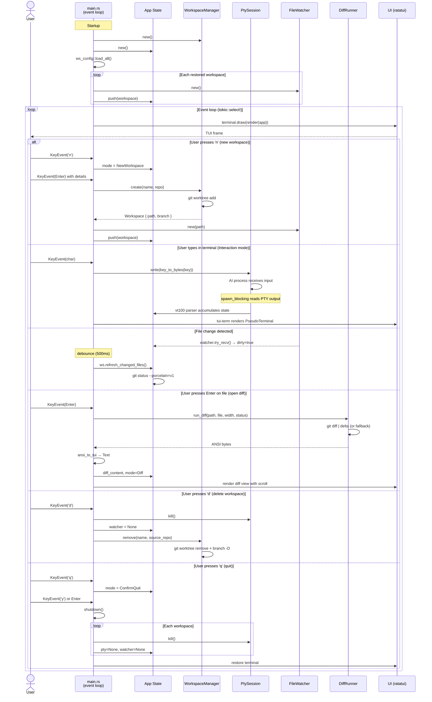

### Key design decisions

- **portable-pty** (sync) wrapped with `tokio::task::spawn_blocking` for non-blocking PTY reads
- **vt100** parser accumulates terminal state; **tui-term** renders it as a ratatui widget
- **ansi-to-tui** converts delta's ANSI output to `ratatui::text::Text` for the diff view
- Workspaces start with no tabs; all tabs (Claude, Gemini, OpenCode, Kilo, Codex, Shell, Kanban, Code Review, API Explorer) are created on demand via `t` which opens a categorized menu (Shell, AI Agents, Tools); PTY-backed tabs each have their own session, while Kanban, Code Review, and API Explorer tabs manage their own state without PTY
- Worktrees are stored in `~/.local/share/piki-multi/worktrees/<project>/<name>` with branch names matching the workspace name exactly; Simple workspaces point directly to their source directory; Project workspaces scan sub-directories instead of running git operations
- Event-driven architecture: `crossterm::EventStream` + `tokio::select!` in `event_loop.rs` for truly async event loop; key handlers return `Option<Action>`, `action.rs` executes actions asynchronously
- STATUS panel uses `git status --porcelain=v1` for full coverage of untracked, staged, conflicted, and renamed files
- Diff runner uses `git diff --no-index /dev/null <file>` for untracked files
- **Structured logging** to file via `tracing` (not to terminal) — TUI output is unaffected; logs rotate daily in `~/.local/share/piki-multi/logs/`

### Performance optimizations

- **Dirty-flag rendering** — UI only redraws when state actually changes (key/mouse events, PTY output, file watcher, resize), eliminating redundant 50ms tick redraws and reducing idle CPU usage
- **parking_lot::Mutex** — Fast, non-poisoning mutex for the vt100 parser eliminates frame drops caused by `try_lock` failures during heavy PTY output
- **Selective diff cache invalidation** — Only invalidates cached diffs for files that changed, preserving expensive delta renders for unmodified files
- **Zero-allocation fuzzy search** — Fuzzy match results store indices into the file list instead of cloning path strings, eliminating per-keystroke allocations
- **Async config persistence** — Workspace config saves run in background tasks via `tokio::spawn`, preventing event loop blocking on file I/O
- **16KB PTY read buffer** — Larger read buffer reduces mutex lock frequency during high-throughput terminal output
- **LRU diff cache** — Replaces naive clear-all-at-capacity eviction with LRU, preserving recently-viewed diffs when the cache is full
- **Zero-allocation footer** — Footer key descriptions use `&'static str` instead of per-frame `String` allocations, and width calculations use arithmetic instead of `format!()`
- **Minimal tokio features** — Only compiles required tokio features (`rt-multi-thread`, `macros`, `process`, `time`, `sync`, `fs`) instead of `"full"`, reducing compile time and binary size
- **Event-driven loop** — Uses `crossterm::EventStream` + `tokio::select!` instead of blocking `event::poll`, eliminating 0-50ms latency on async results (git refresh, fuzzy scan) and achieving true zero-CPU idle

## License

GPL-2.0 — See [LICENSE](LICENSE) for details.
