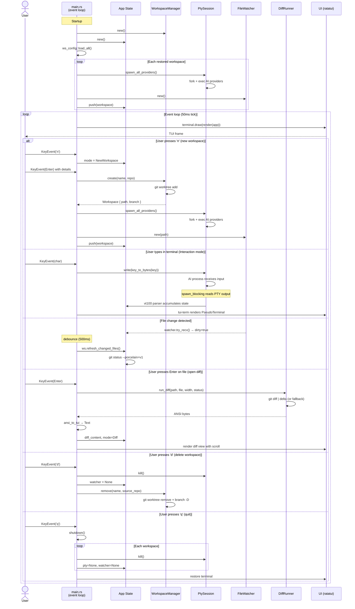

# agent-multi (v1.0.0)

A terminal UI for orchestrating multiple [Claude Code](https://docs.anthropic.com/en/docs/claude-code) instances in parallel, each running in its own isolated git worktree.

Built with Rust and [ratatui](https://ratatui.rs/). Inspired by [superset.sh](https://github.com/supermaven-inc/superset.sh).


## Features

- **Parallel workspaces** — Run multiple AI coding sessions simultaneously, each in an isolated git worktree
- **Multi-AI provider** — Sub-tabs for Claude Code, Gemini CLI, Codex, and a local Shell per workspace; cycle with `g`
- **Live terminal rendering** — See AI assistant output in real-time with full ANSI color support via `tui-term`
- **Interactive input** — Type directly into any AI session (Enter on the terminal pane to interact)
- **Git branch-style naming** — Workspace names support `/`, `.`, `-`, `_` (e.g. `feature/login`, `bugfix/issue-42`)
- **Rich workspace list** — Each workspace shows name, description, worktree path, status, and file count
- **File watching** — Automatically detects file changes in each worktree using `notify`
- **Full git status** — STATUS panel shows all file states: modified, staged, untracked, conflicted, renamed, and more via `git status --porcelain=v1`
- **Side-by-side diffs** — View diffs as a floating overlay rendered by [delta](https://github.com/dandavison/delta) with ANSI colors preserved (terminal stays visible behind)
- **Tab navigation** — Switch between workspaces with Tab, Shift+Tab, or number keys 1-9
- **Vim-style navigation** — j/k for movement, Enter to activate, Esc to go back
- **Customizable themes** — Colors loaded from TOML files; supports named colors and hex `#rrggbb`

## Prerequisites

- [Rust](https://rustup.rs/) >= 1.85 (edition 2024)
- [Claude Code CLI](https://docs.anthropic.com/en/docs/claude-code) (`claude` in PATH)
- [git](https://git-scm.com/) >= 2.20 (worktree support)
- [delta](https://github.com/dandavison/delta) (optional, for side-by-side diffs — falls back to plain git diff)

## Installation

```bash
git clone https://github.com/your-user/agent-multi.git
cd agent-multi
cargo build --release
```

The binary will be at `target/release/piki-multi-ai`.

Or use the install script:

```bash
./install.sh              # installs to ~/.local/bin
./install.sh -d /usr/local/bin  # custom directory
```

## Usage

```bash
piki-multi-ai
```

### Creating Workspaces

Press `n` to open the New Workspace dialog. Provide:
- **Name:** The git branch name (supports `/`, `.`, `-`, `_`).
- **Dir:** The path to the source git repository.
- **Desc:** (Optional) A brief description of the task.

Press `Enter` to create or `Esc` to cancel.

### Persistence

Workspace configurations are saved automatically and restored on startup.

- **Storage:**
  - `~/.local/share/piki-multi/worktrees/<project-name>/<workspace-name>/` (git worktrees)
  - `~/.local/share/piki-multi/workspaces/<project-name>.json` (workspace config per project)

- **Restoration:**
  - On startup, `piki-multi-ai` scans the config directory and restores all valid workspaces.
  - Stale entries (worktrees deleted manually) are cleaned up automatically.
  - Robust de-duplication ensures each workspace is loaded only once.

### Layout

```
+------------------+-------------------------------------------------------+
| WORKSPACES       |  [ ws-1 ]  [ ws-2 ]  [ ws-3 ]   (tabs)               |
|                  |  [ Claude Code ] [ Gemini ] [ Codex ] [ Shell ]      |
|  ▶ ws-1 (active) |-------------------------------------------------------|
|    ● busy | 3    |                                                       |
|    Fix login bug |  AI assistant live terminal output                    |
|    ~/.local/...  |  (diff opens as floating overlay)                     |
|                  |                                                       |
|    ws-2          |                                                       |
|------------------+                                                       |
| STATUS           |                                                       |
|                  |-------------------------------------------------------|
|  M src/auth.rs   |  branch: feature/ws-1 | 3 files | Claude Code: busy  |
|  A src/new.rs    +-------------------------------------------------------+
|  ? untracked.txt |
+------------------+--------------------------------------------------------+
  [n] new  [d] delete  [Tab] switch  [g] switch AI  [?] help  [q] quit
```

### File status indicators

The STATUS panel uses `git status --porcelain=v1` and shows:

| Indicator | Meaning | Color |
|-----------|---------|-------|
| `M` | Modified (unstaged) | Yellow |
| `A` | Added (staged new file) | Green |
| `D` | Deleted | Red |
| `R` | Renamed | Cyan |
| `?` | Untracked | Dark gray |
| `C` | Conflicted (merge conflict) | Magenta |
| `S` | Staged (index only) | Green |
| `SM` | Staged + modified in working tree | Yellow |

### Keybindings

The UI uses a **vim-style modal model**: navigate between panes, then press Enter to interact.

**Navigation mode** (yellow border):

| Key | Action |
|-----|--------|
| `h` / `j` / `k` / `l` | Move between panes |
| `Enter` | Interact with selected pane |
| `n` | Create new workspace |
| `d` | Delete selected workspace |
| `Tab` / `Shift+Tab` | Next / previous workspace |
| `1`-`9` | Jump to workspace N |
| `g` | Cycle AI provider (Claude → Gemini → Codex → Shell) |
| `?` | Help overlay |
| `q` | Quit |

**Interaction mode** (green border):

| Key | Action |
|-----|--------|
| `Ctrl+g` | Back to navigation mode |
| *Terminal pane* | All keys forwarded to AI provider |
| *Workspace list* | `j`/`k` select, `Enter` activate |
| *File list* | `j`/`k` select, `Enter` open diff |

**In diff view:**

| Key | Action |
|-----|--------|
| `j` / `k` | Scroll up/down |
| `Ctrl+d` / `Ctrl+u` | Page down/up |
| `g` / `G` | Top / bottom |
| `n` / `p` | Next / previous file |
| `Ctrl+g` | Close diff |

## Theming

All UI colors are customizable via TOML theme files. Without configuration, the built-in defaults are used.

### Setup

1. Create the config directory and select a theme:

```bash
mkdir -p ~/.config/piki-multi/themes
echo 'theme = "my-theme"' > ~/.config/piki-multi/config.toml
```

2. Create your theme file at `~/.config/piki-multi/themes/my-theme.toml`. You only need to specify the colors you want to override — everything else falls back to defaults:

```toml
[border]
active_interact = "#88c0d0"
active_navigate = "#ebcb8b"

[file_list]
modified = "#ebcb8b"
added = "#a3be8c"
deleted = "#bf616a"
```

See `themes/default.toml` in the repo for all available color keys. Colors can be named (`"Red"`, `"DarkGray"`, `"LightCyan"`, etc.) or hex (`"#rrggbb"`).

### Included themes

| Theme | Description |
|-------|-------------|
| `default` | Standard terminal colors (named colors) |
| `nord` | Arctic, muted dark palette |
| `tokyonight` | Dark blue-tinted palette |
| `synthwave` | Neon retro-futuristic |
| `solarized-light` | Warm light background |
| `catppuccin-latte` | Pastel light palette |

The `install.sh` script copies all themes to `~/.config/piki-multi/themes/` (existing files are not overwritten).

## Architecture

```
src/
  main.rs              # Tokio main loop, event handling, action dispatch
  app.rs               # App state, Workspace model, git status parsing
  theme.rs             # Theme loading from TOML, color parsing
  pty/
    session.rs         # PTY management (portable-pty + vt100 parser)
    input.rs           # Crossterm key events -> PTY bytes
  ui/
    layout.rs          # Full TUI layout (all panels, overlays)
    terminal.rs        # Live PTY rendering (tui-term)
    diff.rs            # Diff rendering (ansi-to-tui)
  workspace/
    manager.rs         # Git worktree CRUD
    config.rs          # Workspace config persistence (JSON)
    watcher.rs         # File system watcher (notify)
  diff/
    runner.rs          # git diff | delta pipeline (with untracked file support)
```

### Sequence diagram



### Key design decisions

- **portable-pty** (sync) wrapped with `tokio::task::spawn_blocking` for non-blocking PTY reads
- **vt100** parser accumulates terminal state; **tui-term** renders it as a ratatui widget
- **ansi-to-tui** converts delta's ANSI output to `ratatui::text::Text` for the diff view
- Each workspace gets its own PTY session and file watcher, running independently
- Worktrees are stored in `~/.local/share/piki-multi/worktrees/<project>/<name>` with branch names matching the workspace name exactly
- Event-driven architecture: key handlers return `Option<Action>`, main loop executes actions asynchronously
- STATUS panel uses `git status --porcelain=v1` for full coverage of untracked, staged, conflicted, and renamed files
- Diff runner uses `git diff --no-index /dev/null <file>` for untracked files

## License

GPL-2.0 — See [LICENSE](LICENSE) for details.
