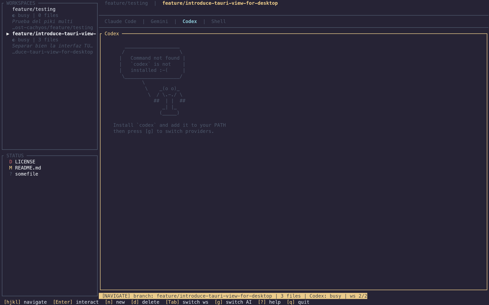
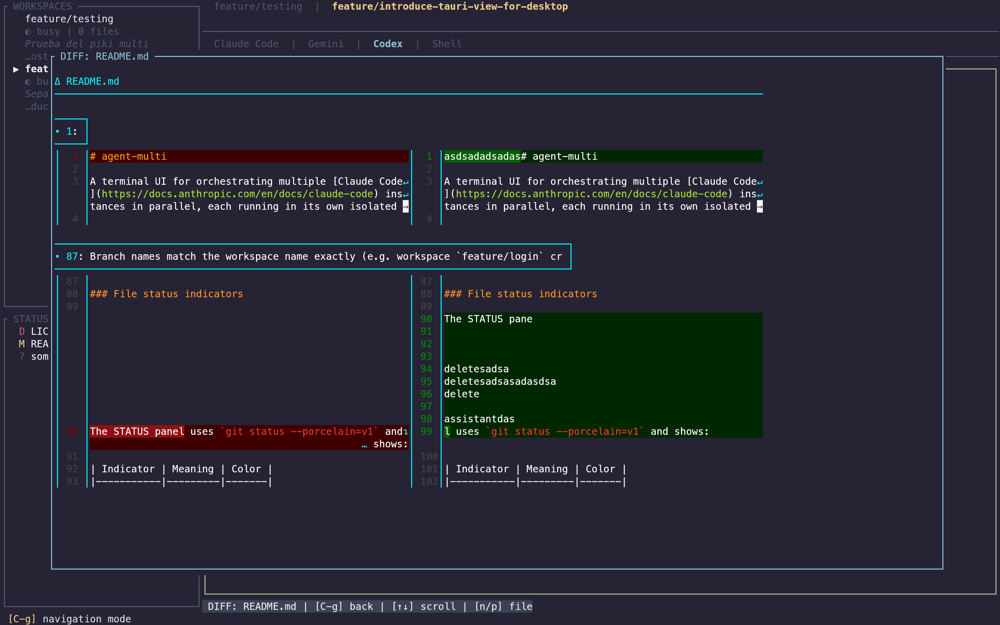
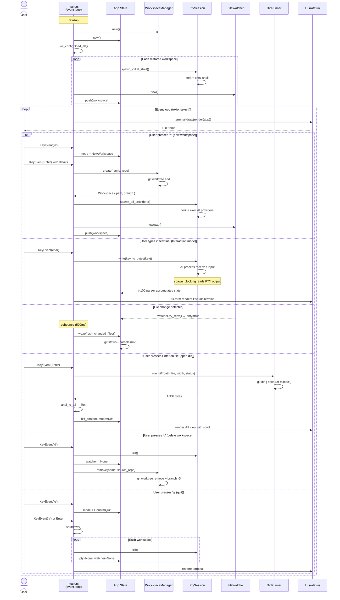

# agent-multi (v0.95.0)

A terminal UI for orchestrating multiple [Claude Code](https://docs.anthropic.com/en/docs/claude-code) instances in parallel, each running in its own isolated git worktree.

Built with Rust and [ratatui](https://ratatui.rs/). Inspired by [superset.sh](https://github.com/supermaven-inc/superset.sh).




## Features

- **Parallel workspaces** — Run multiple AI coding sessions simultaneously, each in an isolated git worktree
- **Dynamic tabs** — Each workspace starts with a Shell tab; create additional tabs on demand (`t`) for Claude Code, Gemini CLI, Codex, Kanban Board, or more shells; close tabs with `w`; cycle with `g`/`G`
- **Live terminal rendering** — See AI assistant output in real-time with full ANSI color support via `tui-term`
- **Interactive input** — Type directly into any AI session (Enter on the terminal pane to interact)
- **Git branch-style naming** — Workspace names support `/`, `.`, `-`, `_` (e.g. `feature/login`, `bugfix/issue-42`)
- **Rich workspace list** — Each workspace shows name, status, file count, and parent project; press `i` to view full details (branch, paths, description, prompt) in a copyable overlay
- **File watching** — Automatically detects file changes in each worktree using `notify`, with periodic refresh every 3s to catch commits and rebases
- **Full git status** — STATUS panel shows all file states: modified, staged, untracked, conflicted, renamed, and more via `git status --porcelain=v1`
- **Ahead/behind indicator** — STATUS panel border and status bar show `↑N to push` / `↓N behind` relative to upstream tracking branch
- **Side-by-side diffs** — View diffs as a floating overlay rendered by [delta](https://github.com/dandavison/delta) with ANSI colors preserved (terminal stays visible behind)
- **Tab navigation** — Switch between workspaces with Tab, Shift+Tab, or number keys 1-9
- **Vim-style navigation** — j/k for movement, Enter to activate, Esc to go back
- **Fuzzy file search** — Search all files in the active worktree with fuzzy matching powered by [nucleo](https://github.com/helix-editor/nucleo) (same engine as Helix editor), respects `.gitignore`
- **$EDITOR integration** — Open any file in your preferred editor (`$EDITOR` or `vi`); TUI suspends and resumes automatically
- **Inline editor** — Edit files directly inside the TUI with a built-in text editor (cursor movement, line numbers, scroll)
- **Clipboard support** — Paste from clipboard (`Ctrl+Shift+V`), copy visible terminal (`Ctrl+Shift+C`), and mouse drag-to-select with auto-copy; cross-platform (Wayland, X11, macOS, Windows)
- **Workspace prompts** — Optionally provide an initial prompt when creating a workspace; the prompt is auto-sent to the active tab on creation, enabling parallel AI orchestration
- **Git operations** — Stage (`s`), unstage (`u`), commit (`c`), push (`P`), and merge (`M`) directly from the TUI; commit dialog with inline message input
- **Pomodoro Timer** — Stay focused with a built-in Pomodoro timer (`t` -> `6`); configurable work/break durations and cycles; flashing visual alerts in the tab bar and main panel when a cycle ends
- **Merge/Apply changes** — Merge or rebase workspace branches into main directly from the TUI (`M`); supports merge commit and rebase strategies with conflict detection
- **System status header** — Live CPU%, RAM usage, battery level, and date/time displayed in a top header bar (powered by `systemstat`)
- **Full mouse support** — Click to focus panes, select workspaces/files, switch tabs, close tabs (×), scroll anywhere contextually; drag to resize borders or select text; overlays dismiss on click
- **Resizable panes** — Resize sidebar and workspace/file split with keyboard (`<`/`>`, `+`/`-`) or mouse drag on borders
- **Markdown viewer** — Preview `.md` files rendered in-terminal via `tui-markdown`; open from fuzzy search with `Ctrl+o`, scroll with `j/k`, `Ctrl+d/u`, `g/G`, or mouse wheel; read-only interact mode; close tab with `w`
- **Customizable configuration** — Keybindings and themes loaded from `~/.config/piki-multi/config.toml`
- **Customizable themes** — Colors loaded from TOML files; supports named colors and hex `#rrggbb`
- **Pre-flight checks** — Validates required (git >= 2.20) and optional dependencies (claude, gemini, codex, delta) at startup with clear error/warning messages
- **Structured logging** — File-based structured logging via `tracing` with daily rotation to `~/.local/share/piki-multi/logs/`; configurable via `--log-level` flag (trace/debug/info/warn/error)

## Prerequisites

- [Rust](https://rustup.rs/) >= 1.85 (edition 2024)
- [Claude Code CLI](https://docs.anthropic.com/en/docs/claude-code) (`claude` in PATH)
- [git](https://git-scm.com/) >= 2.20 (worktree support)
- [delta](https://github.com/dandavison/delta) (optional, for side-by-side diffs — falls back to plain git diff)

## Installation

```bash
git clone https://github.com/your-user/agent-multi.git
cd agent-multi
cargo build --release
```

The binary will be at `target/release/piki-multi-ai`.

Or use the install script:

```bash
./install.sh              # installs to ~/.local/bin
./install.sh -d /usr/local/bin  # custom directory
```

## Usage

```bash
piki-multi-ai [COMMAND]
```

### Options

- `-h`, `--help`: Print help
- `-V`, `--version`: Print version
- `--log-level <LEVEL>`: Set logging verbosity — `trace`, `debug`, `info` (default), `warn`, `error`. Logs are written to `~/.local/share/piki-multi/logs/`

### Commands

#### `generate-config`

Generates a complete configuration file with all default keybindings and options to stdout:

```bash
piki-multi-ai generate-config > ~/.config/piki-multi/config.toml
```

#### `version`

Shows version and author information (same as the **About** overlay in-app):

```bash
piki-multi-ai version
```

### Creating Workspaces

Press `n` to open the New Workspace dialog. Provide:
- **Name:** The git branch name (supports `/`, `.`, `-`, `_`).
- **Dir:** The path to the source git repository.
- **Desc:** (Optional) A brief description of the task.
- **Prompt:** (Optional) An initial prompt to auto-send to the AI provider on creation.
- **Kanban Path:** (Optional) Path to the Kanban board for this workspace (defaults to `~/.config/flow/boards/default`). If a local path is provided and no `board.txt` exists there, a default board with 4 columns (`todo`, `in_progress`, `in_review`, `done`) will be created automatically.

Press `Enter` to create or `Esc` to cancel. Use `Tab` to cycle between fields.

### Editing Workspaces

Press `e` on a selected workspace to modify its **Kanban Path** or **initial Prompt**. This is useful for re-directing a workspace to a specific task board or updating the orchestration instructions.

### Persistence

Workspace configurations are saved automatically and restored on startup.

- **Storage:**
  - `~/.local/share/piki-multi/worktrees/<project-name>/<workspace-name>/` (git worktrees)
  - `~/.local/share/piki-multi/workspaces/<project-name>.json` (workspace config per project)

- **Restoration:**
  - On startup, `piki-multi-ai` scans the config directory and restores all valid workspaces.
  - Stale entries (worktrees deleted manually) are cleaned up automatically.
  - Robust de-duplication ensures each workspace is loaded only once.

### Layout

```
 [CPU] 12%  [RAM] 4.2/16.0G  [BAT] 85%  [TIME] 2026-03-07 14:32
+------------------+-------------------------------------------------------+
| WORKSPACES       |  [ ws-1 ]  [ ws-2 ]  [ ws-3 ]   (workspace tabs)     |
|                  |  [ Shell ]  [ Claude Code × ]    (dynamic sub-tabs)   |
|  ▶ ws-1 (active) |-------------------------------------------------------|
|    ● busy | 3    |                                                       |
|    ⌂ my-project  |  AI assistant live terminal output                    |
|                  |  (diff opens as floating overlay)                     |
|                  |                                                       |
|    ws-2          |                                                       |
|------------------+                                                       |
| STATUS           |                                                       |
|                  |-------------------------------------------------------|
|  M src/auth.rs   | branch: ws-1 | 3 files | ↑1 unpushed | Shell: busy   |
|  A src/new.rs    +-------------------------------------------------------+
|  ? untracked.txt |
| ↑1 to push      |
+------------------+--------------------------------------------------------+
  [hjkl] navigate [n] new ws [r] clone ws [t] new tab [w] close tab [g/G] next/prev tab
  [c] commit [P] push [M] merge [Tab] switch ws [/] search [i] info [?] help [a] about [q] quit
```

### File status indicators

The STATUS panel uses `git status --porcelain=v1` and shows:

| Indicator | Meaning | Color |
|-----------|---------|-------|
| `M` | Modified (unstaged) | Yellow |
| `A` | Added (staged new file) | Green |
| `D` | Deleted | Red |
| `R` | Renamed | Cyan |
| `?` | Untracked | Dark gray |
| `C` | Conflicted (merge conflict) | Magenta |
| `S` | Staged (index only) | Green |
| `SM` | Staged + modified in working tree | Yellow |

### Keybindings

The UI uses a **vim-style modal model**: navigate between panes, then press Enter to interact. **All keybindings are customizable** via `config.toml`. Both the footer and the help overlay (`?`) update dynamically to show your current configuration.

**Default Navigation mode** (yellow border):

| Key | Action |
|-----|--------|
| `h` / `j` / `k` / `l` | Move between panes |
| `Enter` | Interact with selected pane |
| `n` | Create new workspace |
| `r` | Clone workspace (new workspace pre-filled with directory, prompt, and kanban path) |
| `e` | Edit workspace options (Kanban path, Prompt) |
| `d` | Delete selected workspace |
| `Tab` / `Shift+Tab` | Next / previous workspace |
| `1`-`9` | Jump to workspace N |
| `t` | New tab (opens provider selection: 1=Claude, 2=Gemini, 3=Codex, 4=Shell, 5=Kanban Board, 6=Pomodoro Timer) |
| `w` | Close current tab (with confirmation dialog; initial shell tab cannot be closed) |
| `g` / `G` | Next / previous tab |
| `<` / `>` | Resize sidebar width (±5%) |
| `+` / `-` | Resize workspace/file split (±10%) |
| `/` or `Ctrl+f` | Fuzzy file search |
| `c` | Commit (opens dialog) |
| `P` | Push |
| `M` | Merge workspace branch into main |
| `i` | Workspace info overlay (branch, paths, description, prompt; mouse-copyable) |
| `?` | Help overlay |
| `a` | About overlay |
| `q` | Quit (with confirmation dialog) |

**Interaction mode** (green border):

| Key | Action |
|-----|--------|
| `Ctrl+g` | Back to navigation mode |
| *Terminal pane* | All keys forwarded to active tab |
| *Workspace list* | `j`/`k` select, `Enter` switch, `d` delete |
| *File list* | `j`/`k` select, `Enter` open diff, `e` open in $EDITOR, `v` inline editor, `s` stage, `u` unstage |
| *Markdown tab* | `j`/`k` scroll, `Ctrl+d`/`Ctrl+u` page, `g`/`G` top/bottom (read-only) |
| *Kanban tab* | `h/l/j/k` navigate, `H/L` move card, `n` new card, `e` edit card, `d` delete, `Enter` details, `Esc` close modal |
| *Pomodoro tab* | `s` start/pause/dismiss alert, `r` reset |

**In diff view:**

| Key | Action |
|-----|--------|
| `j` / `k` | Scroll up/down |
| `Ctrl+d` / `Ctrl+u` | Page down/up |
| `g` / `G` | Top / bottom |
| `n` / `p` | Next / previous file |
| `Esc` | Close diff |

**In fuzzy search** (`/` or `Ctrl+f`):

| Key | Action |
|-----|--------|
| *type* | Filter files by fuzzy match |
| `↑` / `↓` | Select result |
| `Enter` | Open diff of selected file (if it has changes) |
| `Ctrl+e` | Open in $EDITOR |
| `Ctrl+v` | Open in inline editor |
| `Ctrl+o` | Open markdown file in a new tab (`.md` / `.markdown` only) |
| `Alt+m` | Open markdown file in external `mdr` viewer |
| `Esc` | Close search |

**Pane resize:**

| Key | Action |
|-----|--------|
| `<` / `>` | Resize sidebar width (±5%) |
| `+` / `-` | Resize workspace/file split (±10%) |
| Mouse drag on border | Drag pane borders to resize |

**Mouse:**

| Action | Effect |
|--------|--------|
| Click workspace list | Focus pane and switch to clicked workspace |
| Click file list | Focus pane and select clicked file |
| Click main panel | Focus pane and start text selection |
| Click workspace tab | Switch to that workspace |
| Click sub-tab | Switch to that tab |
| Click × on sub-tab | Close that tab (with confirmation) |
| Scroll in workspace list | Navigate workspaces up/down |
| Scroll in file list | Navigate files up/down |
| Scroll in main panel | Scroll terminal/markdown content |
| Scroll in Help/Diff overlay | Scroll overlay content |
| Scroll in fuzzy search | Navigate results |
| Click on Help/About/Info overlay | Dismiss overlay |
| Drag on border | Resize pane split |
| Drag in terminal | Select text (auto-copies on release) |

**Clipboard:**

| Key | Action |
|-----|--------|
| `Ctrl+Shift+V` | Paste from system clipboard (terminal interaction mode) |
| `Ctrl+Shift+C` | Copy visible terminal content (both modes) |
| Mouse drag | Select text in terminal pane (auto-copies on release) |

**In inline editor:**

| Key | Action |
|-----|--------|
| `Ctrl+s` | Save file |
| `Esc` | Close editor (discard unsaved changes) |
| Arrow keys | Move cursor |
| `Tab` | Insert 4 spaces |

## Configuration & Theming

All UI aspects, including keybindings and themes, are customizable via `~/.config/piki-multi/config.toml`.

### Setup

1. Create the config directory and select a theme:

```bash
mkdir -p ~/.config/piki-multi/themes
echo 'theme = "nord"' > ~/.config/piki-multi/config.toml
```

### Keybindings

You can override any default keybinding in the `[keybindings]` section of `config.toml`. Keybindings are organized by mode:

- `navigation`: Main UI navigation (moving between panes, global actions)
- `interaction`: Actions while interacting with a pane (copy, paste, exit)
- `markdown`: Markdown viewer controls (scrolling)
- `diff`: Diff viewer controls (scrolling, file navigation)
- `workspace_list`: Actions while in the workspace list
- `file_list`: Actions while in the file list
- `fuzzy`: Fuzzy search controls
- `editor`: Inline editor controls
- `new_workspace`: New workspace dialog controls
- `commit`: Commit message dialog controls
- `merge`: Merge confirmation dialog controls
- `new_tab`: New tab dialog controls
- `help` / `about` / `workspace_info`: Overlay controls

Example:
```toml
theme = "nord"

[keybindings.navigation]
quit = "ctrl-q"
new_workspace = "ctrl-n"

[keybindings.interaction]
exit_interaction = "esc"

[keybindings.fuzzy]
editor = "ctrl-o"  # Change open in editor from default ctrl-e
```

Keys support `ctrl-`, `alt-`, and `shift-` prefixes (e.g., `ctrl-shift-c`). You can use special key names like `enter`, `tab`, `backspace`, `esc`, `left`, `right`, `up`, `down`, `pageup`, `pagedown`, `home`, `end`, `insert`, `delete`, and function keys `f1`-`f12`.

### Themes

All UI colors are customizable via TOML theme files. Without configuration, the built-in defaults are used.

1. Theme files are located at `~/.config/piki-multi/themes/<name>.toml`. You only need to specify the colors you want to override — everything else falls back to defaults:

```toml
[border]
active_interact = "#88c0d0"
active_navigate = "#ebcb8b"

[file_list]
modified = "#ebcb8b"
added = "#a3be8c"
deleted = "#bf616a"
```

See `themes/default.toml` in the repo for all available color keys. Colors can be named (`"Red"`, `"DarkGray"`, `"LightCyan"`, etc.) or hex (`"#rrggbb"`).

### Included themes

| Theme | Description |
|-------|-------------|
| `default` | Standard terminal colors (named colors) |
| `nord` | Arctic, muted dark palette |
| `tokyonight` | Dark blue-tinted palette |
| `synthwave` | Neon retro-futuristic |
| `solarized-light` | Warm light background |
| `catppuccin-latte` | Pastel light palette |

The `install.sh` script copies all themes to `~/.config/piki-multi/themes/` (existing files are not overwritten).

## Architecture

The project is organized as a Cargo workspace with a shared core library:

```
Cargo.toml               # Workspace root
crates/
  core/                  # piki-core — shared library (no TUI dependencies)
    src/
      domain.rs          # AIProvider, FileStatus, ChangedFile, WorkspaceStatus, WorkspaceInfo
      git.rs             # Git status parsing, ahead/behind detection
      pty/
        session.rs       # PTY management (portable-pty + vt100 parser)
      workspace/
        manager.rs       # Git worktree CRUD
        config.rs        # Workspace config persistence (JSON)
        watcher.rs       # File system watcher (notify)
      diff/
        runner.rs        # git diff | delta pipeline (with untracked file support)
      sysinfo.rs         # System info poller (CPU, RAM, battery via systemstat + chrono)
      preflight.rs       # Pre-flight dependency checks (git version, optional tools)
  tui/                   # TUI binary (piki-multi-ai) — depends on piki-core
    src/
      main.rs            # Tokio main loop, event handling, action dispatch
      app.rs             # TUI app state, Workspace wrapper, UI-specific types
      clipboard.rs       # System clipboard read/write (Wayland, X11, macOS, Windows)
      theme.rs           # Theme loading from TOML, color parsing (ratatui)
      config.rs          # Global configuration and keybindings (TOML, crossterm)
      pty/
        input.rs         # Crossterm key events -> PTY bytes
      ui/
        layout.rs        # Full TUI layout (all panels, overlays)
        terminal.rs      # Live PTY rendering (tui-term)
        diff.rs          # Diff rendering (ansi-to-tui)
        fuzzy.rs         # Fuzzy search overlay (nucleo matching + ignore walker)
        markdown.rs      # Markdown file viewer (tui-markdown)
        editor.rs        # Inline file editor renderer
```

### Sequence diagram



### Key design decisions

- **portable-pty** (sync) wrapped with `tokio::task::spawn_blocking` for non-blocking PTY reads
- **vt100** parser accumulates terminal state; **tui-term** renders it as a ratatui widget
- **ansi-to-tui** converts delta's ANSI output to `ratatui::text::Text` for the diff view
- Each workspace starts with a single Shell tab; additional tabs (Claude, Gemini, Codex, Shell) are created on demand, each with its own PTY session
- Worktrees are stored in `~/.local/share/piki-multi/worktrees/<project>/<name>` with branch names matching the workspace name exactly
- Event-driven architecture: `crossterm::EventStream` + `tokio::select!` for truly async event loop; key handlers return `Option<Action>`, main loop executes actions asynchronously
- STATUS panel uses `git status --porcelain=v1` for full coverage of untracked, staged, conflicted, and renamed files
- Diff runner uses `git diff --no-index /dev/null <file>` for untracked files
- **Structured logging** to file via `tracing` (not to terminal) — TUI output is unaffected; logs rotate daily in `~/.local/share/piki-multi/logs/`

### Performance optimizations

- **Dirty-flag rendering** — UI only redraws when state actually changes (key/mouse events, PTY output, file watcher, resize), eliminating redundant 50ms tick redraws and reducing idle CPU usage
- **parking_lot::Mutex** — Fast, non-poisoning mutex for the vt100 parser eliminates frame drops caused by `try_lock` failures during heavy PTY output
- **Selective diff cache invalidation** — Only invalidates cached diffs for files that changed, preserving expensive delta renders for unmodified files
- **Zero-allocation fuzzy search** — Fuzzy match results store indices into the file list instead of cloning path strings, eliminating per-keystroke allocations
- **Async config persistence** — Workspace config saves run in background tasks via `tokio::spawn`, preventing event loop blocking on file I/O
- **16KB PTY read buffer** — Larger read buffer reduces mutex lock frequency during high-throughput terminal output
- **LRU diff cache** — Replaces naive clear-all-at-capacity eviction with LRU, preserving recently-viewed diffs when the cache is full
- **Zero-allocation footer** — Footer key descriptions use `&'static str` instead of per-frame `String` allocations, and width calculations use arithmetic instead of `format!()`
- **Minimal tokio features** — Only compiles required tokio features (`rt-multi-thread`, `macros`, `process`, `time`, `sync`, `fs`) instead of `"full"`, reducing compile time and binary size
- **Event-driven loop** — Uses `crossterm::EventStream` + `tokio::select!` instead of blocking `event::poll`, eliminating 0-50ms latency on async results (git refresh, fuzzy scan) and achieving true zero-CPU idle

## License

GPL-2.0 — See [LICENSE](LICENSE) for details.
