# agent-multi

[](https://github.com/juanknebel/piki-multi-ai/actions/workflows/nightly.yml)

A terminal UI for orchestrating multiple [Claude Code](https://docs.anthropic.com/en/docs/claude-code) instances in parallel — each running in its own isolated git worktree, pointing to an existing directory, or managing a multi-service project root. A [Tauri desktop app](#desktop-application) shares the same core and database.

Built with Rust and [ratatui](https://ratatui.rs/).

| Sidebar focused | Terminal focused |
|:---:|:---:|
| 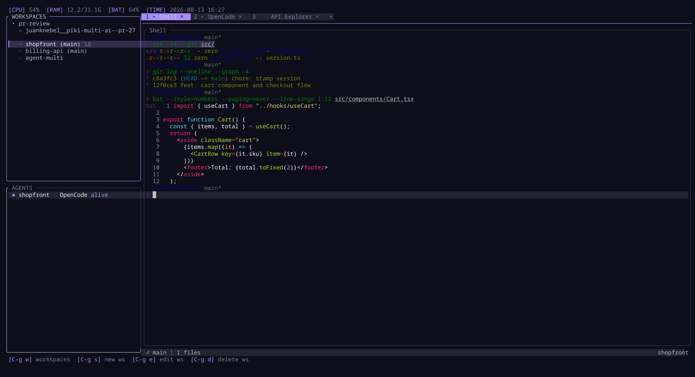 | 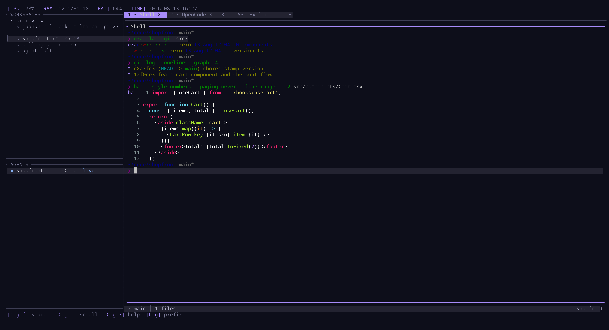 |

<details>
<summary><b>More screenshots</b> — dashboard, new-tab menu, agents, API explorer, code review</summary>

### Workspace Dashboard

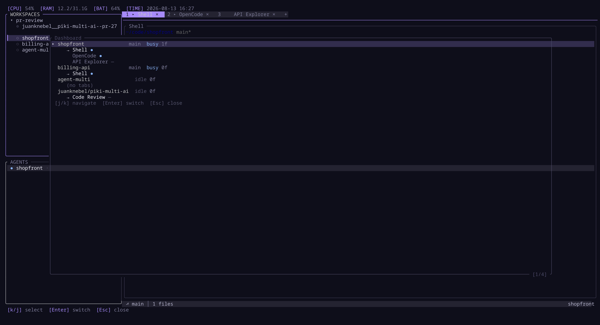

### New Tab (categorized menu)

| Main menu | AI Agents | Tools |
|:---:|:---:|:---:|
| 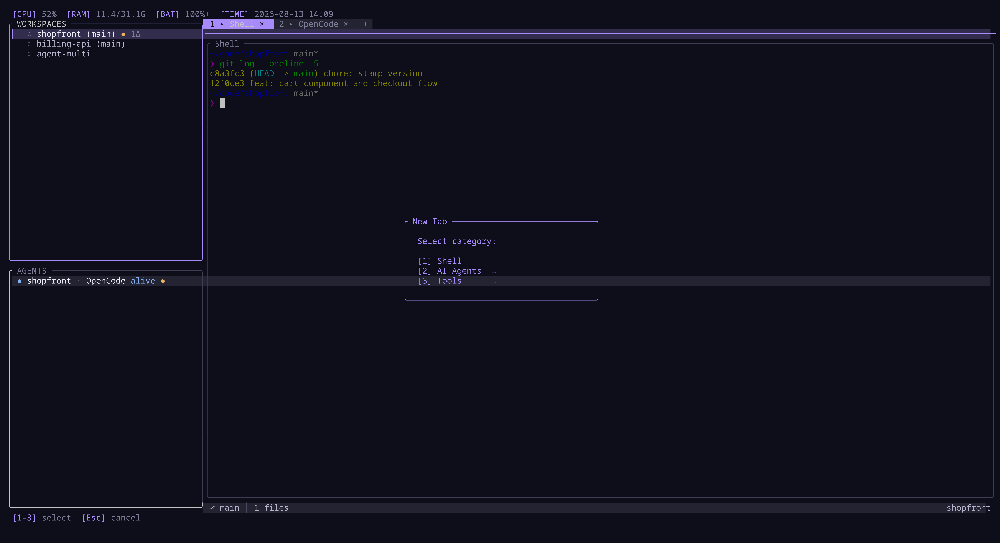 | 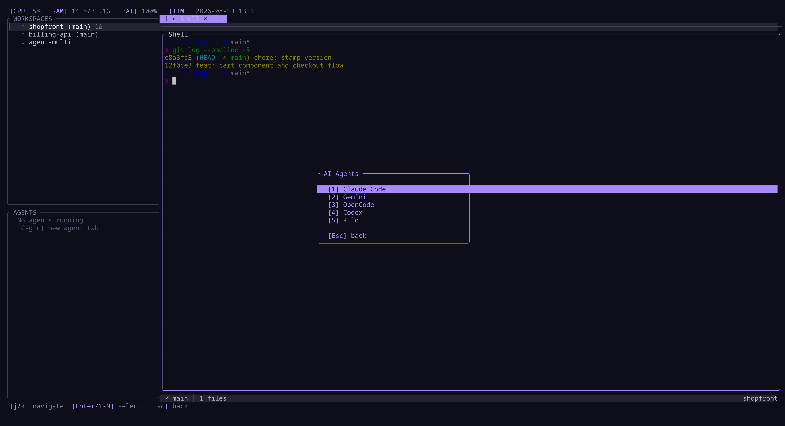 | 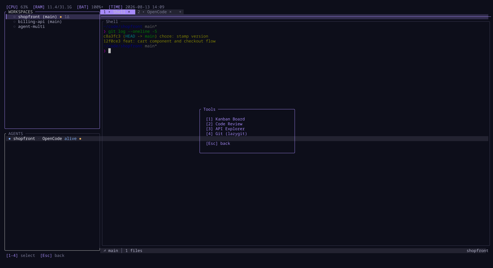 |

### AI Agent Tab

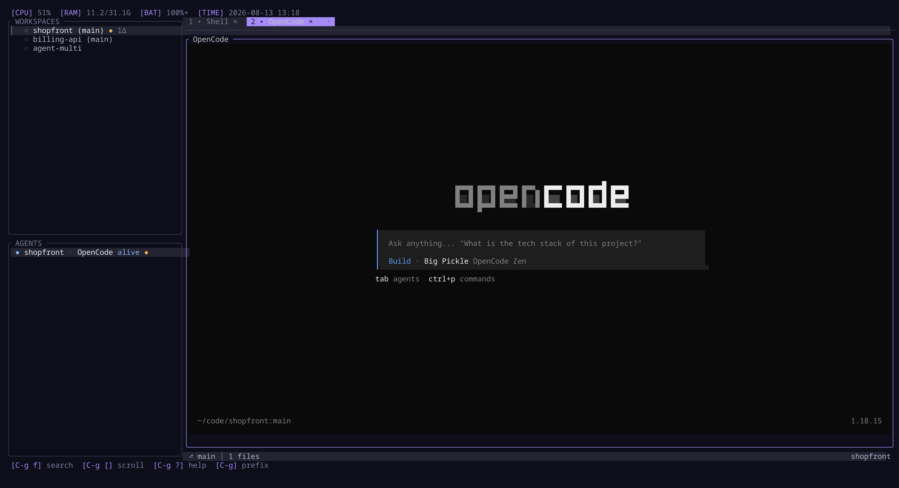

### API Explorer

| Request & Response | Response search |
|:---:|:---:|
| 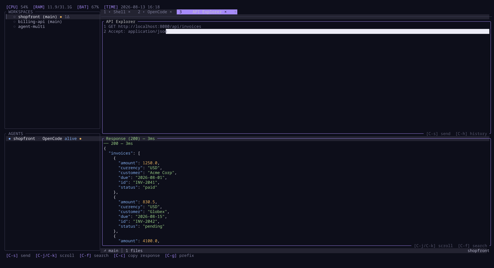 | 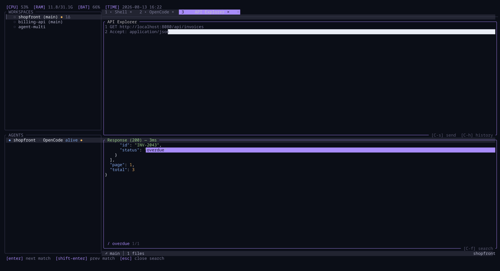 |

### Code Review

| Inline comment | General comment |
|:---:|:---:|
| 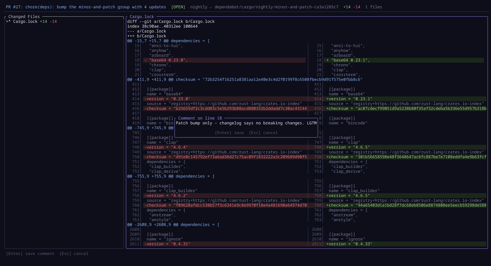 | 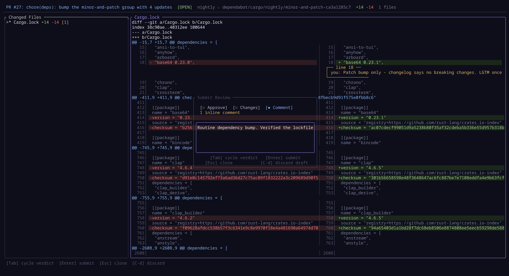 |

</details>

## Features

### Workspaces & orchestration

- **Parallel workspaces** — run multiple AI coding sessions simultaneously: isolated git worktrees, existing directories (Simple), or multi-service roots (Project)
- **Worktree families** — workspaces from the same repo nest automatically under a collapsible parent row, derived from the git worktree structure
- **Dynamic tabs** — workspaces start empty; open Shell, AI-agent, or Tool tabs on demand from a categorized menu; singletons focus instead of duplicating; any tab can be renamed
- **Workspace dashboard & switcher** — bird's-eye overview of the workspaces with open tabs (empty ones hidden), grouped by worktree family with the parent first, with status and git info; also lists **external agents** (`claude`, `codex`, `muse`, `agy`/`antigravity`, `gemini` processes started outside piki, found via `/proc`); fuzzy tree switcher and Alt-Tab-style previous-workspace toggle
- **Command palette** — VS Code-style fuzzy palette over every command, with recently-used ranking and live keybinding hints
- **SQLite persistence** — workspaces, UI preferences, and API history restore automatically on startup; the last focused workspace is remembered

### Sessions & terminal

- **Persistent sessions** — every terminal tab runs inside a lightweight background daemon ("tmux without the UI", designed after [shpool](https://github.com/shell-pool/shpool)): tabs survive quitting or crashing the app and re-attach on the next launch with screen and scrollback restored; shared between TUI and desktop; zero setup, no external dependency; managed in-app (TUI sessions overlay `Ctrl+G Ctrl+S`, desktop Sessions dialog `Alt+Shift+S`) or the `sessions` CLI; closing a running tab in the desktop offers *Keep running* to hand it back to the daemon, the status bar shows `sessions N` (click to manage), and orphan sessions can be adopted as tabs from either frontend
- **Live terminal rendering** — full ANSI terminal emulation via `vt100` + `tui-term`, with real-time output from every agent
- **tmux-style prefix keybindings** — keys always go to the focused pane; app actions live behind a one-shot `Ctrl+G` prefix; fully rebindable
- **Terminal search & scrollback** — search output, scroll mode, mouse-wheel scrollback that also captures inline-TUI transcripts
- **Clipboard & mouse** — drag-to-select with auto-copy, paste, click-to-focus, drag-to-resize, contextual scrolling everywhere (Wayland, X11, macOS, Windows)
- **Shell integration** — zsh/bash/fish tabs report cwd and per-command exit codes (OSC 133/7), feeding tab badges and notifications; user dotfiles are preserved

### AI agents

- **Multi-provider tabs** — Claude Code, Gemini, OpenCode, Kilo, Codex out of the box; add your own binaries via `providers.toml`
- **Structured agent lifecycle** — Claude Code and Antigravity tabs report precise running / needs-permission / idle / done states through hook-driven in-band events (no PTY-silence guessing), with graceful fallback to an idle heuristic
- **Agents pane** — one pane listing every running agent across all workspaces with live status and elapsed run time (`3m 12s`); jump straight to any of them. In the desktop, an agent that needs you is amber in the tab bar, status bar, Agents panel, workspace list and activity bar at once, and `Alt+A` lands on it from any workspace (permission requests first, then unseen news — press again to walk through them). Agents started outside piki (plain terminals, other apps) are surfaced too: in the TUI dashboard and, in the desktop, in an `External (n)` section of the Agents panel with a one-click terminal at their cwd
- **Agent profiles & dispatch** — define named agents per project, sync them to provider-native subagent files, and dispatch them from a kanban card into an auto-created worktree with a composed prompt
- **OS notifications** — agent-finished / needs-attention / command-finished toasts (or OSC 9 for tmux/ssh), with optional chimes and smart suppression when you're already looking at the tab; one `[notifications]` config serves the TUI and the desktop
- **AI Chat** — global chat panel backed by local LLMs (Ollama or llama.cpp) or remote via **OpenRouter** (key only in `config.toml` `[chat] openrouter_api_key` or `OPENROUTER_API_KEY` env — never prompted in chat; optional web search plugin), with an agentic tool-use mode that can inspect the active workspace; `Ctrl+Shift+I` (or the composer's `+`) drops what you are looking at — terminal selection, active file, its diff, editor selection — into the composer as a fenced block, and in agent mode every tool call is a collapsible card with inline Approve / Deny for write tools

### Built-in tools

- **Git via lazygit** — all git handling delegated to an embedded [lazygit](https://github.com/jesseduffield/lazygit) tab per workspace
- **Code Review** — pick any GitHub PR relevant to you, get an ephemeral checkout, review side-by-side diffs with inline comment threads, and submit via `gh`
- **Kanban board** — integrated task board powered by [flow](https://github.com/juanknebel/flow), with agent dispatch from cards
- **API Explorer** — HTTP client tab with Hurl-like syntax, pretty-printed responses, and searchable per-project history
- **File tools** — fuzzy file search ([nucleo](https://github.com/helix-editor/nucleo)), project-wide content search (ripgrep), inline editor with syntax highlighting, `$EDITOR` integration, markdown viewer
- **Observability** — in-app log viewer, structured file logging, live system status header

The full reference — CLI commands, every keybinding, workspace lifecycle, and internals — lives in [docs/technical.md](docs/technical.md).

## Desktop Application

A desktop GUI is available via `piki-desktop`, built with [Tauri v2](https://v2.tauri.app/). It reuses the same core logic and SQLite database as the TUI, so workspaces created in either interface are visible in the other — and, with persistent sessions, so are the terminal tabs.

Highlights on top of the shared feature set:

- **Editor-style shell** — menu bar, activity bar, sidebar views (Explorer, Files, Source Control) with the Agents panel always docked below them, a status bar with branch / changes / cwd / agent status / sessions, full keyboard accessibility with a visible focus ring everywhere
- **Panes with anything in them** — a tab is a tree of split panes (`Ctrl+\` / `Ctrl+Shift+\`); every pane holds one thing — a shell, an agent, a code or markdown editor, the web preview, the kanban board or the API explorer — picked from the blank pane, with *Move here* for the one-per-workspace tools; the layout, editors and previews included, is restored per workspace on the next launch
- **Tabs and sidebar** — middle-click closes a tab (a running process still gets its Close / Keep running / Cancel prompt), `+` and a `⋯` all-tabs list never scroll away, right-click menus on tabs (rename, split, move to another workspace with the process alive, close) and on workspace rows (open, agents, info, edit, create worktree, merge, delete), inline rename on double-click; deleting a workspace says what it removes, counts uncommitted changes and lists the agents it will stop
- **Workspace switcher** (`Ctrl+Space`) ranked by most-recently-used and matched fuzzily (`wsauth` finds `ws-auth`), with an agent / dirty-git glyph per row; `Alt+1…9` jumps directly
- **Agent signals** — an agent that needs you is amber in the tab bar, status bar, Agents panel, workspace list and activity bar at once; `Alt+A` lands on it from any workspace (permission requests first, then unseen news); elapsed run time per agent
- **Modern terminal** — xterm.js with WebGL; `Ctrl+click` opens links in the browser, Unicode 11 widths keep emoji and box-drawing aligned, the tab flashes on a bell and takes the shell's title (a rename always wins); copy on select (one clipboard write per selection, switchable), middle-click paste, a right-click menu, a search bar with `n/m` counter, regex and match-case; `Ctrl+Shift+E` sends the next key straight to the terminal past every app shortcut
- **Editors** — CodeMirror 6 code tabs with LSP support (diagnostics, completion, hover, go-to-definition), WYSIWYG markdown tabs, a read-only viewer with quick-edit; `Ctrl+F` finds a file (opens instantly, the index honours `.gitignore`) and `Enter` lands straight in an editor tab
- **Native git** — staging, commits and amend, pull / push with honest in-flight buttons (`↓N` / `↑N`, one operation at a time), per-file discard (confirmed; deletes an untracked file), a fuzzy branch switcher from the status bar, merge / rebase, stash, side-by-side diffs with conflict resolution, git log, live ahead/behind tracking, PR code review
- **Theming, zoom and density** — 5 built-in presets, a per-variable theme editor and drop-in theme files; light themes are first-class (every tint, scrim, shadow and code-block colour derives from the palette); `Ctrl+=` / `Ctrl+-` / `Ctrl+0` scale the whole interface and the terminal font together; a density setting (compact / normal / comfortable) changes row, bar and control heights independently — compact fits 25% more sidebar rows; the layout keeps the editor usable in small windows
- **Crisp chrome** — one SVG icon set drawn in the text colour (no platform-dependent emoji) and a lean font bundle (WOFF2 Nerd Font for the terminal, a 10 KB icon subset for the sidebar)
- **Settings dialog** (`Ctrl+,`) — General (shared with the TUI), Appearance, Terminal (font, size, line height, scrollback up to 100k, cursor, copy on select — applied live) and Shortcuts (every key rebindable, grouped by category, with a filter and conflict flags)
- **Extras** — file explorer with git decorations, web preview tab for local dev servers, kanban board, API explorer with history, AI chat panel with context injection and tool-call cards, system info dashboard, application log viewer; the window reopens with the size, position and maximized state it was closed with

The desktop layout, every shortcut and each panel are documented in [docs/technical.md](docs/technical.md#desktop-application).

## Installation

### Prerequisites

Required:

- [Rust](https://rustup.rs/) >= 1.85 (edition 2024)
- [git](https://git-scm.com/) >= 2.20 (worktree support)
- [Claude Code CLI](https://docs.anthropic.com/en/docs/claude-code) (`claude` in PATH)

Optional, feature-gated:

- [lazygit](https://github.com/jesseduffield/lazygit) — powers the Git tab
- [gh](https://cli.github.com/) — code review (`gh auth login` to authenticate)
- [ripgrep](https://github.com/BurntSushi/ripgrep) — project search (falls back to `grep -rn`)
- [jq](https://jqlang.github.io/jq/) — structured agent integration and API Explorer JSON filtering
- [Ollama](https://ollama.ai/), [llama.cpp](https://github.com/ggerganov/llama.cpp) or an [OpenRouter](https://openrouter.ai) key — AI Chat panel
- [Node.js](https://nodejs.org/) >= 18 — building the desktop app
- Tauri system libraries (desktop app on Linux): `libwebkit2gtk-4.1-dev`, `libappindicator3-dev`

### TUI

```bash
git clone https://github.com/juanknebel/piki-multi-ai.git
cd piki-multi-ai
./scripts/install.sh              # builds release + installs to ~/.local/bin
./scripts/install.sh -d /usr/local/bin  # custom directory
```

Or build manually with `cargo build --release` — the binary lands at `target/release/piki-multi-ai`.

### Desktop

```bash
./scripts/install-desktop.sh      # builds release binary + desktop entry + icons
```

The install script places the binary in `~/.local/bin/`, installs icons to `~/.local/share/icons/hicolor/`, and creates a `.desktop` entry so Piki Desktop appears in Linux application menus. To build manually:

```bash
cd crates/desktop/frontend && npm install && cd -
cd crates/desktop && cargo tauri build
# Binary at: target/release/piki-desktop
```

## Configuration & Theming

Configuration comes from two places:

- **`~/.config/piki-multi/config.toml`** — the TUI's theme and keybindings, notifications, persistent sessions, the kanban backing store; plus `providers.toml`, `lsp.toml` and the theme directories next to it. Both frontends read it.
- **The desktop Settings dialog** (`Ctrl+,`) — everything desktop-only (shortcuts, appearance, terminal look) and, under *General*, the two settings both frontends share: persistent sessions and notifications. Those are stored in the piki database and take precedence: **Settings dialog > `config.toml` > built-in default**, for the TUI as well, until you reset them in the dialog.

Generate a fully-commented `config.toml` starting point with:

```bash
mkdir -p ~/.config/piki-multi
piki-multi-ai generate-config > ~/.config/piki-multi/config.toml
```

### Settings dialog (desktop)

`Ctrl+,` (or Edit ▸ Settings / the command palette) opens a tabbed Settings dialog — nothing in it needs `config.toml`:

- **General** — persistent sessions on/off, notification delivery (system / host terminal / off), sound. These are the *shared* settings: they are stored in the piki database, so the TUI follows them too, and they win over `[sessions]` / `[notifications]` in `config.toml` until you reset the tab. Notifications switch live; sessions apply on the next launch (the dialog and the status bar say so).
- **Appearance** — the theme editor, density (compact / normal / comfortable) and UI zoom.
- **Terminal** — shell command, font, size, line height, scrollback, cursor, copy on select.
- **Shortcuts** — every rebindable key grouped by category, with a filter, the ° outside-only marker, and a ⚠ flag when two actions share a key.

*Restore Defaults* resets all of that except the shell command and the provider binaries.

### Keybindings

The `prefix_key` setting (default `"ctrl-g"`) defines the tmux-style prefix. The `[keybindings.app]` table holds all global actions; each value is either a single binding string or an array of alternatives. Strings starting with `prefix-` fire after the prefix key (e.g. `"prefix-c"` = `Ctrl+G c`); anything else is a **direct chord** that fires without the prefix (e.g. `"alt-n"`) — handy for promoting frequent actions, at the cost of shadowing that chord in the embedded terminal. Bindings that collide with each other or with the prefix key are ignored with a warning in the logs.

The remaining tables are per-surface local keys (`scroll`, `agents`, `markdown`, `workspace_list`, `fuzzy`, `editor`, `new_workspace`, `new_tab`, `dashboard`, `sessions`, `logs`, `help`, `about`, `workspace_info`).

```toml
theme = "nord"

[keybindings]
prefix_key = "ctrl-a"          # use Ctrl+A as the prefix, screen-style

[keybindings.app]
quit = "prefix-Q"              # Ctrl+A Q to quit
next_tab = ["prefix-n", "alt-n"]  # also bind Alt+N directly, no prefix

[keybindings.fuzzy]
editor = "ctrl-o"  # Change open in editor from default ctrl-e
```

Keys support `ctrl-`, `alt-`, and `shift-` modifiers (e.g., `ctrl-shift-c`), plus the `prefix-` marker in the `app` table. Special key names: `enter`, `tab`, `backspace`, `esc`, arrows, `pageup`/`pagedown`, `home`/`end`, `insert`, `delete`, and `f1`-`f12`. The default bindings are listed in [docs/technical.md](docs/technical.md#tui-keybindings), and the in-app help (`Ctrl+G ?`) always reflects your current configuration.

### Themes (TUI)

Theme files live at `~/.config/piki-multi/themes/<name>.toml`, selected with `theme = "<name>"` in `config.toml`. You only need to specify the colors you want to override — everything else falls back to defaults:

```toml
[border]
active = "#88c0d0"

[file_list]
modified = "#ebcb8b"
added = "#a3be8c"
deleted = "#bf616a"

[status]
needs_you = "#ebcb8b"
```

See `themes/piki-dark.toml` in the repo for all available color keys (including the `[status]` agent-state and `[diff]` code-review groups). Colors can be named (`"Red"`, `"DarkGray"`), `"Reset"` (terminal default), or hex (`"#rrggbb"`).

Included themes (copied to the config dir by `install.sh`, never overwriting):

| Theme | Description |
|-------|-------------|
| `default` | The built-in "Cabina" dark palette (violet ink, iris accent) |
| `piki-dark` | Same as `default`, under an explicit name |
| `piki-ansi` | Cabina degraded to the 16 ANSI colors, for terminals without truecolor |
| `nord` | Arctic, muted dark palette |
| `tokyonight` | Dark blue-tinted palette |
| `synthwave` | Neon retro-futuristic |
| `breeze` | KDE Plasma's signature dark palette with blue accent |
| `solarized-light` | Warm light background |
| `catppuccin-latte` | Pastel light palette |

### Themes (desktop)

The desktop app ships 5 built-in presets and also scans `~/.config/piki-multi/desktop-themes/` for `*.json` files at startup. Any valid file appears in the preset dropdown next to the built-ins, no recompilation needed:

```json
{
  "id": "my-theme",
  "name": "My Theme",
  "isDark": true,
  "colors": {
    "bg-primary": "#232629",
    "accent-primary": "#3daee9",
    "text-primary": "#eff0f1"
  }
}
```

- `id` must not collide with a built-in (`obsidian-dark`, `nord-dark`, `catppuccin-mocha`, `solarized-light`, `tokyo-night`); colliding files are ignored.
- `colors` is partial-friendly: any key you omit falls back to `obsidian-dark` (when `isDark: true`) or `solarized-light` (when `isDark: false`); invalid hex values are dropped silently.
- The Theme dialog's editor (`Alt+T`) lists every color key; a custom file may set any of them.

### Custom providers (`providers.toml`)

Add custom AI providers via `~/.config/piki-multi/providers.toml` (created with a default Claude entry on first startup). Each provider specifies the binary, arguments, and how prompts are passed:

```toml
[[providers]]
name = "My Custom AI"
description = "A custom AI tool"
command = "/usr/local/bin/my-ai"
default_args = ["--json"]
dispatchable = true
agent_dir = ".my-ai/agents"

[providers.prompt_format]
type = "Flag"          # "Positional" (bare arg), "Flag" (via flag), or "None"
value = "--task"
```

| Field | Description |
|-------|------------|
| `name` | Display name (shown in tab bar and menus) |
| `description` | Human-readable description |
| `command` | Binary path or name (resolved via `$PATH`) |
| `default_args` | Arguments always passed before prompt args |
| `prompt_format` | How prompts are passed: `Positional`, `Flag`, or `None` |
| `dispatchable` | Whether this provider appears in agent dispatch menus |
| `agent_dir` | Repo subdirectory for agent config files (e.g. `.claude/agents`) |

Custom providers appear alongside built-in providers in the New Tab menu and in agent dispatch dialogs, in both the TUI and the desktop app. Providers can also be managed in-app (`Ctrl+G v` in the TUI, Tools → Providers in the desktop).

### Notifications (`[notifications]`)

How background agent events reach you — the TUI and the desktop app both read this table:

```toml
[notifications]
delivery = "system"   # "system" (OS desktop toast, default) | "terminal" | "off"
sound = true          # built-in chimes; off by default
# Optional custom sounds (any format your system player decodes):
# sound_path = "~/sounds/ding.wav"            # used for all events
# sound_done_path = "~/sounds/done.wav"       # agent finished
# sound_attention_path = "~/sounds/hey.wav"   # agent needs you
```

- `delivery = "terminal"` emits an **OSC 9** escape so your terminal emulator (kitty, ghostty, …) shows its own notification — useful inside tmux or over ssh where a desktop toast can't reach you; the sequence is tmux-passthrough-wrapped automatically.
- **Sound is independent of `delivery`** — chimes play even with `delivery = "off"`. Ascending chime = task done; descending-then-up = agent needs input. Chimes fire only for agent events, never for plain shell commands.
- Nothing fires for the tab you're currently looking at while the window has focus.
- The desktop's Settings ▸ General (`Ctrl+,`) sets `delivery` and `sound` without editing this file; that choice is stored in the piki database, applies to the TUI as well, and wins over this table until you reset it there. The `sound_*_path` overrides stay file-only.
- Playback uses `pw-play`/`paplay`/`aplay` on Linux, `afplay` on macOS — no audio stack in piki itself. Set `PIKI_DISABLE_SOUND=1` to hard-mute regardless of config.

### Persistent sessions (`[sessions]`)

Persistent sessions are on by default and need no setup. To run every tab in-process instead (the pre-daemon behavior):

```toml
[sessions]
enabled = false
```

Or flip it in the desktop's Settings ▸ General (`Ctrl+,`): that choice is stored in the piki database, wins over this file for both frontends, and takes effect on the next launch (the status bar reads `sessions … (restart)` until then).

The daemon can be managed in-app (TUI sessions overlay `Ctrl+G Ctrl+S`, desktop Sessions dialog `Alt+Shift+S`) or from the CLI (`piki-multi-ai sessions list|kill|stop`); see [docs/technical.md](docs/technical.md#persistent-sessions) for the full behavior and [docs/persistent-sessions.md](docs/persistent-sessions.md) for the design.

### AI Chat (`[chat]`)

Local backends (Ollama, llama.cpp) need no configuration beyond picking the server in the chat settings. OpenRouter needs an API key, read only from this file or the `OPENROUTER_API_KEY` environment variable — the chat UI never asks for it:

```toml
[chat]
openrouter_api_key = "sk-or-..."
web_search = false   # OpenRouter web-search plugin (TUI: Ctrl+W toggles it per provider)
```

## Documentation

- [docs/technical.md](docs/technical.md) — the complete reference: CLI, layout, every keybinding, workspace lifecycle, agent integrations, architecture, and development workflow
- [docs/persistent-sessions.md](docs/persistent-sessions.md) — persistent-session daemon design and wire protocol
- [docs/performance.md](docs/performance.md) — event-loop performance model and invariants

## License

GPL-2.0 — See [LICENSE](LICENSE) for details.
