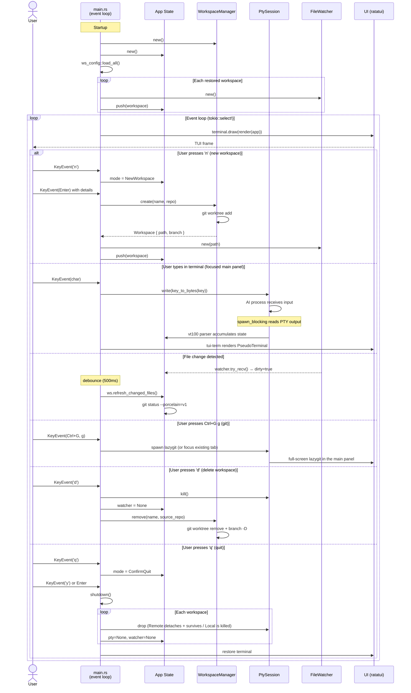

# Technical reference

The complete reference for `agent-multi` beyond installing and configuring it: the
command-line interface, the TUI layout and every keybinding, workspace lifecycle and
persistence, agent integrations, architecture, and the development workflow.

For a quick tour, installation and configuration, see the [README](../README.md).
Companion documents: [persistent sessions design](persistent-sessions.md) ·
[performance notes](performance.md).

## Table of contents

- [Command-line interface](#command-line-interface)
- [On-disk layout](#on-disk-layout)
- [TUI layout](#tui-layout)
- [TUI keybindings](#tui-keybindings)
- [Code Review](#code-review)
- [Desktop keyboard shortcuts](#desktop-keyboard-shortcuts)
- [Workspaces](#workspaces)
- [Persistent sessions](#persistent-sessions)
- [Agent integrations](#agent-integrations)
- [Notifications](#notifications)
- [Architecture](#architecture)
- [Performance](#performance)
- [Testing](#testing)
- [Development](#development)

## Command-line interface

```bash
piki-multi-ai [COMMAND]
```

### Options

- `-h`, `--help`: Print help
- `-V`, `--version`: Print version
- `--log-level <LEVEL>`: Set logging verbosity — `trace`, `debug`, `info` (default), `warn`, `error`. Logs are written to `~/.local/share/piki-multi/logs/`
- `--data-dir <PATH>`: Override the data directory. When set, **all** app state is stored under this path: database, worktrees, logs, and config. Useful for running a nightly/test instance alongside stable (e.g. `piki-multi-ai --data-dir /tmp/piki-nightly`)

### Commands

#### `generate-config`

Generates a complete configuration file with all default keybindings and options to stdout:

```bash
piki-multi-ai generate-config > ~/.config/piki-multi/config.toml
```

#### `version`

Shows version and author information (same as the **About** overlay in-app):

```bash
piki-multi-ai version
```

#### `migrate`

Migrates workspace configurations from legacy JSON files to the SQLite database. JSON files are preserved (not deleted) for manual verification:

```bash
piki-multi-ai migrate
```

#### `serve` / `sessions`

Manage the **persistent-session daemon** (see [Persistent sessions](#persistent-sessions)). You normally never run `serve` yourself — the app starts the daemon automatically — but the commands exist for scripting and debugging:

```bash
piki-multi-ai serve [--foreground]     # run the session daemon (logs to <data-dir>/logs/sessions.log)
piki-multi-ai sessions list            # list live + exited sessions the daemon holds
piki-multi-ai sessions kill <id>       # kill one session's process (kept, as exited)
piki-multi-ai sessions stop            # stop the daemon (kills every session)
```

The desktop binary exposes the same daemon entry point as `piki-desktop --serve-sessions` (parsed before Tauri starts). Both frontends launch it automatically; which binary happens to serve is irrelevant — they speak the same protocol against the same socket.

## On-disk layout

All paths are centralized in `piki-core::paths::DataPaths`. Two roots exist: the **data dir** (`$XDG_DATA_HOME/piki-multi`, i.e. `~/.local/share/piki-multi`) and the **config dir** (`~/.config/piki-multi`). With `--data-dir <PATH>`, *both* resolve under that path, giving a fully isolated instance (own database, own worktrees, own config, own session daemon).

**Data dir** (`~/.local/share/piki-multi/`):

| Path | Contents |
|------|----------|
| `piki.db` | The SQLite database (WAL mode) — workspaces, agent profiles, API history, UI preferences |
| `worktrees/<project>/<name>/` | Managed git worktrees, one per worktree workspace |
| `repos/` | Default clone destination for GitHub-origin workspaces |
| `review-checkouts/` | App-managed PR checkouts for Code Review (one base clone per repo + one `git worktree` per PR); safe to prune |
| `logs/piki-multi.log.*` | Application log, daily rotation via `tracing-appender` |
| `logs/sessions.log` | Session daemon log (append; level via `PIKI_SESSION_LOG`) |
| `sessions/daemon.{sock,lock,pid}` | Session daemon socket, single-instance flock, and pid file |
| `shell-integration/` | Materialized OSC 133/7 init scripts + bridge files for zsh/bash/fish |
| `claude-hooks/` | Materialized Claude Code hook scripts + generated `--settings` file |
| `workspaces/` | Legacy JSON workspace configs (migration source for `migrate`; no longer written) |

**Config dir** (`~/.config/piki-multi/`):

| Path | Contents |
|------|----------|
| `config.toml` | Main configuration: theme, keybindings, notifications, sessions |
| `providers.toml` | Custom AI provider definitions |
| `themes/<name>.toml` | TUI theme files |
| `desktop-themes/<name>.json` | Custom desktop theme presets |
| `lsp.toml` | Desktop LSP server registry (see [Desktop internals](#desktop-internals)) |

One deliberate exception outside both roots: the Antigravity hook bridge is a plugin inside agy's own config root (`~/.gemini/config/plugins/piki-multi-bridge/`), because that is the only place agy discovers hooks from.

### Environment variables

User-facing:

| Variable | Effect |
|----------|--------|
| `PIKI_DISABLE_SOUND=1` | Hard-mute notification chimes regardless of config |
| `PIKI_FORCE_LOGIN_ENV=1` | Force the interactive login-shell environment capture even when stdin is a TTY (normally skipped — it costs ~0.5–1s sourcing your dotfiles) |
| `PIKI_SESSION_LOG=<level>` | Session daemon log level (`trace`/`debug`/`info`/`warn`/`error`/`off`; default `info`) |

Internal — set by piki for its child processes; documented so they can be recognized, not set by hand:

| Variable | Effect |
|----------|--------|
| `PIKI_CLI_AGENT` | Arms the structured cli-agent hook channel; hooks no-op without it |
| `PIKI_CLI_AGENT_SOCK` | Per-tab FIFO path the hook scripts write events to |
| `PIKI_CLI_AGENT_V` / `PIKI_CLI_AGENT_SCRIPT_V` | Protocol / script version negotiation |
| `PIKI_CLI_AGENT_TARGET` | Which bridge (claude / antigravity) the hook payload is for |
| `PIKI_CLAUDE_HOOK_SETTINGS` | Path to the generated `claude --settings` file; the shell bridge uses it to wrap a manually-typed `claude` |
| `PIKI_SHELL_INTEGRATION` | Marks a shell spawned with piki's OSC 133/7 integration |

## TUI layout

```
 [CPU] 12%  [RAM] 4.2/16.0G  [BAT] 85%  [TIME] 2026-03-07 14:32
+------------------+-------------------------------------------------------+
| WORKSPACES       | [▸ Claude Code ×] [$ Shell ×] +   (tab blocks + new)  |
|                  |-------------------------------------------------------|
|  ▼ frontend (2)  |                                                       |
|  ▶ ⎇ ws-1  3∆ ↑1 |  AI assistant live terminal output                    |
|    ⎇ ws-2        |  (Ctrl+G c or click + to open a new tab)              |
|  ▸ backend (1)   |                                                       |
|                  |                                                       |
|------------------+                                                       |
| AGENTS           |-------------------------------------------------------|
| ▷ ws-1 · Claude  | branch: ws-1 | 3 files | ↑1 unpushed | Claude: busy  |
| ⏳ ws-2 · Codex  +-------------------------------------------------------+
| ✓ api · Claude   |
|                  |
+------------------+--------------------------------------------------------+
  Footer keys change per focused pane. Examples:
  Workspace list: [k/j] select [enter] open [e] edit ws [d] delete ws [C-g] prefix
  Agents:         [k/j] navigate [enter] jump to agent [C-g] prefix
  Main panel:     [ctrl-shift-f] search [C-g [] scroll [C-g ?] help [C-g] prefix
```

The AGENTS pane (bottom-left) lists every running AI agent across all workspaces with its live status (▷ running, ⚠ needs permission, ⏳ waiting, ✓ done, ● alive, ○ exited); `Enter` or a click jumps to that workspace and tab. This includes a `claude` typed manually inside a shell tab: the shell bridge transparently wraps `claude` with piki's hook settings, so it reports status the same way as a dedicated agent tab (listed as `Claude (Shell)` once its first hook event arrives; skipped if you pass your own `--settings`). Such a shell entry drops off the pane as soon as the CLI exits — the shell returns to its prompt and its OSC 133 command-end marker clears the tab's agent state — while the shell itself keeps running; a dedicated agent tab stays listed for as long as the tab is open. Git status details live in the lazygit tab (`Ctrl+G g`).

## TUI keybindings

The UI uses a **tmux-style prefix model**: keys always go to the focused pane (the embedded terminal gets full passthrough), and app-level actions live behind a one-shot **`Ctrl+G` prefix** — press `Ctrl+G`, then the action key. `Esc` cancels a pending prefix, `Ctrl+G Ctrl+G` sends a literal Ctrl+G to the terminal, and unknown chords show a toast. **All keybindings are customizable** via `config.toml` (see the [README's Configuration section](../README.md#configuration--theming)). Both the footer and the help overlay (`Ctrl+G ?`) update dynamically to show your current configuration.

**macOS support**: The app auto-detects the operating system. On macOS, all `Ctrl` and `Alt` keybindings also accept `Cmd` (⌘), and the UI displays `cmd-` instead of `ctrl-`/`alt-` in help text, footer hints, and status bar. The prefix works as `Cmd+G` too. The `Alt` → `Cmd` mapping exists because macOS Option key sends special characters instead of Alt in most terminals. Both original modifiers are always accepted as a fallback.

**Prefix actions** (`Ctrl+G` + key, status bar shows `[PREFIX]` while pending):

<!-- BEGIN:prefix-keys -->
| Key | Action |
|-----|--------|
| `h` / `j` / `k` / `l` (or arrows) | Move focus between panes (`h` from main panel goes to workspace list) |
| `c` | New tab (opens category menu: 1=Shell, 2=AI Agents →, 3=Tools →) |
| `x` | Close current tab (with confirmation dialog) |
| `n` / `p` | Next / previous tab |
| `1`..`9` | Jump to tab N |
| `w` | Workspace switcher (tree of workspaces + tabs; type to filter, Enter to jump) |
| `}` / `{` | Next / previous workspace |
| `` ` `` | Toggle to previous workspace |
| `s` | Create new workspace |
| `e` | Edit workspace options (Kanban path, Prompt) |
| `d` | Delete the selected workspace (with confirmation dialog) |
| `i` | Workspace info overlay (branch, paths, description, prompt; mouse-copyable) |
| `r` | Create Worktree (GitHub-only): spawn a git worktree from the selected GitHub-origin workspace, inheriting prompt/kanban |
| `g` | Git: open-or-focus the lazygit tab for the current workspace (respawns if the process exited) |
| `:` | Command palette (fuzzy-searchable list of all commands) |
| `/` | Fuzzy file search |
| `t` | Search in project (ripgrep content search; Enter opens `$EDITOR` at the matched line) |
| `f` | Search within the active terminal's output |
| `[` | Terminal scroll mode (see below) |
| `y` | AI Chat panel |
| `b` | Workspace dashboard overlay (bird's-eye view of all workspaces and tabs) |
| `C-s` | Sessions overlay (persistent-session daemon state and management, see below) |
| `o` | Log viewer overlay (last 500 log entries, color-coded, filterable by level) |
| `m` | Manage agent profiles (create/edit/delete agents for this project) |
| `v` | Manage providers (add/edit/delete custom AI providers) |
| `R` | Rename current tab (custom title, empty to clear; reflected in Agents pane) |
| `<` / `>` (or `,` / `.`) | Resize sidebar width (±5%) |
| `+` / `-` (or `=`) | Resize workspace/file split (±10%) |
| `a` | About overlay |
| `?` | Help overlay |
| `q` | Quit (with confirmation dialog) |
| `Ctrl+G` | Send a literal Ctrl+G to the terminal |
| `Esc` | Cancel the pending prefix |
<!-- END:prefix-keys -->

> This table is checked against `default_app()` by the `docs_parity` tests: every action key must appear here, and no key may be listed that nothing binds.

**Terminal scroll mode** (`Ctrl+G [`, status bar shows `[SCROLL]`): `j`/`k` scroll by line, `Ctrl+U`/`Ctrl+D` (or `PageUp`/`PageDown`) by page, `g`/`G` top/bottom, `/` opens terminal search, `Esc`/`q` exits and snaps back to the live view. Mouse wheel scrolling works at any time without entering the mode.

**Focused-pane keys** (no prefix needed — keys go straight to the pane):

| Pane | Keys |
|------|------|
| *Terminal pane* | All keys forwarded to the active tab; `Ctrl+G f` search, `Ctrl+Shift+C` copy visible content, `Ctrl+Shift+V` paste |
| *Workspace list* | `j`/`k` select, `Enter` switch + focus main panel, `e` edit, `d` delete |
| *Agents pane* | `j`/`k` select agent, `Enter` or click to jump to that workspace/tab |
| *Markdown tab* | `j`/`k` scroll, `Ctrl+d`/`Ctrl+u` page, `g`/`G` top/bottom (read-only) |
| *Kanban tab* | `h/l/j/k` navigate, `H/L` move card, `n` new card, `e` edit card, `d` delete, `D` dispatch agent, `Enter` details, `r` refresh, `Esc` close modal |
| *Code Review tab* | Locked mode — see [Code Review](#code-review) below |
| *API Explorer tab* | `Ctrl+S` send request, `Ctrl+J`/`Ctrl+K` scroll response, `Ctrl+F` search response, `Ctrl+H` API history, `Ctrl+C` copy response, mouse scroll in editor/response |

**In kanban card editor** (after pressing `e` or `n`):

| Key | Action |
|-----|--------|
| `Left` / `Right` | Move cursor within field |
| `Home` / `End` | Jump to start / end of field |
| `Backspace` / `Delete` | Delete char before / at cursor |
| `Tab` | Switch between Title and Description |
| `Enter` | Save card |
| `Esc` | Cancel editing |

**In dispatch agent dialog** (after pressing `D` on a kanban card):

| Key | Action |
|-----|--------|
| `Left` / `Right` | Cycle agent/provider; includes `(None)` option when agents are configured |
| `Tab` | Next agent/provider |
| Any text | Type additional prompt (appended to card description) |
| `Enter` | With agent: dispatch to new worktree. With `(None)` or raw provider: choose workspace destination (New/Current) |
| `Esc` | Cancel (step 1) or Back (step 2) |

**In manage agents overlay** (after pressing `A`):

| Key | Action |
|-----|--------|
| `j` / `k` | Navigate agent list |
| `n` | Create new agent profile |
| `e` / `Enter` | Edit selected agent |
| `d` | Delete selected agent |
| `p` | Sync agent to repo (write `.{provider}/agents/<name>.md`) |
| `i` | Import agents from repo files into app |
| `Esc` | Close |

**In import agents overlay** (after pressing `i` in manage agents):

| Key | Action |
|-----|--------|
| `j` / `k` | Navigate discovered agents |
| `Space` | Toggle selection (checkbox) |
| `a` | Toggle select all / deselect all |
| `Enter` | Import selected agents |
| `Esc` | Cancel, return to manage agents |

**In edit agent dialog — step 1** (name + provider):

| Key | Action |
|-----|--------|
| `Tab` | Switch between Name and Provider fields |
| `Left` / `Right` | Cycle provider (on Provider field) |
| `Enter` | Next — open role editor (step 2) |
| `Esc` | Cancel |

**In edit agent dialog — step 2** (role editor, large floating window):

| Key | Action |
|-----|--------|
| Any text | Edit agent role/instructions (multiline with Enter) |
| `Up` / `Down` | Move cursor between lines |
| `PageUp` / `PageDown` | Jump 10 lines |
| Mouse scroll | Scroll 3 lines up/down |
| `Ctrl+D` | Clear all text |
| `Ctrl+S` | Save agent and close |
| `Esc` | Back to step 1 without saving |

**In sessions overlay** (`Ctrl+G Ctrl+S`) — every session the persistent-session daemon holds, whether or not it's open as a tab here (see [Persistent sessions](#persistent-sessions)). The title shows the daemon's pid; each row shows the session (custom title > provider > command), its workspace, and its state — `▷ attached` (open as a tab here), `⚠ detached` (running with no local tab: left over from a previous run, or attached only in the other frontend), `○ exited`:

| Key | Action |
|-----|--------|
| `j` / `k` | Navigate sessions |
| `Enter` | Attached session: jump to its workspace/tab. Detached: adopt it as a tab (its recorded workspace if loaded, else the active one) and jump to it |
| `x` | Kill the session's process (kept in the list as exited) |
| `d` | Remove the session from the daemon entirely |
| `r` | Reload the list from the daemon |
| `Esc` or `Ctrl+S` | Close |

**In log viewer** (`Ctrl+G o`):

| Key | Action |
|-----|--------|
| `j` / `k` | Select next/previous line |
| `h` / `l` | Scroll left/right (horizontal) |
| `Ctrl+d` / `Ctrl+u` | Page down/up |
| `g` / `G` | Top / bottom |
| `Enter` / `y` | Copy selected line to clipboard |
| `0`-`5` | Filter by level (0=all, 1=error, 2=warn, 3=info, 4=debug, 5=trace) |
| `/` | Open text search bar (type to filter by message/target; `Esc` clears, `Enter` confirms) |
| `r` | Toggle auto-refresh / tail mode (title shows `~`; disables when navigating up) |
| Mouse scroll | Select up/down |
| Mouse click | Select clicked line |
| `Esc` or `Ctrl+l` | Close log viewer |

**In command palette** (`Ctrl+p`):

| Key | Action |
|-----|--------|
| *type* | Filter commands by fuzzy match |
| `↑` / `↓` | Select command |
| `Enter` | Execute selected command |
| `Esc` | Close palette |

**In fuzzy search** (`/` or `Ctrl+f`):

| Key | Action |
|-----|--------|
| *type* | Filter files by fuzzy match |
| `↑` / `↓` | Select result |
| `Enter` | Open diff of selected file (if it has changes) |
| `Ctrl+e` | Open in $EDITOR |
| `Ctrl+v` | Open in inline editor |
| `Ctrl+o` | Open markdown file in a new tab (`.md` / `.markdown` only) |
| `Alt+m` | Open markdown file in external `mdr` viewer |
| `Esc` | Close search |

**Pane resize:**

| Key | Action |
|-----|--------|
| `<` / `>` | Resize sidebar width (±5%) |
| `+` / `-` | Resize workspace/file split (±10%) |
| Mouse drag on border | Drag pane borders to resize |

**Mouse:**

| Action | Effect |
|--------|--------|
| Click workspace list | Switch to the clicked workspace (focus moves to the main panel; empty click just focuses the main panel) |
| Click agents pane | Jump to the clicked agent's workspace/tab (focus moves to the main panel; empty click just focuses the main panel) |
| Click main panel | Focus pane and start text selection |
| Click tab | Switch to that tab |
| Click × on tab | Close that tab (with confirmation) |
| Click + after the tabs | Open the New Tab dialog |
| Scroll in workspace list | Navigate workspaces up/down |
| Scroll in agents pane | Navigate agents up/down |
| Scroll in main panel | Scroll terminal scrollback/markdown (includes inline-TUI transcripts like Codex); forwarded as escape sequences to alt-screen TUI apps |
| Scroll in Help overlay | Scroll overlay content |
| Scroll in fuzzy search | Navigate results |
| Click on Help/About/Info overlay | Dismiss overlay |
| Drag on border | Resize pane split |
| Drag in terminal | Select text (auto-copies on release) |

**Terminal input:**

| Key | Action |
|-----|--------|
| `Shift+Enter` | Insert newline (requires Kitty keyboard protocol support) |
| `Ctrl+Enter` | Insert newline (fallback for terminals without Kitty protocol) |
| `Enter` | Submit / send input |

**Clipboard:**

| Key | Action |
|-----|--------|
| `Ctrl+Shift+V` | Paste from system clipboard (terminal focused) |
| `Ctrl+Shift+C` | Copy visible terminal content (both modes) |
| Mouse drag | Select text in terminal pane (auto-copies on release) |

**In inline editor:**

| Key | Action |
|-----|--------|
| `Ctrl+s` | Save file |
| `Esc` | Close editor (with unsaved changes, a second `Esc` confirms the discard) |
| Arrow keys | Move cursor |
| `Tab` | Insert 4 spaces |

## Code Review

Full-screen PR review, independent of any open workspace: New Tab → Tools → Code Review opens a PR picker listing PRs relevant to the current `gh` user across all accessible repos (authored, already-interacted-with, review-requested-but-pending), fetched via `gh search prs`; picking one checks out the PR into an app-managed directory (`<data-dir>/review-checkouts`, separate from your regular worktrees) — cloning it on first use and just fetching/resetting on later opens (a no-op if the PR's head hasn't moved), then opens it as a throwaway "ephemeral" workspace that never persists across restarts, shown in the sidebar with its own icon (`◎`). `gh` availability and authentication are checked lazily on first use and cached for the session.

**PR picker** (New Tab → Tools → Code Review, `2`):

Lists PRs relevant to the current `gh` user across every accessible repo, grouped into three sections: "My PRs" (authored), "Interacted With" (already commented/reviewed — tagged `[requested]` if a review was also asked for), and "Review Requested" (requested, no interaction yet). Picking one checks out the PR (cloning or reusing/fast-forwarding as needed) and opens it as an ephemeral review workspace. Press `o` to browse a specific repo instead: type `owner/repo` (or paste a GitHub URL — `https://github.com/owner/repo`, `.../pull/N`, an SSH remote, all normalized to `owner/repo`) and `Enter` lists every open PR in it (unfiltered by relevance-to-you), so you can pick any PR in a repo you know even if GitHub wouldn't otherwise surface it. `m` returns to the default categorized list; `r` reloads whichever list is showing. Picking a PR that's already open in an ephemeral review workspace reopens that workspace instead of checking it out again. If the workspace you're standing on already holds a review, `2` reopens its tab directly instead of opening this picker. Long lists scroll to keep the selection in view (a `[n/total]` indicator appears bottom-right once the list overflows the popup).

| Key | Action |
|-----|--------|
| `j` / `k` | Navigate PRs |
| `Enter` | Check out the selected PR and open its review |
| `r` | Reload the current list from GitHub |
| `o` | Browse a specific repo's PRs (prompts for `owner/repo`) |
| `m` | Back to the default categorized list (only shown while browsing a repo) |
| `Esc` | Cancel the repo prompt, or close the picker entirely |

**Review view** (locked mode — all other keys blocked):

The Code Review tab takes over the full screen. While active, workspace switching, pane navigation, and all other global keybindings are disabled. Both `q` and submitting (`s` → `Enter`) just back out to the general view — neither closes the tab, clears the workspace, nor touches the checkout on disk; clicking or pressing Enter on the workspace in the sidebar reopens it. The Code Review tab itself isn't closable (`×`/`Ctrl+G x` are no-ops on it) — since a review workspace exists only to hold this one tab, closing it would leave the workspace stranded in the sidebar with nothing to reopen. Submitting additionally clears the just-sent draft (comments, body, reply drafts) so reopening the review can't accidentally resubmit them. To actually discard a review workspace and delete its checkout, delete it from the sidebar like any other workspace (`prefix d`) — that always asks first and always deletes the checkout, never just detaches it.

The diff pane shows a **side-by-side split view**: the left panel displays the old file (deletions in red), the right panel displays the new file (additions in green), and context lines appear on both sides. Deletions and additions are paired row-by-row; file and hunk headers span the full width. Existing comments from other reviewers appear inline as threads (root comment + replies); press `c` on any line to add your own inline comment, `R` to reply to an existing thread anchored there, `d` to delete your own comment. Comments are displayed as yellow blocks inline on the appropriate side (left for deletions, right for additions); your inline comments submit alongside the review via the GitHub API, and thread replies are sent individually right after. The cursor highlights both halves simultaneously. Note: GitHub does not allow Approve or Request Changes on your own PRs — use Comment instead.

| Key | Context | Action |
|-----|---------|--------|
| `j` / `k` | File list | Navigate files |
| `Enter` | File list | View diff for selected file |
| `l` | File list | Switch focus to diff pane |
| `r` | File list | Refresh PR data from GitHub (re-checks out only if the PR moved) |
| `j` / `k` | Diff pane | Move cursor up/down |
| `Ctrl+d` / `Ctrl+u` | Diff pane | Page down/up (cursor jumps ±20) |
| `g` / `G` | Diff pane | Jump cursor to top/bottom |
| `c` | Diff pane | Add inline comment on cursor line (opens editor) |
| `R` | Diff pane | Reply to the existing comment thread on cursor line, if any (opens editor) |
| `d` | Diff pane | Delete your own inline comment on cursor line |
| `h` | Diff pane | Switch focus to file list |
| `n` / `p` | Diff pane | Next/previous file (auto-loads diff) |
| `[` / `]` | Any | Shrink / grow file-list panel (±5%, clamped 10–90%; persists across restarts) |
| `s` | Any | Open submit review overlay |
| `q` | Any | Back to the general view (nothing is closed or deleted — reopen from the sidebar) |
| Mouse scroll | File list / Diff | Scroll content (moves cursor in diff) |
| Mouse click | Left/right pane | Switch focus / set cursor |
| Drag divider | File list / Diff border | Resize file-list panel interactively |

**In comment editor** (opened with `c` for a new comment, or `R` to reply to an existing thread):

| Key | Action |
|-----|--------|
| *type* | Edit comment text |
| `Enter` | Save comment/reply (empty body removes it) |
| `Esc` | Cancel without saving |
| `Left` / `Right` / `Home` / `End` | Move cursor |
| `Backspace` | Delete character |

**In submit review overlay** (opened with `s`):

| Key | Action |
|-----|--------|
| `Tab` | Cycle verdict (Approve → Request Changes → Comment) |
| *type* | Edit review comment body |
| `Enter` | Submit review to GitHub (inline comments included) |
| `Esc` | Close overlay (draft preserved) |
| `Ctrl+D` | Discard draft, comments, and close overlay |

## Desktop keyboard shortcuts

The terminal owns every key it can use. An app shortcut fires while a terminal, text input or editor has focus **only** if its chord is one the terminal can't receive as bytes — `Alt+…`, `Ctrl+Shift+…` or `Ctrl+Alt+…`. Plain `Ctrl+<letter>` / `Ctrl+Space` shortcuts (marked ° below) work everywhere else — sidebar, tab bar, dialogs — but with a shell focused `Ctrl+B` reaches tmux, `Ctrl+P` walks history and `Ctrl+F` in a CodeMirror editor is CodeMirror's find. Rebinding a marked-free shortcut to a plain `Ctrl+<letter>` demotes it to outside-only (the Settings dialog says so when you do it).

| Shortcut | Action |
|---|---|
| **General** | |
| `Ctrl+P` ° | Command palette |
| `Ctrl+N` ° | New workspace |
| `Ctrl+Space` ° | Workspace switcher |
| `Alt+D` | Dashboard |
| `?` ° | Help / all shortcuts |
| `Esc` | Close dialog / overlay |
| `Alt+1`…`Alt+9` | Switch to workspace N |
| Right-click workspace row (or its `⋯`) | Workspace menu: Open, Agents, Info, Edit, Create Worktree (GitHub), Merge / Rebase, Delete |
| **View & Panels** | |
| `Ctrl+B` ° | Toggle sidebar |
| `Ctrl+Shift+L` | Toggle AI Chat panel |
| `Alt+K` | Kanban Board |
| `Alt+Shift+W` | Open Web Preview tab |
| `Alt+T` | Theme settings |
| `Alt+S` | Settings |
| `Alt+P` | Manage providers |
| `Alt+Shift+L` | Application logs |
| `Alt+Shift+S` | Sessions (persistent) dialog |
| `Alt+I` | System Info |
| `Ctrl+=` ° / `Ctrl+-` ° / `Ctrl+0` ° | Zoom in / out / reset — scales the whole UI and the terminal font together |
| `Ctrl+Shift+=` / `Ctrl+Shift+-` / `Ctrl+Shift+0` | Same zoom actions, also with a terminal focused |
| **Search** | |
| `Ctrl+F` ° | Find file (fuzzy) |
| `Enter` / `Alt+Enter` | In the file finder: open in an editor tab / in the read-only viewer (`Ctrl+E` for `$EDITOR`) |
| `Ctrl+Shift+F` | Search in project (grep) |
| `Ctrl+Shift+B` | Search in terminal |
| `Ctrl+J` ° | API jq filter (in API Explorer) |
| `Ctrl+H` | Request history (in API Explorer) |
| **Git** | |
| `Ctrl+M` ° | Merge / Rebase |
| `Alt+B` | Switch branch (also by clicking `⎇ branch` in the status bar) |
| `Alt+L` | Git log |
| `Ctrl+Shift+S` | Git stash |
| `Ctrl+Z` ° | Undo stage/unstage |
| `Ctrl+Shift+R` | Code review |
| `Ctrl+Enter` | Commit (in the commit message box) |
| **Agents** | |
| `Ctrl+Shift+A` | Manage agents |
| `Ctrl+Shift+D` | Dispatch agent |
| `Alt+A` | Jump to the agent needing attention (permission first, then unseen news; repeat to walk through them) |
| **Panes & Tabs** | |
| `Ctrl+T` ° | New blank tab |
| `Ctrl+\` ° | Split active pane right |
| `Ctrl+Shift+\` ° | Split active pane down |
| `Ctrl+Shift+Q` ° | Close active pane |
| `Ctrl+Tab` / `Ctrl+Shift+Tab` | Next / previous tab |
| Drag divider | Resize split |
| Middle-click tab | Close tab (a running process still gets the Close / Keep running / Cancel confirm) |
| Right-click tab | Tab menu: Rename, Split right / down, Move to workspace…, Close, Close keep running (with a session daemon) |
| `⋯` in the tab bar | List every tab of the workspace (name, agent status, current one marked) — the way to find a tab once the strip overflows |
| Double-click tab | Rename inline |
| **Terminal** | |
| `Ctrl+Shift+E` | Send the next key to the terminal — the following keystroke bypasses every app shortcut (type `Alt+B` into readline although it is Switch Branch); the pane header shows `next key → terminal` while armed, `Esc` or the chord again cancels |
| `Ctrl+Shift+K` | Clear the terminal (screen + scrollback) |
| `Ctrl+Shift+C` / `Ctrl+Shift+V` | Copy / paste (`Cmd+C` / `Cmd+V` on macOS) |
| Select text | Copy to clipboard — one write per selection gesture; Settings ▸ Terminal ▸ *Copy on select* turns it off |
| Middle-click | Paste: the primary selection where the platform delivers one (X11, GTK on Wayland), otherwise the clipboard |
| `Ctrl+click` link | Open the URL in the default browser (`Cmd+click` on macOS) |
| Right-click | Terminal menu: Open / Copy link (over a URL), Copy, Paste, Select All, Clear, Search…, Send Next Key |
| `Enter` / `Shift+Enter` | Next / previous match in the terminal search bar; `Esc` closes it and returns focus to the terminal |
| `Shift+PgUp` / `Shift+PgDn` | Scroll one page |
| `Shift+Home` / `Shift+End` | Scroll to top / bottom |
| **Code Editor** | |
| `Ctrl+I` | Quick Edit inline (in file viewer) |
| `Ctrl+E` | Open in $EDITOR (in file viewer / file search / project search) |
| `Ctrl+S` | Save file (in editor) |
| `Ctrl+F` | Find in file (CodeMirror) |

° = outside-only (see above). On macOS every `Ctrl`/`Alt` above is `⌘`. Rows without ° that are not in the Settings dialog (`Esc`, `Alt+1…9`, `Ctrl+Tab`, copy/paste, `Ctrl+H`, `Ctrl+Enter`, the editor keys, the mouse gestures) are fixed widget bindings; everything else is editable at runtime via the Settings dialog (`Alt+S`). The in-app help (`?`) is generated from the same registry, so it always shows your current keys.

### Desktop tabs, sidebar and switcher

- **Tab bar**: the chips scroll in their own strip; `+` (new blank tab) and `⋯` (all tabs) sit outside it and stay visible with any number of tabs. The `×` is dim on inactive tabs, full on hover/active. Every close path — `×`, middle-click, the menu, `Close Tab` — goes through the same teardown, so a live process always gets the Close / Keep running / Cancel dialog. *Move to workspace…* (tab menu, File menu, palette) offers only terminal/agent tabs (editors, boards and previews are bound to their workspace's files): the backend re-parents the tab with its process untouched — a daemon session also gets its `workspace_path` re-pointed so the next launch restores it in the new workspace — and the app switches to the target with the moved tab in front.
- **Workspace rows** carry one `⋯` (plus right-click) instead of a row of hover buttons; *Merge / Rebase* switches to that workspace first. The *Delete* confirm is one shared implementation (sidebar and palette): the hint depends on the workspace type (a worktree loses its worktree and branch; a Simple/Project workspace only leaves the list), it counts uncommitted changes, and lists the running agents — which deletion really terminates (their daemon sessions are removed, not left as orphans).
- **Workspace switcher** (`Ctrl+Space`): with an empty query the most recently used workspace is first (the MRU list is bumped on every switch and persisted with the settings as `workspaceMru`); a query is matched fuzzily across name, repo folder and branch, best score first with recency as the tie-break. Each row shows the workspace's worst agent state (permission / needs you / running…) or an amber dot for uncommitted changes, `Alt+N` when it has one, and `folder · ⎇ branch`.
- **Branch labels** share one rule everywhere (workspace list, status bar, switcher, dashboard, empty state): middle-truncated at 28 characters, the full name in the tooltip. Collapsible groups share one chevron pair: `▸` collapsed, `▾` expanded.
- **Empty state**: a workspace with no tabs — or a blank pane — shows `<workspace> · ⎇ <branch>` and buttons for Shell, every configured provider and *Open file…* (the fuzzy file finder); the app-wide welcome only appears when there is no workspace at all.
- **Agents panel** height is clamped so the workspace list above it always keeps its header plus at least four rows (it scrolls beyond that); the clamp is re-applied when the window shrinks.

### Desktop terminal

- **Links**: URLs in the output are underlined on hover; `Ctrl+click` (`Cmd+click` on macOS) opens them through the backend's `open_url` command (http/https only — anything else a program prints is refused), never in the webview. Right-clicking a link adds *Open Link* / *Copy Link* to the menu.
- **Unicode**: xterm runs with Unicode 11 widths, so emoji and other wide glyphs occupy two cells and box-drawing around them (Claude's status lines) stays aligned.
- **Bell and title**: a `BEL` flashes the tab chip of the terminal that rang; a window title set by the program (OSC 0/2 — `user@host: ~/dir`, `vim file.rs`) becomes the tab label and the pane header, but only as a fallback: a name given with *Rename* always wins, and the Agents panel keeps the provider label.
- **Clipboard**: copy-on-select writes the clipboard **once per selection gesture**, on mouse-up, however many rows the drag covered (a pure state machine, `copy-on-select.ts`); it is silent, only an explicit *Copy* toasts. The clipboard goes through `tauri-plugin-clipboard-manager` (the app owns the selection); the old `wl-copy`/`xclip`/`pbcopy` path is kept only as the fallback when the plugin errors. Middle-click pastes: WebKitGTK delivers the X11/GTK *primary* selection as a native `paste` event, which the terminal consumes; when no such event arrives within the click (Wayland without the primary-selection protocol, macOS, Windows) it pastes the clipboard instead, so the button always does something — unless a program is tracking the mouse (tmux, Claude's TUI), in which case the click is the program's. `Shift+Insert` works natively too.
- **Context menu** (right-click): Copy (disabled without a selection), Paste, Select All (copies too when copy-on-select is on), Clear, Search…, Send Next Key to Terminal.
- **Search bar** (`Ctrl+Shift+B`, menu, palette): anchored to the top-right of the terminal (it never scrolls with the viewport), a `n/m` result counter (`No results` in red, `m+` past the highlight limit), *Aa* match-case and *.\** regex toggles, `Enter` / `Shift+Enter` next / previous, `Esc` closes and focuses the terminal. The last query and toggles are remembered per tab.
- **Send next key** (`Ctrl+Shift+E`): the next keystroke bypasses the app's shortcut dispatcher and xterm's own copy/paste interception and is turned into bytes as any terminal would (`Alt+B` → `ESC b`). Modifier presses on the way to a chord keep it armed; `Esc`, the chord again, or the terminal losing focus cancel it. The armed pane shows `next key → terminal` in its header.
- **Settings ▸ Terminal** (`Alt+S`): font family (empty = the theme's mono font), font size, line height, scrollback (1k–100k), cursor style + blink, copy on select. Everything applies to every open terminal immediately and is persisted under the `terminal` key of the settings document (only the fields that differ from the defaults). The font size is the **base at zoom 1** — UI zoom (`Ctrl+=` / `Ctrl+-` / `Ctrl+0`) multiplies it (`14px × 125% = 18px`), and the dialog shows the effective size next to the field.

### Desktop Source Control panel

The common git loop runs from the panel, the Git menu or the palette without a shell:

- **Pull / push**: the header shows `↓N` when the branch is behind its upstream and `↑N` when ahead (the same counts as the status bar). While an operation runs the button is disabled and reads `↓…` / `↑…`; a second click, palette entry or menu item for the same workspace is a no-op ("Push already in progress") — one intent, one process. Success is a toast (`Pulled 3 commits`, `Already up to date`, `Pushed successfully`); failures show git's own message. A pull that git cannot reconcile (diverged branches without a `pull.rebase` / `pull.ff` policy) is reported, not forced; a pull that stops on conflicts is aborted so the worktree is left as it was, and the error names the conflicting files (resolve with Merge / Rebase or a shell).
- **Commit / Amend**: *Amend last commit* under the Commit button prefills the message box with the last commit message (unless you had already typed one) and turns the button into *Amend*; it is live with staged changes or a new message — an empty message keeps the current one (`git commit --amend --no-edit`). Unticking restores what you had typed. `Ctrl+Enter` commits or amends.
- **Discard**: every row in *Changes* has a `⟲` action that throws away the working-tree changes of that file (`git restore --worktree`, the index is untouched) behind a confirm; for an untracked file the action reads *Delete file* and really deletes it (`git clean -fd`). Both are irreversible and say so.
- **Switch branch** (`Alt+B`, click `⎇ branch` in the status bar, Git ▸ Switch Branch…, palette): a fuzzy-filterable list of local branches plus remote-tracking branches that have no local counterpart (`remote` tag; picking one creates a tracking branch), the current one marked with `●` and its `↑ ↓` counts. Checkout never forces: when uncommitted changes would be overwritten, or the branch is checked out in another worktree, git's refusal is the error toast and nothing changes.
- **Code Review** opens its overlay immediately with a *Loading PR…* skeleton (closable) while `gh` runs, then *Loading review comments…*; if `gh` is missing or fails, the overlay shows the error with *Retry* / *Close* instead of a silent toast.

### Desktop file finder (`Ctrl+F`)

- **Opens before it indexes**: the input is focused on the first frame; the list arrives when the backend answers (the footer says `Indexing…` until then, and the last list seen for that workspace is shown meanwhile). Whatever you type while it is indexing is applied the moment the list lands.
- **`Enter` edits, `Alt+Enter` views**: `Enter` (or a click) opens the file as an editor tab — CodeMirror for code, the WYSIWYG markdown editor for `.md` — exactly what a click in the file tree does; `Alt+Enter` opens the read-only viewer (rendered markdown for `.md`); `Ctrl+E` runs `$EDITOR` in a new terminal tab. Files whose extension says they are not text (images, archives, fonts, media, compiled and database blobs) stay in the viewer whichever key you press. Opening and editing a file that is not in git status is two keys: `Ctrl+F`, `Enter`.
- **What is listed**: the index is a gitignore-aware walk (the `ignore` crate, ripgrep's walker) — `.gitignore`, `.ignore`, `.git/info/exclude` and your global excludes all apply, also in a workspace that is not a git repo; dotfiles and dot-directories (`.github/`, `.cargo/`, `.env.example`) are included, `.git` itself is always pruned, symlinks are not followed. The walk stops at 50 000 paths and the footer then says the index is capped.
- **Caching**: the backend memoises the list per workspace and drops it when the file watcher reports a create, delete or rename (plain edits of listed files keep it) and when you switch workspace, so the next `Ctrl+F` re-walks only when the tree may have changed.

## Workspaces

### Creating workspaces

Press `Ctrl+G s` (or `n` in the workspace list) to open the New Workspace dialog. Provide:

- **Source:** Toggle between `Local folder` and `GitHub URL` using `Space`, `Left`, or `Right`. Local folder points to any existing directory on disk (git not required); GitHub URL clones a public/private GitHub repo into a destination you choose. The resulting workspace is always a Simple workspace internally; worktrees are spawned later from a GitHub-origin workspace via the "Create Worktree" action.
- **Folder / URL:** When Source = Local folder, this is the path to the directory (`~` expands to `$HOME`). When Source = GitHub URL, paste the clone URL (HTTPS, SSH, or `git@github.com:owner/repo.git`).
- **Clone into:** *(GitHub source only)* Parent directory the repo is cloned into; the clone lands at `<clone-into>/<repo>`. Pre-filled with `<data_dir>/repos` as a hint — that default folder is auto-created on first use, but any other path you type must already exist (`~` expands to `$HOME`). In the desktop app a folder picker is available.
- **Desc:** (Optional) A brief description of the task. The workspace name is always derived automatically — folder basename for Local, repo name for GitHub.
- **Prompt:** (Optional) An initial prompt stored with the workspace.
- **Kanban Path:** (Optional) Path to the Kanban board for this workspace (defaults to `~/.config/flow/boards/default`). If a local path is provided and no `board.txt` exists there, a default board with 4 columns (`todo`, `in_progress`, `in_review`, `done`) will be created automatically.

Press `Enter` to create or `Esc` to cancel. Use `Tab` to cycle between fields.

### Editing workspaces

Press `e` on a selected workspace to modify its **Kanban Path** or **Prompt**. This is useful for re-directing a workspace to a specific task board or updating the orchestration instructions.

### Persistence

Workspace configurations are saved automatically and restored on startup using a SQLite database:

- `~/.local/share/piki-multi/piki.db` (single SQLite database with WAL mode)
- Includes workspace config, API Explorer history (with FTS5 full-text search), collapsed worktree families, and UI layout preferences
- API history persists across restarts and is searchable via `Ctrl+H` in the API Explorer tab; duplicate requests (same method + URL + body) are deduplicated automatically, keeping only the latest response
- API history is scoped per project — each repository sees only its own entries

> **Note:** If you have existing JSON workspace configs in `~/.local/share/piki-multi/workspaces/`, run `piki-multi-ai migrate` to import them into the database.

**Restoration:**

- On startup, `piki-multi-ai` scans the storage backend and restores all valid workspaces.
- Stale entries (worktrees deleted manually) are cleaned up automatically.
- Robust de-duplication ensures each workspace is loaded only once.
- Simple and Project workspaces reference the original directory and are never cleaned up as stale.
- The **last focused workspace** is remembered across restarts: switching workspaces persists the active path in `ui_preferences`, and on startup the app re-focuses that workspace (falling back to the first one if the saved path no longer exists).

## Persistent sessions

Every terminal tab — shells, AI agents, dispatched agents, and the lazygit tab — runs inside a lightweight background **session daemon** (a "tmux without the UI", designed after [shpool](https://github.com/shell-pool/shpool)), so it **survives quitting or crashing the app, closing the terminal, or an ssh drop**. On the next launch each session re-attaches to its workspace with the **screen and scrollback restored**. The TUI and desktop app share the same daemon, so a tab opened in one is visible in the other.

- **Automatic** — the daemon starts on demand (`<data-dir>/sessions/daemon.sock`, one per data dir) and stops itself after 60s with no sessions. No setup, no external dependency (no tmux).
- **Quitting detaches** — sessions keep running in the background. The quit prompt says how many are running; press `k` there to quit **and** kill them all. Closing a tab, or deleting its workspace, removes its session.
- **Graceful fallback** — if the daemon can't start or speaks an incompatible protocol, tabs run in-process exactly as before, with a log line. Nothing breaks.
- **Manage in-app** — the TUI's sessions overlay (`prefix ctrl-s`) lists everything the daemon holds — including sessions no tab is showing — with jump/adopt (`Enter`), kill (`x`), and remove (`d`). The desktop has an equivalent **Sessions dialog** (`Alt+Shift+S`, or View → Sessions / command palette): the same list with click-to-jump on an attached session, plus **Adopt** on a detached session (opens it as a tab in the workspace whose path it recorded, or asks which workspace when that one isn't loaded — TUI parity) and Kill/Remove buttons, each behind a confirm when it would end a live process.
- **Visible state (desktop)** — on launch a toast says `Restored N sessions in M workspaces` and each workspace that received restored tabs shows a `↺` badge until you visit it. The status bar's right side reads `sessions N` (live sessions in the daemon, all clients), `sessions off` (`[sessions] enabled = false`) or `sessions unavailable` (enabled but the daemon isn't answering — polled every 3s, so a killed daemon shows within one poll); clicking it opens the Sessions dialog. Quitting with live tabs says what actually happens: `N sessions keep running in the background` for daemon-backed tabs versus `N terminal sessions … will be terminated` for in-process ones (only the latter makes the Quit button red).
- **Closing a tab that is still running** — the desktop asks first. The confirm names each live process with its agent status (e.g. `claude — needs permission`) and offers **Close** (kill), **Keep running** (only when the daemon is on: the window lets go of the session without killing it, and it reappears in Sessions as *detached*, adoptable from the TUI or the CLI) or **Cancel**. A dirty editor in the same tab is prompted for separately, first. A tab whose process exited shows a dimmed `○` chip and an **↻ Restart** button in its pane header that respawns the same provider in the same pane, keeping a custom title.
- **Manage from the CLI** — `piki-multi-ai sessions list|kill|stop` (see [Commands](#serve--sessions)).
- **Disable** — set `enabled = false` under `[sessions]` in `config.toml` to run every tab in-process. Both frontends honor it: the TUI through its full config parse, the desktop through `piki_core::session::sessions_enabled()` (the desktop keeps its other settings in SQLite and reads `config.toml` only for this).

Killing the app hard (SIGKILL) still leaves sessions running, because the daemon is a separate process that owns the PTYs. The one thing that takes sessions down with it is the daemon itself dying — kept deliberately tiny for that reason. Design and internals: [persistent-sessions.md](persistent-sessions.md).

## Agent integrations

### Shell integration (Linux/macOS)

Shell tabs (zsh, bash, fish) auto-source a tiny init script that emits OSC 133 (prompt/command markers + exit code) and OSC 7 (cwd reporting). Piki's per-tab OSC parser captures those markers from the PTY stream and surfaces them: cwd of the active shell tab in the desktop status bar, ✓/✗ exit-code badge on the shell tab after each command, a workspace `●` badge when a command finishes in a background tab, and an OS notification on every `command-end` (see [Notifications](#notifications)). The init scripts live in `crates/core/src/shell_integration/scripts/` and are materialized to `<data_dir>/shell-integration/` on first use; bridge files chain to your real `~/.zshrc` / `~/.bashrc` so user dotfiles are preserved (fish loads its integration via `-C 'source ...'` on top of your `config.fish`). Disabled gracefully for unsupported shells (`sh`, `dash`, etc.).

### Structured Claude integration (Warp-style)

Claude Code agent tabs get a precise lifecycle channel instead of guessing from PTY silence. Piki ships six Claude Code hook scripts (`SessionStart`, `UserPromptSubmit`, `PostToolUse`, `PermissionRequest`, `Notification`, `Stop`) and passes them via a generated `claude --settings` file (your `~/.claude/settings.json` is never touched); each hook emits an **in-band OSC 777** sequence (`ESC]777;notify;piki://cli-agent;<json>BEL`) that the same per-tab OSC parser sniffs out of the PTY stream — purely additive, the agent stays a raw passthrough. Surfaces a per-tab status glyph (running / waiting-permission / idle / done) in the desktop status bar + an aggregate dot on the workspace tab, routes permission/idle/done through the shared notification + workspace-attention rail, and replaces the byte-silence idle heuristic (which auto-steps-aside once the channel proves live, and stays as graceful fallback otherwise). Scripts are materialized to `<data_dir>/claude-hooks/`; require `jq`. The channel is self-disabling (hooks no-op unless `PIKI_CLI_AGENT` is set) and version-negotiated (`v` field; unknown majors are dropped and the tab falls back to the heuristic). Core logic + parser live in `crates/core/src/cli_agent/` and `shell_integration::parser`; providers without a bridge (Gemini, etc.) keep the `IdleWatcher` unchanged.

**Attention flow (desktop).** Every `pty-agent-event` carries an `attention` flag — true for permission / idle-notification / stop until the user looks at the tab. Looking is what clears it, exactly like the TUI event loop: `set_active_tab` and `switch_workspace` acknowledge the now-visible tab's marker and emit `pty-agent-ack`, and news that lands on the tab already on screen is acknowledged on the spot (its event arrives with `attention: false`). `list_agent_rows` (status, attention, summary, `elapsed_secs`) is the single source for every agent signal — the Agents panel, the workspace-list rollup, the `● N need you` status-bar segment, the amber badge on the Explorer activity icon (so a hidden sidebar never hides the signal) and `Alt+A`, which orders candidates by the shared `status_severity` (permission > unseen news) and cycles when already standing on one. Elapsed time comes from `CliAgentState::run_started_at` (set on session start / prompt submit, cleared on stop), survives a daemon re-attach via the session snapshot, and ticks client-side between refreshes; the TUI Agents pane shows the same `3m 12s` suffix.

### Structured Antigravity integration

Antigravity (`agy`) tabs get the same lifecycle channel, so the Agents pane shows running / done instead of a bare "alive". agy has no `--settings` equivalent — its hooks are only discovered from a **plugin** — so piki materializes one shared, self-contained plugin at `~/.gemini/config/plugins/piki-multi-bridge/` (`plugin.json` + `hooks.json` + scripts; no `agy plugin install` needed, the directory alone is enough) and maps `PreInvocation` → `prompt_submit`, `PostToolUse` → `tool_complete`, `Stop` → `stop` (with query/response previews read from agy's transcript). The per-tab FIFO path rides the environment (`PIKI_CLI_AGENT_SOCK`), which agy passes down to its hook children, so one static plugin serves every tab and nothing per-spawn is written into your agy config. Like the Claude bridge it is self-disabling — the handlers no-op (printing `{}`) unless `PIKI_CLI_AGENT` is set, so a plain `agy` run outside piki is unaffected. `PreToolUse` is deliberately not registered: agy fires it before every tool step whether or not you'll be asked to approve it, so Antigravity tabs have no `waiting-permission` state; everything else is at parity. Lives in `crates/core/src/cli_agent/install_antigravity.rs`; requires `jq`.

### Passive status detection (Codex, Muse)

Providers with no hook bridge can still get better-than-"alive" status. `crates/core/src/agent_state_detect.rs` classifies a tab passively by matching the provider's OSC window-title spinner glyphs and known blocking-prompt text against a static `StateManifest` — no in-band protocol, just reading what the agent already draws. Manifests exist for `codex` and `muse` (matched by command basename, so `/usr/local/bin/codex` works). Blocked needles outrank the spinner, because Muse keeps its title spinner running behind approval dialogs. Results are written into the same `ShellTabState.cli_agent` field the hook bridges populate, so the Agents pane needs zero provider-specific rendering logic. Adding a provider = adding a manifest.

### Idle watcher

The generic fallback for every provider without structured or passive status: `crates/core/src/idle_watcher.rs` (shared by TUI and desktop) watches the tab's PTY byte counter and fires an idle notification once output has been silent past the provider's threshold (`ProviderConfig.idle_threshold_secs`, default 3s). After firing it re-arms only once at least `DEFAULT_IDLE_REARM_BYTES` (256) of *new* output arrive — cursor blinks, spinner frames and status redraws at the agent's prompt don't re-fire it. The watcher steps aside automatically for tabs whose cli-agent channel has reported, so a bridged agent never double-notifies.

### Agent profiles

Configure named agents per project (`A` key, Simple workspaces only) with a two-step wizard: step 1 selects name + provider, step 2 opens a large floating editor for the agent's role/instructions; agents are stored in SQLite per `source_repo` with version tracking; press `p` to sync agent config to the repo as provider-native subagent files (e.g., `.claude/agents/<name>.md`); press `i` to import agents from repo files (reverse sync) — scans all provider directories for `.md` files, shows a checklist with `(new)`/`(exists)` status, and imports selected agents marked as synced; version indicator shows sync status (`v3 ✓` synced, `v2 ✗` pending); editing an agent increments its version and resets sync status; falls back to raw provider selector when no agents are configured.

### Agent dispatch

Select a kanban card, press `D` to dispatch a configured agent or raw provider: the agent selector includes a `(None)` option to dispatch without a profile; when no agent is selected, a second step asks whether to create a new worktree workspace or use the current one; with an agent selected, automatically creates a git worktree with a convention-based branch (`feature/`, `bug/`, or `spike/` based on card priority), nesting it under its parent's worktree family in the sidebar; inherits the parent's kanban board, and launches the agent with an auto-composed prompt (`Use the <agent> agent to plan and then implement the task: <card title>` + card description + optional additional prompt); the agent's role is materialized as a provider-native subagent file in the worktree; card moves to "in progress" with assignee set to agent name; deleting the agent workspace moves the card back to "todo" and clears the assignee.

## Notifications

Unified desktop-notification surface for tab-completion events, fired regardless of which workspace is currently focused, with an in-process replace-by-origin mailbox so the same tab can't pile up stale entries. Events are tagged with a `NotificationCategory` (`Complete` for shell exit 0 / agent idle after a meaningful burst, `Error` for shell non-zero exits). Each event carries a per-tab `origin` key — pushing a new event for the same `origin` replaces any previous mailbox entry instead of stacking (design lifted from Warp's `app/src/ai/agent_management/notifications/`).

1. **Custom-provider tabs** (Claude/Gemini/etc.) trigger when their `IdleWatcher` reports the PTY has been silent past the configured threshold (default 3 s); the watcher also enforces a minimum re-arm byte delta (`DEFAULT_IDLE_REARM_BYTES = 256`) so cursor blinks, status redraws, and spinner frames at the agent's prompt don't cause repeated re-fires — the next notification only arrives after the agent produces a meaningful burst of new output. The agent-idle body includes how long the agent was quiet (`Claude finished the task (idle 5s)`), and the title is prepended with a per-provider glyph from `ProviderConfig.icon` (defaults seeded: `✦` Claude Code, `✧` Gemini; users can set their own in `providers.toml`). For Claude tabs with the structured cli-agent channel active this heuristic is superseded by precise task-complete / idle / permission-request events (`notify_cli_agent`) and the `IdleWatcher` steps aside automatically the moment the first structured event is parsed — it only remains the fallback when hooks are unavailable (`jq` missing or a protocol-version mismatch).
2. **Shell tabs** trigger when an OSC 133 `command-end` marker arrives, with the workspace name, exit code, and the **last command typed** (captured between OSC 133 `B` and `C` and ANSI-stripped) in the body (`` Command finished — <ws> — exit 0 `cargo test` `` / `` Command failed (exit N) — <ws> — exit N `make build` ``). The sidebar still marks a `●` badge per workspace for visual breadcrumb.

All helpers live in `piki-core::notifications` (`notify_agent_idle`, `notify_command_end`, `NotificationCategory`, `NotificationMailbox`, `mailbox_snapshot`) and are shared by TUI and Desktop via a single `notify-rust` dependency in `piki-core`. The mailbox snapshot (`piki_core::notifications::mailbox_snapshot()`) is available as a foundation for a future in-app notification history panel.

An OS notification is suppressed **only** when the user is already looking at that exact event's tab — i.e. it's the active tab of the active workspace **and** the piki window/terminal has OS focus. An event from a *background* tab/workspace still fires the OS notification even while piki is focused, because the user can't see a tab they aren't on (window focus alone is too coarse — the active-tab gate is what makes background agents actually notify). Focus is tracked via crossterm `FocusGained`/`FocusLost` (TUI) and Tauri `WindowEvent::Focused` (desktop); terminals that don't emit focus events (CSI ? 1004) default to unfocused, so they always notify. The mailbox always records regardless.

Delivery is selectable (`[notifications]` in `config.toml`): OS toast (default), OSC 9 to the host terminal emulator (tmux/ssh-friendly), or off — plus optional built-in chimes (done/attention) played through the system audio tools, independent of the toast mode. `piki_core::notifications::NotificationsConfig` is the shared type: the TUI embeds it in its `Config`, the desktop reads just that table via `NotificationsConfig::from_config_file` in `main.rs`, and both call `apply()` once at startup — so `delivery = "off"` silences either binary. See the [README's Configuration section](../README.md#configuration--theming).

## Architecture

The project is organized as a Cargo workspace with a shared core library:

```
Cargo.toml               # Workspace root
crates/
  core/                  # piki-core — shared library (no TUI dependencies)
    src/
      domain.rs          # AIProvider (with Custom variant), FileStatus, ChangedFile, WorkspaceStatus, WorkspaceInfo, WorkspaceType, WorkspaceOrigin (Local | GitHub { url })
      git.rs             # Git status parsing, ahead/behind detection
      github.rs          # GitHub PR operations via gh CLI (PR info, files, unified diff parser, inline comments, submit review)
      paths.rs           # DataPaths struct — centralized directory resolution (database, worktrees, logs, config)
      providers.rs       # ProviderConfig, ProviderManager — user-configurable providers from providers.toml
      sysinfo.rs         # System info poller (CPU, RAM, battery via systemstat + chrono) + structured SysInfoSnapshot for dashboard (disk, uptime, load avg, hostname)
      preflight.rs       # Pre-flight dependency checks (git version, optional tools)
      pty/
        session.rs       # PtySession facade: Local (portable-pty + vt100) | Remote (daemon-backed); launch.rs resolves command/args/env/integration
      session/           # Persistent-session daemon (docs/persistent-sessions.md)
        protocol.rs      # Framed daemon⇄client wire protocol (JSON control + raw byte frames)
        restore.rs       # Restore buffer from a vt100 parser (screen + scrollback + modes)
        daemon/          # The headless daemon: owns PTYs, fans out to N clients, retains exited sessions
        client.rs        # Daemon handle + Attachment stream + ensure_daemon (autostart)
      workspace/
        manager.rs       # Git worktree CRUD
        config.rs        # Workspace config persistence
        watcher.rs       # File system watcher (notify)
      storage/
        mod.rs           # Storage traits (WorkspaceStorage, ApiHistoryStorage, UiPrefsStorage) + factory
        json.rs          # Legacy JSON storage backend (migration source)
        sqlite.rs        # SQLite backend (WAL mode, FTS5 for API history, upsert dedup)
  desktop/               # piki-desktop — Tauri v2 desktop GUI (depends on piki-core)
    src/
      main.rs            # Tauri entry point, setup, command registration
      state.rs           # DesktopApp, DesktopWorkspace, DesktopTab state structs
      pty_raw.rs         # RawPtySession — raw PTY bytes streamed via Tauri events (base64)
      events.rs          # Tauri event emission (sysinfo, git refresh, toast)
      log_buffer.rs      # In-memory tracing ring buffer (500 entries) for log viewer
      commands/
        workspace.rs     # Workspace CRUD IPC commands
        pty.rs           # PTY spawn/write/resize/close
        git.rs           # Git stage/unstage/commit/amend/push/pull/discard/branches/checkout/merge/resolve
        diff.rs          # Side-by-side diff generation
        gitlog.rs        # Git log history
        stash.rs         # Git stash operations
        agents.rs        # Agent profiles CRUD + dispatch
        review.rs        # PR info + code review via gh CLI
        theme.rs         # Theme get/set via SQLite preferences
        logs.rs          # Application log retrieval + clear
        search.rs        # Fuzzy file index (gitignore-aware walk, memoised per workspace), file read/write, project search
        markdown.rs      # Markdown file reading
        system.rs        # System info
    frontend/            # Vanilla TypeScript + xterm.js (Vite build)
      src/
        main.ts          # App init, global keyboard shortcuts, window close handler
        state.ts         # AppState (EventTarget-based singleton)
        ipc.ts           # Tauri IPC command wrappers
        types.ts         # TypeScript type definitions
        theme.ts         # ThemeEngine — 5 presets, CSS variable application, xterm sync, cssToken()
        theme-derive.ts  # Pure colour math: computeDerived() (on-accent, selection, file-icon tints, glows, kanban palette), themeTone()
        hljs-theme.ts    # highlight.js `.hljs-*` block generated from the palette (markdown fences follow the theme)
        zoom.ts          # UI zoom levels + terminal font size (pure); ui-zoom.ts applies/persists (`--ui-zoom` on <html>)
        terminal-settings.ts # Settings ▸ Terminal (pure + store glue); copy-on-select.ts, literal-next.ts (pure terminal state machines)
        layout-budget.ts # Shared sidebar/chat width budget so the editor column keeps ≥ 320px
        components/      # UI components (activity-bar, sidebar, tab-bar, terminal-panel, etc.); icons.ts = the SVG icon set (`icon(name)`)
        fonts/           # Bundled JetBrainsMono NF Mono .woff2 (Regular/Bold/Italic, full Nerd Font for the terminal) + piki-icons.woff2 (PUA subset for the file tree) + fonts.css (@font-face)
        styles/          # index.css entry (import order = cascade); variables.css = design tokens (colours,
                         # --font-*, --fs-* scale, --sp-* spacing, --radius-*, --leading-*, --z-* layers,
                         # --dur-* motion, --control-height*, --focus-ring*, --density + the height tokens it scales); reset.css (global :focus-visible);
                         # primitives.css (.ui-surface / .ui-header / .ui-btn / .ui-input / .ui-empty);
                         # dialog-core.css + dialog-{providers,agent,logs,help,workspace,git,settings}.css,
                         # toast.css, file-viewer.css; one sheet per panel (sidebar, kanban, api-panel, …);
                         # src/css-invariants.test.ts guards the token/focus rules
  api-client/            # piki-api-client — HTTP/API client (independent, no TUI/core deps)
    src/
      lib.rs             # Public re-exports
      client.rs          # ApiClient trait (transport abstraction)
      config.rs          # ClientConfig, Auth
      request.rs         # ApiRequest builder, Method enum
      response.rs        # ApiResponse (status, headers, body)
      parser.rs          # Hurl-like syntax parser (METHOD URL\nHeaders\n\nBody → ParsedRequest)
      protocol.rs        # Protocol enum (HTTP, prepared for future gRPC)
      http/
        client.rs        # HttpClient (reqwest-based ApiClient impl)
  tui/                   # TUI binary (piki-multi-ai) — depends on piki-core
    src/
      main.rs            # Entry point, CLI args, tokio runtime setup
      event_loop.rs      # Async event loop (crossterm::EventStream + tokio::select!)
      action/            # Action enum + async dispatch (workspaces, tabs, files, review, API, chat, agents)
      app.rs             # TUI app state, Workspace wrapper, UI-specific types
      dialog_state.rs    # DialogState enum (GitLog, GitStash, NewTab, ConflictResolution, etc.)
      code_review.rs     # Code review state (PR info, files, cached diffs, persistent draft)
      clipboard.rs       # System clipboard read/write (Wayland, X11, macOS, Windows)
      theme.rs           # Theme loading from TOML, color parsing (ratatui)
      config.rs          # Global configuration and keybindings (TOML, crossterm)
      syntax.rs          # SyntaxHighlighter wrapping syntect for ratatui integration
      log_buffer.rs      # In-memory ring buffer tracing layer for log viewer
      command_palette.rs # Command palette types, registry, nucleo state
      workspace_switcher.rs # Tree-style workspace switcher state (workspaces + tabs, substring filter)
      helpers.rs         # Shared utility functions
      pty/
        input.rs         # Crossterm key events -> PTY bytes
      input/
        mod.rs           # Main input dispatcher (mode routing)
        interaction.rs   # Focused-pane key handlers (API, markdown, filelist, terminal, workspace, kanban)
        dialog.rs        # Dialog input handlers (workspace, tabs, agents, providers, logs)
        mouse.rs         # Mouse events (click, scroll, drag-to-select, resize, PTY forwarding)
        editor_input.rs  # Inline editor keyboard handling
        code_review_input.rs   # Code review locked-mode input
        command_palette_input.rs # Command palette search & selection
        fuzzy_input.rs   # Fuzzy file search input
        workspace_switcher_input.rs # Workspace switcher modal input
        text_field_common.rs  # Shared text field input utilities
        fuzzy_common.rs  # Shared fuzzy matching utilities
        confirm_common.rs # Y/N confirmation dialog utilities
      ui/
        layout.rs        # Full TUI layout (all panels, overlays)
        panels.rs        # Panel frame rendering
        sidebar.rs       # Workspace list sidebar + Agents pane
        statusbar.rs     # Footer bar and status line rendering
        terminal.rs      # Live PTY rendering (tui-term)
        fuzzy.rs         # Fuzzy search overlay (nucleo matching + ignore walker)
        command_palette.rs # Command palette overlay renderer
        markdown.rs      # Markdown file viewer (tui-markdown)
        editor.rs        # Inline file editor renderer (syntax-highlighted)
        code_review.rs   # Full-screen code review layout (side-by-side split diff) + submit overlay
        api.rs           # API Explorer tab renderer (editor + response panes)
        dialogs.rs       # Dialog and overlay renderers (dashboard, agents, providers, etc.)
        scrollbar.rs     # Shared vertical scrollbar helper (thin indicators)
        subtabs.rs       # Tab bar rendering (solid tab blocks with provider icons, × close buttons and a + button)
        workspace_switcher.rs # Workspace switcher overlay renderer
```

### Crate dependency rules

```
piki-api-client        (independent — no piki deps)
piki-core              (independent — UI-agnostic; must NOT depend on tui/api-client)
piki-agent             → piki-core + piki-api-client   (must NOT depend on tui/desktop)
agent-multi (TUI)      → piki-core + piki-api-client + piki-agent
piki-desktop           → piki-core + piki-api-client + piki-agent
```

Anything shared by both frontends belongs in `piki-core` (or `piki-agent`/`piki-api-client` for chat/HTTP); public types that cross crate boundaries live in `core/src/domain.rs`. The two frontends never depend on each other — parity is achieved by pushing logic down, not sideways. Examples of the rule in action: `status_severity()` (agent rollup ranking), the `IdleWatcher`, the notification mailbox, and the whole `session/` module all live in core precisely so TUI and desktop can't drift.

### Sequence diagram



### Key design decisions

- **portable-pty** (sync) wrapped with `tokio::task::spawn_blocking` for non-blocking PTY reads; writes are queued to a per-session writer thread so the UI thread never blocks on a child that stopped reading stdin
- **Terminal always comes back** — normal exit and the panic hook restore the terminal; a signal-safe handler (`term_guard.rs`) does the same on SIGTERM/SIGHUP so `kill <pid>` after a hang doesn't leave the shell in raw mode with mouse reporting on. A watchdog thread logs `event loop stalled` if the main loop stops ticking for 10 s
- **vt100** parser accumulates terminal state; **tui-term** renders it as a ratatui widget
- Workspaces start with no tabs; all tabs (Claude, Gemini, OpenCode, Kilo, Codex, Shell, Kanban, Code Review, API Explorer, Git/lazygit) are created on demand via `Ctrl+G c` which opens a categorized menu (Shell, AI Agents, Tools); PTY-backed tabs each have their own session, while Kanban, Code Review, and API Explorer tabs manage their own state without PTY; the Git tab runs lazygit in its own PTY
- Worktrees are stored in `~/.local/share/piki-multi/worktrees/<project>/<name>` with branch names matching the workspace name exactly; Simple and Project workspaces point directly to their source directory rather than a managed worktree (git status still runs there, harmlessly empty for non-git directories)
- Event-driven architecture: `crossterm::EventStream` + `tokio::select!` in `event_loop.rs` for truly async event loop; key handlers return `Option<Action>`, `action.rs` executes actions asynchronously
- **Structured logging** to file via `tracing` (not to terminal) — TUI output is unaffected; logs rotate daily in `~/.local/share/piki-multi/logs/`

### Input pipeline (TUI)

Every user interaction follows one path: **key event → AppMode/DialogState → Action → state mutation → render**. `input/mod.rs` routes keys — modal `AppMode`s first, then the tmux-style prefix state machine (`InputState { Normal, PrefixPending, TermScroll, Resize }`), then the focused pane. Handlers return `Option<Action>`; `action/mod.rs::execute_action()` routes each `Action` to its domain module's `handle()`, which does the async work and mutates `App`. `ui/layout.rs` routes `AppMode` to the right render function. Render functions are pure (`fn(frame, area, &App)`).

`crates/tui/src/action_catalog.rs` is the **single source of truth for every user-facing key**: the command palette, the which-key overlay, the `prefix-?` help browser, and this document's prefix table all derive from it (the latter enforced by the `docs_parity` tests).

### Storage layer

Trait-based, SQLite-only backend (`crates/core/src/storage/`). Traits `WorkspaceStorage`, `ApiHistoryStorage`, `UiPrefsStorage`, `AgentProfileStorage` are held as boxed objects in `AppStorage`, built by `storage::create_storage()`. One database (`piki.db`, WAL mode) guarded by `parking_lot::Mutex<Connection>`.

Tables: `workspaces`, `agent_profiles`, `api_history` (+ `api_history_fts`, an FTS5 virtual table kept in sync by triggers), `collapsed_groups`, `ui_preferences`, and `schema_version`. API history has a unique natural key on `(source_repo, method, url, request_text)` — re-sending the same request upserts, keeping only the latest response — and every query is scoped by `source_repo`, so each repository sees only its own entries. Schema changes add a migration in `sqlite.rs` and bump the version constant. `rusqlite` ≥0.36 dropped `u64` support, so `pr_number` is cast to/from `i64` at the SQLite boundary.

### Terminal emulation & the vendored vt100

The `vt100` crate is vendored (`vendor/vt100`, wired via `[patch.crates-io]`) with two behavioral patches plus one addition:

1. **Scroll-region scrollback** — lines scrolled off a scroll region anchored at row 0 are pushed into scrollback, matching real terminals. Codex-style inline TUIs (ratatui `insert_before`) publish their transcript exactly that way; stock vt100 discards it, leaving mouse-wheel scrollback empty over those tabs.
2. **`Screen::restore_formatted()`** — serializes scrollback + primary screen + alternate screen + cursor/attrs/input modes to escape codes, so the session daemon can rebuild a terminal on a re-attaching client. Round-trip tests live in `crates/core/src/session/restore.rs`.
3. **Answerback queue** — responses to terminal query sequences (DSR `CSI 6n`/`CSI 5n`, DA1) are queued in `Screen::take_answerback()`; the PTY reader drains that after each parse pass and writes it back to the PTY. Apps that probe the terminal at startup (muse, vim) hang or silently exit without it.

On the wheel: on the primary screen the wheel scrolls piki's local scrollback and is **never** synthesized into arrow keys (that would recall shell history); alt-screen apps get real mouse events or arrow-key translation depending on whether they track the mouse, and agent tabs drop untracked wheel events entirely so they can't queue up as phantom input.

### Shell environment capture

GUI launches (`.desktop` / `.app`) inherit a stripped environment, so `shell_env::user_login_env()` (cached) captures the user's real shell env by running an interactive login shell. **Fast path:** when stdin is a TTY — the normal terminal-launched TUI case — it returns `std::env::vars()` directly, because the login-shell round-trip costs ~0.5–1s sourcing the user's dotfiles at startup. `PIKI_FORCE_LOGIN_ENV=1` forces the round-trip.

### AI Chat engine

Three crates cooperate:

- **`piki-api-client`** — transport. `ChatClient` trait unifies two local-LLM backends: `OllamaClient` (`GET /api/tags`, streaming `POST /api/chat`) and `LlamaCppClient` (OpenAI-compatible `GET /v1/models`, SSE `POST /v1/chat/completions`). Streaming is delivered token-by-token over `mpsc` channels as `ChatStreamEvent` (`Token` / `Done` / `ToolCalls` / `Error`). The same crate holds the Hurl-like parser and `HttpClient` used by the API Explorer.
- **`piki-core::chat`** — domain types shared by both frontends (`ChatMessage`, `ChatRole` incl. `Tool`, `ChatConfig`, `ChatServerType`, tool-use types).
- **`piki-agent`** — the agentic loop. `AgentLoop` sends messages with tool definitions, executes requested tools, feeds results back, and repeats until the LLM answers with text only (max 20 iterations). Built-in read-only tools: `git_status`, `read_file` (path-sandboxed), `list_files`, `search_code`. Progress reaches the UI as `AgentEvent`s. A 60s no-token watchdog in both frontends unlocks the panel if a stream dies.

### Desktop internals

The desktop backend wraps `piki-core` behind Tauri IPC commands; the frontend is vanilla TypeScript. Terminals use `RawPtySession` — raw PTY bytes streamed to xterm.js as base64 Tauri events, no server-side `vt100` (xterm.js *is* the emulator; the persistent-session daemon still keeps a vt100 mirror server-side for restores).

**Window state**: `tauri-plugin-window-state` saves the main window's size, position, maximized and fullscreen state on close and restores them before the first frame, so the app reopens where and how it was closed (visibility/decorations are left to `tauri.conf.json`). **Settings document**: every persisted UI preference (sidebar width, Agents-panel height, shortcuts, `shell`, pane layouts, file-tree state, chat width, `uiZoom`) lives in one JSON document (`settings` row of `UiPrefsStorage`), owned on the frontend by `settings-store.ts` — one in-memory snapshot loaded at startup, `patch()` per write, a single debounced writer that always writes the whole document (the Rust side reads `shell` from it when spawning a shell).

**Layout, tone & zoom**: the shell is a CSS grid (`layout.css`) — activity bar | sidebar | editor | chat. The editor column is `minmax(var(--editor-min-width), 1fr)` (320px) and the sidebar column is capped at `50vw`; the sidebar and chat drag clamps share one budget (`layout-budget.ts`) so the two panels can never squeeze the editor below 320px. At or below 1000px wide the chat leaves the grid and floats over the editor, docked right. Status-bar segments ellipsize instead of overflowing. Every theme derives its tone (`data-theme-tone="dark|light"` on `<html>`) from the luminance of `--bg-primary`: scrims, elevation shadows and the noise texture switch on it, all tints are `color-mix()` of theme tokens, and the highlight.js palette for markdown fences is generated from the theme, so light presets (Solarized Light) are readable on every screen. UI zoom (`Ctrl+=` / `Ctrl+-` / `Ctrl+0`, persisted as `uiZoom`) sets `--ui-zoom` on `<html>`; the type scale, spacing, bar heights and activity bar are rem so they scale with it, and the terminal font size follows (`Settings ▸ Terminal font size × zoom`, 14px by default). **Density** is a second, independent multiplier: the Settings density dropdown stamps `data-density="compact"` (0.8) or `"comfortable"` (1.15) on `<html>` and `--density` scales every height token — menu/status/tab bars, dialog headers, controls, the pane header and the sidebar rows (`--row-height` 23px for file-tree / git rows, `--row-height-lg` 32px for workspace rows) — so compact fits 25% more rows in the same sidebar while widths, font sizes and spacing stay put. **Fonts**: the bundled JetBrainsMono Nerd Font ships as three lossless WOFF2 files (≈1 MB each, down from 2.5 MB TTFs) — the terminal and code editors use the full face so any prompt glyph renders — plus a 10 KB `piki-icons` subset holding only the file-tree PUA glyphs, first in the UI font stack behind a PUA `unicode-range` so the sidebar icons never wait on the big face; the terminal waits for the face to load before opening xterm so cells are measured on the right font. **Icons**: every chrome glyph (status dots, chevrons, refresh/edit/discard buttons, branch, folder…) is an inline `currentColor` SVG from `components/icons.ts`; a vitest bans the old emoji/dingbat characters from component code.

**LSP**: a WebSocket proxy (`src/lsp/`) spawns language servers as child processes and bridges JSON-RPC to CodeMirror 6 (`codemirror-languageserver`). The registry is `~/.config/piki-multi/lsp.toml` — per-server `id`, `command`, `args`, `extensions`, optional `init_options` — seeded with rust-analyzer, typescript-language-server, and pyright. `idle_ttl_secs` (default 300) shuts idle servers down after a workspace switch; `max_concurrent` (default 3) caps how many run at once.

## Performance

The event-loop performance model and its invariants are documented in [performance.md](performance.md) — read it before changing event-loop timing or adding per-wakeup work. Highlights:

- **Dirty-flag rendering** — UI only redraws when state actually changes (key/mouse events, PTY output, file watcher, resize), capped at ~30fps, reducing idle CPU usage
- **Output-driven wakeups** — PTY reader threads wake the event loop through a coalesced dirty-bit + notify signal instead of the loop polling byte counters on a fast tick; the fallback tick runs at just 250ms and only bounds periodic bookkeeping
- **Tick-gated per-tab polling** — All O(workspaces × tabs) bookkeeping (idle detection, OSC drains, liveness checks) runs only on the tick, never on keystrokes, so input latency doesn't grow with the number of open projects
- **Selective file watching (Linux)** — One inotify watch per real source directory instead of a blind recursive watch; `target/`, `node_modules/`, `.git/` subtrees are never registered, avoiding tens of thousands of kernel watches per workspace and event storms during builds
- **parking_lot::Mutex** — Fast, non-poisoning mutex for the vt100 parser eliminates frame drops caused by `try_lock` failures during heavy PTY output
- **Zero-allocation fuzzy search** — Fuzzy match results store indices into the file list instead of cloning path strings, eliminating per-keystroke allocations
- **Async config persistence** — Workspace config saves run in background tasks via `tokio::spawn`, preventing event loop blocking on file I/O
- **16KB PTY read buffer** — Larger read buffer reduces mutex lock frequency during high-throughput terminal output
- **LRU diff cache** — Replaces naive clear-all-at-capacity eviction with LRU, preserving recently-viewed diffs when the cache is full
- **Zero-allocation footer** — Footer key descriptions use `&'static str` instead of per-frame `String` allocations, and width calculations use arithmetic instead of `format!()`
- **Minimal tokio features** — Only compiles required tokio features (`rt-multi-thread`, `macros`, `process`, `time`, `sync`, `fs`) instead of `"full"`, reducing compile time and binary size
- **Event-driven loop** — Uses `crossterm::EventStream` + `tokio::select!` instead of blocking `event::poll`, so async results (git refresh, fuzzy scan, PTY output) apply the moment they arrive

## Testing

`just test` runs the whole suite (workspace minus `piki-desktop`; its Rust is tested by `just lint-desktop` after the frontend build). The layers:

- **UI snapshot tests** (`crates/tui/src/ui/mod.rs`) — dialogs, overlays and the full layout rendered to a `TestBackend` buffer and pinned with `insta` snapshots (`ui/snapshots/`). After an intentional UI change, review with `just snapshots` and commit the updated `.snap` files.
- **Input-handler tests** (`crates/tui/src/input/dialog_tests.rs`) — every dialog's key paths against a real `App` built by the `test_support` fixtures (`test_app()`, `add_test_workspace()`, `add_terminal_tab()`, …). Handlers that write to disk use `test_app_isolated()` so tests never touch the real user config.
- **Documentation parity tests** — `docs_parity` (in `action_catalog.rs`) fails the build if this document's prefix table drifts from `default_app()`; `every_bind_resolves_to_a_real_binding` fails it if a catalog entry points at a binding that doesn't exist. `config.example.toml` is mirrored by hand.
- **Session tests** — protocol round-trips and vt100 restore round-trips as unit tests; `crates/core/tests/session_daemon.rs` and `session_facade.rs` drive a full in-process daemon (spawn/attach/detach/kill/restore, multi-client fan-out); `crates/tui/src/helpers.rs` has an end-to-end persistence test (spawn → write → drop/detach → re-attach → screen restored).
- **Desktop frontend unit tests** (`crates/desktop/frontend/src/**/*.test.ts`, vitest, `npm test` / `just frontend-test`) — pure-logic modules with no DOM: the shortcut registry (`parseCombo`, the terminal-safe rule, help-section invariants), `fuzzy.ts` scoring/MRU, `file-kind.ts` (which paths get an editor tab), `settings-store.ts` (coalesced writes, mid-write patches, failed-write recovery), `in-flight.ts` (the one-op-at-a-time guard behind push/pull/checkout: a double click is one push, a rejection releases the key), `copy-on-select.ts` (a 40-row drag is one clipboard write), `literal-next.ts` (arm / cancel / one-key pass-through), `terminal-settings.ts` (normalisation, diff-from-defaults, font size × zoom), `components/icons.ts` (every icon well-formed + no emoji/dingbat glyph left in component code) and `css-invariants.test.ts` (token / focus / density rules over the stylesheets). Run by `just frontend` and by `nightly.yml::build-desktop` before the build.
- **Ignored E2E tests** — drive real external binaries, so they're `#[ignore]` by default and run explicitly with `cargo test -- --ignored`: `crates/core/tests/pty_terminal_queries.rs` (real `muse` against the vt100 answerback path) and `crates/core/tests/cli_agent_antigravity.rs` (real `agy` against the hook bridge).

## Development

Recipes live in the `justfile` (`cargo install just`):

```bash
just ci        # everything CI runs — do this before pushing
just fmt       # reformat in place
just lint      # clippy, warnings denied
just test      # rust test suite
just frontend  # typecheck + build the desktop frontend
just run       # run the TUI
```

`just ci` mirrors `.github/workflows/nightly.yml` exactly, so a green run locally means a green run on CI. Pull requests run the same checks automatically.

A few things worth knowing:

- **`piki-desktop` is excluded from `just test`** because `tauri-build` needs `crates/desktop/frontend/dist` to exist. Use `just lint-desktop`, which builds the frontend first.
- **Blame** — the repo was reformatted once, in a single commit listed in `.git-blame-ignore-revs`. Run `git config blame.ignoreRevsFile .git-blame-ignore-revs` so local `git blame` skips it.
- **Security advisories** — `cargo audit` runs weekly and on dependency changes (`.github/workflows/audit.yml`). Advisories that can't be acted on are listed in `.cargo/audit.toml` with the reason and what would clear them — add entries there, never by silencing the job.

### CI pipeline

`.github/workflows/nightly.yml` runs on every push to `nightly` and on every PR:

- **`test`** (ubuntu + macos) — `cargo fmt --check` (ubuntu leg), `cargo clippy --workspace --exclude piki-desktop --all-targets -- -D warnings`, `cargo test --workspace --exclude piki-desktop`. This is the only job PRs run.
- **`build`** and **`build-desktop`** (push only, `needs: test`) — build the TUI release artifacts and the desktop bundle; `build-desktop` builds the frontend (`tsc && vite build`) first, then lints and builds the desktop crate — this is where the desktop's Rust and the frontend's TypeScript are actually checked.
- **`release`** (push only) — publishes the nightly artifacts.

A failing `test` blocks the artifact jobs. `just ci` reproduces the whole gate locally.

### Branches & releases

Work lands on `nightly`; `main` only receives release merges. `scripts/release.sh <version>` runs the release flow from `nightly` (version bumps, build, `--no-ff` merge into `main`, tag, push); `--hotfix` cuts a patch release from `main`; `--dry-run` simulates. It deliberately does **not** sync back to nightly — run `scripts/post-release.sh` after CI is green to advance the nightly version. The `Clean Main` ruleset on `main` blocks branch deletion and non-fast-forward pushes; the release flow's merge commits are allowed.

### Logging

The app logs to file only (the terminal belongs to the TUI): `tracing` with daily rotation via `tracing-appender` into `<data-dir>/logs/`, level set by `--log-level`. The in-app log viewer (`prefix o` in the TUI, `Alt+Shift+L` in the desktop) shows the last 500 entries from an in-memory ring buffer. The session daemon logs separately to `<data-dir>/logs/sessions.log` (level via `PIKI_SESSION_LOG`; stderr when run with `serve --foreground`).
